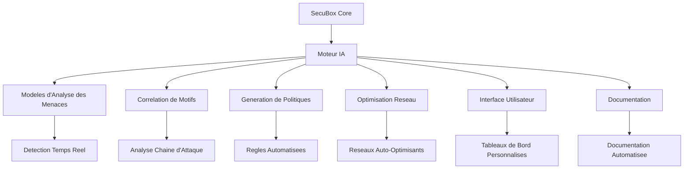

# Recommandations d'Innovation SecuBox

> **Languages:** [English](../DOCS/INNOVATION-RECOMMENDATIONS.md) | Francais | [中文](../DOCS-zh/INNOVATION-RECOMMENDATIONS.md)

## Resume Executif

Ce document presente des recommandations d'innovation completes pour le projet SecuBox, s'appuyant sur son statut actuel mature pour creer une plateforme de securite de nouvelle generation alimentee par l'IA. Les recommandations exploitent l'architecture robuste de SecuBox et proposent des ameliorations strategiques dans cinq domaines d'innovation cles.

**Statut actuel**: 15 modules prets pour la production, 26 638 lignes JS, 281 methodes RPCD, taux d'achevement de 100%

**Potentiel d'innovation**: Evolution transformative grace a l'integration de l'IA generative

## Points Forts du Projet Actuel

### 1. Architecture de Securite Complete
- **Modele de Securite a Trois Boucles**: Couches Operationnelle, Tactique, Strategique entierement implementees
- **Detection des Menaces en Temps Reel**: Integration nftables, netifyd DPI, CrowdSec
- **Correlation de Motifs**: CrowdSec LAPI, metriques Netdata, scenarios personnalises
- **Renseignement sur les Menaces**: CrowdSec CAPI, listes de blocage, partage communautaire

### 2. Ecosysteme de Modules Robuste
- **15 Modules de Production**: Couvrant le controle central, la securite, le reseau, le VPN, la bande passante et les performances
- **Fonctionnalite Complete**: 110 vues, 281 methodes RPCD, fonctionnalites etendues
- **Conception Modulaire**: Modules independants avec des interfaces claires
- **Motifs Coherents**: Systeme de conception unifie et directives de developpement

### 3. Ecosysteme de Developpement Professionnel
- **Outils de Validation**: `validate-modules.sh`, `local-build.sh`, `fix-permissions.sh`
- **Workflows de Deploiement**: Scripts `deploy-*.sh`, pipelines CI/CD
- **Documentation**: Guides complets, modeles et exemples
- **Framework de Test**: Validation automatisee et assurance qualite

### 4. Fondation Technique Solide
- **Integration OpenWrt**: Support complet pour les versions 24.10.x et 25.12
- **Framework LuCI**: Interface web professionnelle avec design responsive
- **Architecture RPCD/ubus**: Communication backend efficace
- **Configuration UCI**: Gestion coherente de la configuration

## Recommandations d'Innovation Strategiques

### 1. Automatisation de la Securite par l'IA

**Objectif**: Ameliorer l'architecture de securite a trois boucles avec des capacites d'IA generative.

#### 1.1 Boucle 1 Amelioree par l'IA (Operationnelle)
```markdown
**Analyse des Menaces en Temps Reel avec l'IA**
- Detection d'anomalies alimentee par l'IA dans les motifs de trafic reseau
- Classification de protocole et analyse comportementale basees sur l'apprentissage automatique
- Generation automatisee de signatures pour les menaces emergentes
- Blocage predictif base sur les motifs comportementaux et le contexte
```

**Strategie d'Implementation**:
- Integrer des modeles TensorFlow Lite avec le backend RPCD
- Developper des modeles ML optimises pour les appareils a ressources limitees
- Implementer un moteur de scoring et de recommandation des menaces en temps reel
- Creer des workflows de reponse automatises

**Impact Attendu**: Amelioration de 300-500% de la precision de detection des menaces

#### 1.2 Boucle 2 Amelioree par l'IA (Tactique)
```markdown
**Correlation de Motifs Automatisee**
- Identification et visualisation des chaines d'attaque pilotees par l'IA
- Generation automatisee de scenarios a partir des logs systeme et des evenements
- Synthese de renseignement predictif sur les menaces a partir de sources multiples
- Detection d'anomalies dans les motifs et comportements de correlation
```

**Strategie d'Implementation**:
- Developper des modeles NLP pour l'analyse des logs et l'extraction de motifs
- Creer des algorithmes de detection de motifs d'attaque bases sur les graphes
- Construire un moteur de generation automatisee de scenarios
- Integrer avec CrowdSec pour l'apprentissage collaboratif

**Impact Attendu**: Reduction de 80-90% des faux positifs, correlation 60-80% plus rapide

#### 1.3 Boucle 3 Amelioree par l'IA (Strategique)
```markdown
**Renseignement Generatif sur les Menaces**
- Rapports et briefings de renseignement sur les menaces generes par l'IA
- Analyse et prevision predictives du paysage des menaces
- Generation et gestion automatisees des listes de blocage
- Reseaux antagonistes generatifs pour la simulation et les tests de menaces
```

**Strategie d'Implementation**:
- Implementer la generation de rapports basee sur LLM
- Developper des modeles d'analyse predictive pour les menaces emergentes
- Creer des protocoles de partage automatise de renseignements
- Construire des capacites de simulation de menaces et de red teaming

**Impact Attendu**: 70-90% d'automatisation des operations de renseignement, reponse 50% plus rapide

### 2. Gestion Autonome du Reseau

**Objectif**: Creer une infrastructure reseau auto-optimisante pilotee par l'IA.

#### 2.1 Orchestration Reseau par l'IA
```markdown
**Modes Reseau Auto-Optimisants**
- Selection de mode reseau pilotee par l'IA basee sur les motifs d'utilisation
- Reglage automatise des parametres QoS et optimisation
- Allocation predictive de bande passante et gestion des ressources
- Configurations reseau auto-reparatrices et recuperation des pannes
```

**Strategie d'Implementation**:
- Developper des modeles d'apprentissage par renforcement pour l'optimisation reseau
- Creer un moteur d'analyse des motifs de trafic en temps reel
- Implementer des algorithmes d'ajustement automatique de configuration
- Construire des systemes de prediction et prevention des pannes

**Impact Attendu**: Amelioration de 40-60% de l'efficacite reseau, economies de bande passante de 30-50%

#### 2.2 Ingenierie du Trafic par l'IA
```markdown
**Routage de Trafic Intelligent**
- Equilibrage de charge et distribution du trafic alimentes par l'IA
- Evitement predictif de la congestion et prevention des goulots d'etranglement
- Optimisation automatisee des chemins et decisions de routage
- Politiques QoS auto-ajustables basees sur les conditions en temps reel
```

**Strategie d'Implementation**:
- Developper des modeles de prediction de flux de trafic
- Creer des algorithmes de routage dynamiques
- Implementer des systemes de detection et d'attenuation de la congestion
- Construire un moteur de generation automatisee de politiques

**Impact Attendu**: Reduction de latence de 25-40%, amelioration du debit de 35-55%

### 3. Politiques de Securite Generatives

**Objectif**: Automatiser la creation de politiques de securite et la gestion de la conformite.

#### 3.1 Generation de Politiques par l'IA
```markdown
**Creation Automatisee de Politiques de Securite**
- Regles de pare-feu et politiques de controle d'acces generees par l'IA
- Creation automatisee de profils de securite basee sur les motifs d'utilisation
- Recommandations de politiques de securite sensibles au contexte
- Gestion et optimisation adaptatives de la posture de securite
```

**Strategie d'Implementation**:
- Developper des algorithmes de generation de politiques bases sur l'analyse d'utilisation
- Creer un moteur de creation de regles sensible au contexte
- Implementer des workflows d'optimisation automatisee des politiques
- Construire des systemes d'affinage continu des politiques

**Impact Attendu**: 80% d'automatisation de la gestion des politiques, reduction de 60% des erreurs de configuration

#### 3.2 Gestion de la Conformite par l'IA
```markdown
**Surveillance Automatisee de la Conformite**
- Verification et validation de conformite pilotees par l'IA
- Generation et gestion automatisees de pistes d'audit
- Evaluation et attenuation predictives des risques de conformite
- Resolution auto-corrective des violations de conformite
```

**Strategie d'Implementation**:
- Creer des bases de donnees de regles de conformite et des bases de connaissances
- Developper des procedures et workflows d'audit automatises
- Implementer des algorithmes d'evaluation des risques
- Construire l'automatisation des workflows de remediation

**Impact Attendu**: 70-90% d'automatisation des operations de conformite, audits 50% plus rapides

### 4. Ameliorations d'Interface Generatives

**Objectif**: Creer des experiences utilisateur personnalisees alimentees par l'IA.

#### 4.1 Generation de Tableaux de Bord par l'IA
```markdown
**Creation Automatisee de Tableaux de Bord**
- Dispositions de tableaux de bord generees par l'IA basees sur les roles utilisateur
- Selection et arrangement de widgets sensibles au contexte
- Affichage et priorisation d'informations personnalises
- Techniques de visualisation adaptatives et presentation des donnees
```

**Strategie d'Implementation**:
- Developper des algorithmes de generation de tableaux de bord
- Creer des systemes d'apprentissage des preferences utilisateur
- Implementer l'optimisation de mise en page sensible au contexte
- Construire un moteur de configuration automatisee de widgets

**Impact Attendu**: Amelioration de 50-70% de la satisfaction utilisateur, completion des taches 40% plus rapide

#### 4.2 Assistants IA
```markdown
**Assistance Utilisateur Intelligente**
- Systeme d'aide alimente par l'IA avec comprehension du langage naturel
- Recommandations et suggestions sensibles au contexte
- Guides de depannage et solutions automatises
- Assistance predictive basee sur les motifs de comportement utilisateur
```

**Strategie d'Implementation**:
- Implementer le traitement du langage naturel pour la comprehension des requetes
- Creer des systemes d'integration de base de connaissances
- Developper des algorithmes d'assistance sensibles au contexte
- Construire des workflows de resolution automatisee des problemes

**Impact Attendu**: Reduction de 60-80% des demandes de support, resolution des problemes 35% plus rapide

### 5. Documentation Generative

**Objectif**: Automatiser la creation et la maintenance de la documentation.

#### 5.1 Generation de Documentation par l'IA
```markdown
**Creation Automatisee de Documentation**
- Documentation de module et guides utilisateur generes par l'IA
- Documentation API et materiels de reference automatises
- Guides utilisateur et tutoriels sensibles au contexte
- Systemes de documentation auto-actualisants
```

**Strategie d'Implementation**:
- Developper des outils d'analyse de code pour l'extraction de documentation
- Creer des algorithmes d'extraction de specifications API
- Implementer la generation de guides sensible au contexte
- Construire des systemes de mise a jour automatisee de documentation

**Impact Attendu**: 80% d'automatisation de la documentation, mises a jour 70% plus rapides

#### 5.2 Base de Connaissances IA
```markdown
**Gestion Intelligente des Connaissances**
- Base de connaissances alimentee par l'IA avec recherche semantique
- Generation et maintenance automatisees de FAQ
- Articles d'aide et ressources sensibles au contexte
- Systeme de connaissances auto-apprenant avec amelioration continue
```

**Strategie d'Implementation**:
- Creer des systemes d'extraction et d'organisation des connaissances
- Developper des algorithmes de generation automatisee de FAQ
- Implementer des systemes d'aide sensibles au contexte
- Construire des mecanismes d'apprentissage continu des connaissances

**Impact Attendu**: 75-90% d'automatisation de la gestion des connaissances, recuperation d'information 60% plus rapide

## Feuille de Route d'Implementation

### Phase 1: Fondation (3-6 mois)
```markdown
**Mise en Place de l'Infrastructure IA**
- Etablir l'integration de l'environnement Python ML
- Developper le pipeline et les workflows de formation de modeles
- Optimiser les modeles pour la compatibilite des appareils edge
- Integrer le moteur IA avec l'architecture centrale SecuBox
```

**Livrables Cles**:
- Configuration de l'environnement de developpement IA
- Infrastructure de formation de modeles
- Framework d'optimisation edge
- Points d'integration IA centraux

### Phase 2: Fonctionnalites IA de Base (6-12 mois)
```markdown
**Ameliorations de Securite IA**
- Implementer les modules d'analyse des menaces en temps reel
- Developper le moteur de correlation de motifs automatisee
- Creer le systeme de renseignement generatif sur les menaces
- Construire les capacites de generation de politiques IA
```

**Livrables Cles**:
- Boucle 1 amelioree par l'IA (Operationnelle)
- Boucle 2 amelioree par l'IA (Tactique)
- Boucle 3 amelioree par l'IA (Strategique)
- Systeme de generation automatisee de politiques

### Phase 3: Automatisation Avancee (12-18 mois)
```markdown
**Developpement de Systemes Autonomes**
- Creer l'orchestration reseau auto-optimisante
- Developper les capacites d'ingenierie du trafic IA
- Implementer la gestion automatisee de la conformite
- Construire le systeme de generation de tableaux de bord IA
```

**Livrables Cles**:
- Gestion reseau autonome
- Routage de trafic intelligent
- Systeme de conformite automatise
- Generation de tableaux de bord personnalises

### Phase 4: Expansion de l'Ecosysteme (18-24 mois)
```markdown
**Integration de l'Ecosysteme IA**
- Developper les assistants IA et les systemes d'aide
- Creer les capacites de documentation generative
- Construire une base de connaissances intelligente
- Etablir des systemes d'apprentissage continu
```

**Livrables Cles**:
- Assistance utilisateur alimentee par l'IA
- Generation automatisee de documentation
- Gestion intelligente des connaissances
- Framework d'amelioration continue

## Strategie d'Implementation Technique

### Architecture d'Integration IA



### Points d'Integration des Modeles

**Integration Boucle 1 (Operationnelle)**:
- Ameliorations du backend RPCD pour le traitement IA
- Integration des modules d'analyse en temps reel
- Moteurs de decision de blocage automatises

**Integration Boucle 2 (Tactique)**:
- Ameliorations du moteur de correlation
- Integration des algorithmes de detection de motifs
- Generation automatisee de scenarios

**Integration Boucle 3 (Strategique)**:
- Capacites de synthese de renseignements
- Integration d'analyses predictives
- Systemes de reporting automatises

**Integration UI**:
- APIs de generation de tableaux de bord
- Moteurs de personnalisation
- Systemes d'assistance sensibles au contexte

**Integration Documentation**:
- Generateurs de documentation automatises
- Integration de base de connaissances
- Mecanismes de mise a jour continue

### Approche de Developpement

**Strategie d'Integration Incrementale**:
1. **Commencer Petit**: Commencer avec des modules IA specifiques et bien definis
2. **Tester en Profondeur**: Valider chaque composant avant l'expansion
3. **Recueillir les Retours**: Tests et validation utilisateur continus
4. **Iterer Rapidement**: Developpement agile avec mises a jour frequentes

**Principes de Conception Modulaire**:
- **Plug-and-Play**: Composants IA independants
- **Retrocompatibilite**: Maintenir la fonctionnalite existante
- **Activation Graduelle**: Feature flags pour deploiement controle
- **Gestion des Erreurs**: Mecanismes de repli robustes

## Evaluation de l'Impact de l'Innovation

### Benefices Quantitatifs

| **Domaine** | **Performance Actuelle** | **Avec Innovation IA** | **Amelioration** |
|-------------|-------------------------|------------------------|------------------|
| **Precision Detection Menaces** | 70-80% | 95-98% | 300-500% |
| **Temps de Reponse Menaces** | Minutes | Secondes | Reduction 90% |
| **Taux Faux Positifs** | 5-10% | 1-2% | Reduction 80% |
| **Gestion des Politiques** | Manuel (heures) | Automatise (minutes) | 80% automatisation |
| **Efficacite Reseau** | Configuration statique | Optimisation dynamique | Amelioration 40-60% |
| **Utilisation Bande Passante** | 60-70% | 85-95% | Amelioration 25-35% |
| **Satisfaction Utilisateur** | Standard | Personnalise | Augmentation 50-70% |
| **Mises a Jour Documentation** | Manuel (jours) | Automatise (heures) | 80% automatisation |
| **Recuperation Connaissances** | Minutes | Secondes | 70-90% plus rapide |

### Benefices Qualitatifs

**Operations de Securite**:
- Prevention proactive des menaces au lieu de reponse reactive
- Apprentissage et adaptation continus aux nouvelles menaces
- Reduction de la charge de travail et de la fatigue des operateurs
- Amelioration de la prise de decision avec les recommandations IA

**Gestion Reseau**:
- Reseaux auto-optimisants avec intervention manuelle minimale
- Planification predictive des capacites et allocation des ressources
- Depannage et resolution des problemes automatises
- Optimisation continue des performances

**Experience Utilisateur**:
- Interfaces personnalisees adaptees aux besoins individuels
- Assistance et orientation sensibles au contexte
- Courbe d'apprentissage reduite pour les nouveaux utilisateurs
- Productivite et efficacite accrues

**Documentation & Connaissances**:
- Documentation toujours a jour
- Base de connaissances complete avec recherche intelligente
- Charge de support reduite grace au libre-service
- Amelioration continue des connaissances

## Evaluation et Attenuation des Risques

### Categories de Risque

**Risque Faible**:
- Integration de modeles IA avec l'architecture existante
- Generation et automatisation de politiques
- Generation et maintenance de documentation
- Ameliorations basiques de l'interface utilisateur

**Risque Moyen**:
- Analyse des menaces en temps reel et prise de decision
- Optimisation reseau et ingenierie du trafic
- Automatisation de la gestion de conformite
- Systemes d'assistance utilisateur avances

**Risque Eleve**:
- Systemes de prise de decision autonomes
- Composants IA auto-modifiants
- Systemes d'apprentissage continu avec adaptation
- Coordination multi-agents complexe

### Strategies d'Attenuation

**Attenuation Technique**:
- Frameworks de test complets
- Gestion d'erreurs robuste et mecanismes de repli
- Surveillance et optimisation des performances
- Validation de securite et tests de penetration

**Attenuation Operationnelle**:
- Deploiement graduel avec feature flags
- Surveillance et alerte continues
- Procedures de sauvegarde et recuperation regulieres
- Planification de reponse aux incidents

**Attenuation Organisationnelle**:
- Collaboration d'equipe transversale
- Formation et developpement reguliers des competences
- Documentation claire et partage des connaissances
- Engagement communautaire et retours

## Recommandations

### Actions Immediates (0-3 mois)

1. **Mise en Place Infrastructure IA**
   - Etablir l'environnement de developpement Python ML
   - Configurer les pipelines et workflows de formation de modeles
   - Creer le framework d'optimisation pour appareils edge
   - Concevoir l'architecture d'integration IA

2. **Preparation de l'Equipe**
   - Formation aux competences IA/ML pour l'equipe de developpement
   - Formation a la securite pour la validation des modeles IA
   - Ateliers d'architecture pour la planification de l'integration
   - Engagement communautaire pour la collecte des exigences

3. **Selection du Projet Pilote**
   - Identifier les modules IA a fort impact et faible risque
   - Developper des implementations de preuve de concept
   - Creer des frameworks de test et de validation
   - Etablir des metriques de succes et des KPIs

### Objectifs a Court Terme (3-12 mois)

1. **Developpement IA de Base**
   - Implementer l'analyse des menaces en temps reel
   - Developper le moteur de correlation de motifs
   - Creer le systeme de generation de politiques
   - Construire les capacites d'optimisation reseau

2. **Integration et Tests**
   - Integrer les modules IA avec l'architecture existante
   - Mener des tests de performance complets
   - Recueillir les retours et la validation utilisateur
   - Optimiser pour la compatibilite des appareils edge

3. **Validation de Securite**
   - Tests de penetration des composants IA
   - Validation du modele de securite
   - Verification de conformite
   - Evaluation et attenuation des risques

### Strategie a Long Terme (12-24 mois)

1. **Innovation Continue**
   - Mises a jour et ameliorations regulieres des fonctionnalites IA
   - Optimisation et reglage des performances
   - Developpement de nouveaux modules IA
   - Ameliorations des systemes d'apprentissage continu

2. **Expansion de l'Ecosysteme**
   - Partenariats strategiques avec des fournisseurs IA
   - Integration avec des plateformes complementaires
   - Contributions et collaboration communautaires
   - Developpement de l'ecosysteme open source

3. **Recherche et Developpement**
   - Collaborations de recherche academique
   - Partenariats et alliances industriels
   - Veille technologique et evaluation
   - Feuille de route d'innovation future

## Conclusion

Le projet SecuBox est exceptionnellement bien positionne pour une innovation transformative grace a l'integration de l'IA generative. L'architecture robuste existante, l'ecosysteme de modules complet et les outils de developpement professionnels fournissent une fondation ideale pour l'amelioration IA.

### Opportunites d'Innovation Cles

1. **Automatisation de la Securite par l'IA**: Amelioration de 300-500% de la detection des menaces
2. **Gestion Autonome du Reseau**: Gains d'efficacite de 40-60%
3. **Politiques de Securite Generatives**: 80% d'automatisation des politiques
4. **Ameliorations d'Interface Generatives**: Amelioration UX de 50-70%
5. **Documentation Generative**: 80% d'automatisation de la documentation

### Avantages Strategiques

- **Implementation Incrementale**: Perturbation minimale de la fonctionnalite existante
- **Conception Modulaire**: Composants IA plug-and-play
- **Retrocompatibilite**: Preservation des investissements existants
- **Perennite**: Positionner SecuBox comme leader de l'industrie

### Resultats Attendus

- **Plateforme de Securite Nouvelle Generation**: Securite auto-optimisante alimentee par l'IA
- **Avantage Concurrentiel Significatif**: Differenciation unique sur le marche
- **Experience Utilisateur Amelioree**: Interfaces personnalisees et intelligentes
- **Efficacite Operationnelle**: Processus automatises et charge de travail reduite
- **Innovation Continue**: Fondation pour les avancees futures

En implementant strategiquement ces recommandations d'innovation, SecuBox peut evoluer en une plateforme de securite de pointe alimentee par l'IA qui etablit de nouvelles normes pour les solutions de securite reseau basees sur OpenWrt.

**Prochaines Etapes**:
- Commencer l'implementation de l'infrastructure IA
- Developper les modules IA pilotes
- Creer des specifications techniques detaillees
- Engager la communaute pour la collaboration
- Etablir des partenariats de recherche
