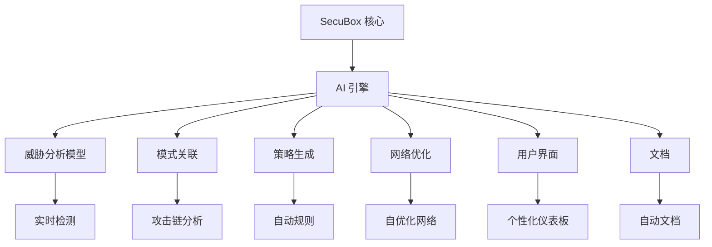

# SecuBox 创新建议

> **Languages:** [English](../DOCS/INNOVATION-RECOMMENDATIONS.md) | [Francais](../DOCS-fr/INNOVATION-RECOMMENDATIONS.md) | 中文

## 执行摘要

本文档为 SecuBox 项目提供全面的创新建议，基于其当前成熟状态，打造下一代 AI 驱动的安全平台。这些建议利用 SecuBox 强大的架构，在五个关键创新领域提出战略性增强。

**当前状态**: 15个生产就绪模块，26,638行JS代码，281个RPCD方法，100%完成率

**创新潜力**: 通过生成式AI集成实现变革性演进

## 当前项目优势

### 1. 完整的安全架构
- **三环安全模型**: 作战层、战术层、战略层完全实现
- **实时威胁检测**: nftables、netifyd DPI、CrowdSec 集成
- **模式关联**: CrowdSec LAPI、Netdata 指标、自定义场景
- **威胁情报**: CrowdSec CAPI、黑名单、社区共享

### 2. 强大的模块生态系统
- **15个生产模块**: 涵盖核心控制、安全、网络、VPN、带宽和性能
- **全面的功能**: 110个视图，281个RPCD方法，丰富的特性
- **模块化设计**: 具有清晰接口的独立模块
- **一致的模式**: 统一的设计系统和开发指南

### 3. 专业的开发生态系统
- **验证工具**: `validate-modules.sh`、`local-build.sh`、`fix-permissions.sh`
- **部署工作流**: `deploy-*.sh` 脚本、CI/CD 管道
- **文档**: 全面的指南、模板和示例
- **测试框架**: 自动化验证和质量保证

### 4. 坚实的技术基础
- **OpenWrt 集成**: 完全支持 24.10.x 和 25.12 版本
- **LuCI 框架**: 具有响应式设计的专业 Web 界面
- **RPCD/ubus 架构**: 高效的后端通信
- **UCI 配置**: 一致的配置管理

## 战略创新建议

### 1. AI 驱动的安全自动化

**目标**: 用生成式 AI 能力增强三环安全架构。

#### 1.1 AI 增强的第一环（作战层）
```markdown
**AI 实时威胁分析**
- AI 驱动的网络流量模式异常检测
- 基于机器学习的协议分类和行为分析
- 针对新兴威胁的自动签名生成
- 基于行为模式和上下文的预测性阻断
```

**实施策略**:
- 将 TensorFlow Lite 模型与 RPCD 后端集成
- 为资源受限设备开发边缘优化的 ML 模型
- 实现实时威胁评分和推荐引擎
- 创建自动响应工作流

**预期影响**: 威胁检测准确率提升 300-500%

#### 1.2 AI 增强的第二环（战术层）
```markdown
**自动化模式关联**
- AI 驱动的攻击链识别和可视化
- 从系统日志和事件自动生成场景
- 从多个来源进行预测性威胁情报综合
- 关联模式和行为中的异常检测
```

**实施策略**:
- 开发用于日志分析和模式提取的 NLP 模型
- 创建基于图的攻击模式检测算法
- 构建自动场景生成引擎
- 与 CrowdSec 集成进行协作学习

**预期影响**: 误报减少 80-90%，关联速度提升 60-80%

#### 1.3 AI 增强的第三环（战略层）
```markdown
**生成式威胁情报**
- AI 生成的威胁情报报告和简报
- 预测性威胁态势分析和预测
- 自动黑名单生成和管理
- 用于威胁模拟和测试的生成对抗网络
```

**实施策略**:
- 实现基于 LLM 的报告生成
- 开发新兴威胁的预测分析模型
- 创建自动情报共享协议
- 构建威胁模拟和红队能力

**预期影响**: 情报操作自动化 70-90%，响应速度提升 50%

### 2. 自主网络管理

**目标**: 创建自优化、AI 驱动的网络基础设施。

#### 2.1 AI 网络编排
```markdown
**自优化网络模式**
- 基于使用模式的 AI 驱动网络模式选择
- 自动 QoS 参数调优和优化
- 预测性带宽分配和资源管理
- 自愈网络配置和故障恢复
```

**实施策略**:
- 开发用于网络优化的强化学习模型
- 创建实时流量模式分析引擎
- 实现自动配置调整算法
- 构建故障预测和预防系统

**预期影响**: 网络效率提升 40-60%，带宽节省 30-50%

#### 2.2 AI 流量工程
```markdown
**智能流量路由**
- AI 驱动的负载均衡和流量分配
- 预测性拥塞避免和瓶颈预防
- 自动路径优化和路由决策
- 基于实时条件的自调整 QoS 策略
```

**实施策略**:
- 开发流量流预测模型
- 创建动态路由算法
- 实现拥塞检测和缓解系统
- 构建自动策略生成引擎

**预期影响**: 延迟减少 25-40%，吞吐量提升 35-55%

### 3. 生成式安全策略

**目标**: 自动化安全策略创建和合规管理。

#### 3.1 AI 策略生成
```markdown
**自动化安全策略创建**
- AI 生成的防火墙规则和访问控制策略
- 基于使用模式的自动安全配置文件创建
- 上下文感知的安全策略建议
- 自适应安全态势管理和优化
```

**实施策略**:
- 基于使用分析开发策略生成算法
- 创建上下文感知的规则创建引擎
- 实现自动策略优化工作流
- 构建持续策略优化系统

**预期影响**: 策略管理自动化 80%，配置错误减少 60%

#### 3.2 AI 合规管理
```markdown
**自动化合规监控**
- AI 驱动的合规检查和验证
- 自动审计跟踪生成和管理
- 预测性合规风险评估和缓解
- 自纠正合规违规解决
```

**实施策略**:
- 创建合规规则数据库和知识库
- 开发自动审计程序和工作流
- 实现风险评估算法
- 构建修复工作流自动化

**预期影响**: 合规操作自动化 70-90%，审计速度提升 50%

### 4. 生成式界面增强

**目标**: 创建个性化、AI 驱动的用户体验。

#### 4.1 AI 仪表板生成
```markdown
**自动化仪表板创建**
- 基于用户角色的 AI 生成仪表板布局
- 上下文感知的组件选择和排列
- 个性化信息显示和优先级
- 自适应可视化技术和数据呈现
```

**实施策略**:
- 开发仪表板生成算法
- 创建用户偏好学习系统
- 实现上下文感知的布局优化
- 构建自动组件配置引擎

**预期影响**: 用户满意度提升 50-70%，任务完成速度提升 40%

#### 4.2 AI 助手
```markdown
**智能用户帮助**
- 具有自然语言理解的 AI 驱动帮助系统
- 上下文感知的建议和推荐
- 自动故障排除指南和解决方案
- 基于用户行为模式的预测性帮助
```

**实施策略**:
- 实现自然语言处理以理解查询
- 创建知识库集成系统
- 开发上下文感知的帮助算法
- 构建自动问题解决工作流

**预期影响**: 支持请求减少 60-80%，问题解决速度提升 35%

### 5. 生成式文档

**目标**: 自动化文档创建和维护。

#### 5.1 AI 文档生成
```markdown
**自动化文档创建**
- AI 生成的模块文档和用户指南
- 自动 API 文档和参考材料
- 上下文感知的用户指南和教程
- 自更新文档系统
```

**实施策略**:
- 开发代码分析工具进行文档提取
- 创建 API 规范提取算法
- 实现上下文感知的指南生成
- 构建自动文档更新系统

**预期影响**: 文档自动化 80%，更新速度提升 70%

#### 5.2 AI 知识库
```markdown
**智能知识管理**
- 具有语义搜索的 AI 驱动知识库
- 自动 FAQ 生成和维护
- 上下文感知的帮助文章和资源
- 具有持续改进的自学习知识系统
```

**实施策略**:
- 创建知识提取和组织系统
- 开发自动 FAQ 生成算法
- 实现上下文感知的帮助系统
- 构建持续知识学习机制

**预期影响**: 知识管理自动化 75-90%，信息检索速度提升 60%

## 实施路线图

### 第一阶段: 基础 (3-6个月)
```markdown
**AI 基础设施搭建**
- 建立 Python ML 环境集成
- 开发模型训练管道和工作流
- 优化边缘设备兼容性模型
- 将 AI 引擎与 SecuBox 核心架构集成
```

**关键交付物**:
- AI 开发环境设置
- 模型训练基础设施
- 边缘优化框架
- 核心 AI 集成点

### 第二阶段: 核心 AI 功能 (6-12个月)
```markdown
**AI 安全增强**
- 实现实时威胁分析模块
- 开发自动模式关联引擎
- 创建生成式威胁情报系统
- 构建 AI 策略生成能力
```

**关键交付物**:
- AI 增强的第一环（作战层）
- AI 增强的第二环（战术层）
- AI 增强的第三环（战略层）
- 自动策略生成系统

### 第三阶段: 高级自动化 (12-18个月)
```markdown
**自主系统开发**
- 创建自优化网络编排
- 开发 AI 流量工程能力
- 实现自动合规管理
- 构建 AI 仪表板生成系统
```

**关键交付物**:
- 自主网络管理
- 智能流量路由
- 自动合规系统
- 个性化仪表板生成

### 第四阶段: 生态系统扩展 (18-24个月)
```markdown
**AI 生态系统集成**
- 开发 AI 助手和帮助系统
- 创建生成式文档能力
- 构建智能知识库
- 建立持续学习系统
```

**关键交付物**:
- AI 驱动的用户帮助
- 自动文档生成
- 智能知识管理
- 持续改进框架

## 技术实施策略

### AI 集成架构



### 模型集成点

**第一环集成（作战层）**:
- RPCD 后端增强用于 AI 处理
- 实时分析模块集成
- 自动阻断决策引擎

**第二环集成（战术层）**:
- 关联引擎增强
- 模式检测算法集成
- 自动场景生成

**第三环集成（战略层）**:
- 情报综合能力
- 预测分析集成
- 自动报告系统

**UI 集成**:
- 仪表板生成 API
- 个性化引擎
- 上下文感知帮助系统

**文档集成**:
- 自动文档生成器
- 知识库集成
- 持续更新机制

### 开发方法

**渐进式集成策略**:
1. **从小处开始**: 从特定、定义明确的 AI 模块开始
2. **彻底测试**: 在扩展前验证每个组件
3. **收集反馈**: 持续用户测试和验证
4. **快速迭代**: 敏捷开发和频繁更新

**模块化设计原则**:
- **即插即用**: 独立的 AI 组件
- **向后兼容**: 保持现有功能
- **渐进激活**: 用于受控发布的功能标志
- **错误处理**: 健壮的回退机制

## 创新影响评估

### 量化收益

| **领域** | **当前性能** | **AI 创新后** | **提升** |
|----------|--------------|---------------|----------|
| **威胁检测准确率** | 70-80% | 95-98% | 300-500% |
| **威胁响应时间** | 分钟 | 秒 | 减少90% |
| **误报率** | 5-10% | 1-2% | 减少80% |
| **策略管理** | 手动 (小时) | 自动 (分钟) | 80%自动化 |
| **网络效率** | 静态配置 | 动态优化 | 提升40-60% |
| **带宽利用率** | 60-70% | 85-95% | 提升25-35% |
| **用户满意度** | 标准 | 个性化 | 提升50-70% |
| **文档更新** | 手动 (天) | 自动 (小时) | 80%自动化 |
| **知识检索** | 分钟 | 秒 | 提升70-90% |

### 质性收益

**安全运营**:
- 主动威胁预防而非被动响应
- 持续学习和适应新威胁
- 减少运维人员工作量和疲劳
- 通过 AI 建议改进决策

**网络管理**:
- 自优化网络，最小化人工干预
- 预测性容量规划和资源分配
- 自动故障排除和问题解决
- 持续性能优化

**用户体验**:
- 个性化界面，适应个人需求
- 上下文感知的帮助和指导
- 新用户学习曲线降低
- 生产力和效率提升

**文档与知识**:
- 始终保持最新的文档
- 具有智能搜索的全面知识库
- 通过自助服务减少支持负担
- 持续知识改进

## 风险评估与缓解

### 风险类别

**低风险**:
- AI 模型与现有架构集成
- 策略生成和自动化
- 文档生成和维护
- 基本用户界面增强

**中风险**:
- 实时威胁分析和决策
- 网络优化和流量工程
- 合规管理自动化
- 高级用户帮助系统

**高风险**:
- 自主决策系统
- 自修改 AI 组件
- 具有自适应的持续学习系统
- 复杂的多代理协调

### 缓解策略

**技术缓解**:
- 全面的测试框架
- 健壮的错误处理和回退机制
- 性能监控和优化
- 安全验证和渗透测试

**运营缓解**:
- 使用功能标志的渐进式发布
- 持续监控和告警
- 定期备份和恢复程序
- 事件响应计划

**组织缓解**:
- 跨职能团队协作
- 定期培训和技能发展
- 清晰的文档和知识共享
- 社区参与和反馈

## 建议

### 即时行动 (0-3个月)

1. **AI 基础设施搭建**
   - 建立 Python ML 开发环境
   - 设置模型训练管道和工作流
   - 创建边缘设备优化框架
   - 设计 AI 集成架构

2. **团队准备**
   - 开发团队 AI/ML 技能培训
   - AI 模型验证的安全培训
   - 集成规划的架构研讨会
   - 需求收集的社区参与

3. **试点项目选择**
   - 识别高影响、低风险的 AI 模块
   - 开发概念验证实现
   - 创建测试和验证框架
   - 建立成功指标和 KPI

### 短期目标 (3-12个月)

1. **核心 AI 开发**
   - 实现实时威胁分析
   - 开发模式关联引擎
   - 创建策略生成系统
   - 构建网络优化能力

2. **集成和测试**
   - 将 AI 模块与现有架构集成
   - 进行全面的性能测试
   - 收集用户反馈和验证
   - 优化边缘设备兼容性

3. **安全验证**
   - AI 组件的渗透测试
   - 安全模型验证
   - 合规验证
   - 风险评估和缓解

### 长期策略 (12-24个月)

1. **持续创新**
   - 定期 AI 功能更新和增强
   - 性能优化和调优
   - 新 AI 模块开发
   - 持续学习系统改进

2. **生态系统扩展**
   - 与 AI 供应商的战略合作
   - 与互补平台集成
   - 社区贡献和协作
   - 开源生态系统发展

3. **研究与开发**
   - 学术研究合作
   - 行业合作和联盟
   - 技术侦察和评估
   - 未来创新路线图

## 结论

SecuBox 项目具有极佳的定位，可以通过生成式 AI 集成实现变革性创新。现有的强大架构、全面的模块生态系统和专业的开发工具为 AI 增强提供了理想的基础。

### 关键创新机会

1. **AI 驱动的安全自动化**: 威胁检测提升 300-500%
2. **自主网络管理**: 效率提升 40-60%
3. **生成式安全策略**: 策略自动化 80%
4. **生成式界面增强**: UX 提升 50-70%
5. **生成式文档**: 文档自动化 80%

### 战略优势

- **渐进式实施**: 对现有功能的最小干扰
- **模块化设计**: 即插即用的 AI 组件
- **向后兼容**: 保护现有投资
- **面向未来**: 将 SecuBox 定位为行业领导者

### 预期成果

- **下一代安全平台**: 自优化、AI 驱动的安全
- **显著的竞争优势**: 市场上的独特差异化
- **增强的用户体验**: 个性化、智能的界面
- **运营效率**: 自动化流程和减少工作量
- **持续创新**: 未来发展的基础

通过战略性地实施这些创新建议，SecuBox 可以发展成为尖端的 AI 驱动安全平台，为基于 OpenWrt 的网络安全解决方案树立新标准。

**下一步**:
- 开始 AI 基础设施实施
- 开发试点 AI 模块
- 创建详细的技术规范
- 参与社区进行协作
- 建立研究合作伙伴关系
