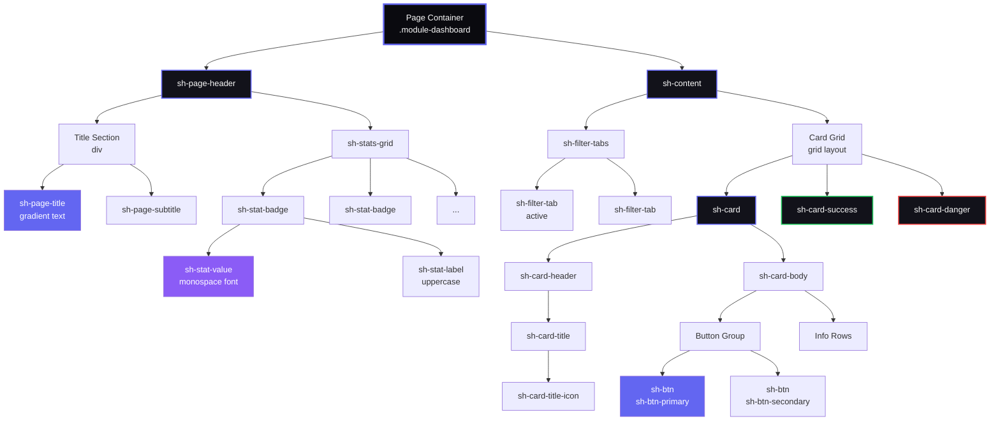
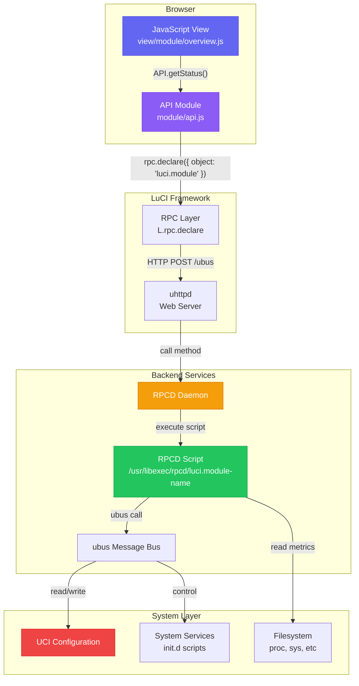
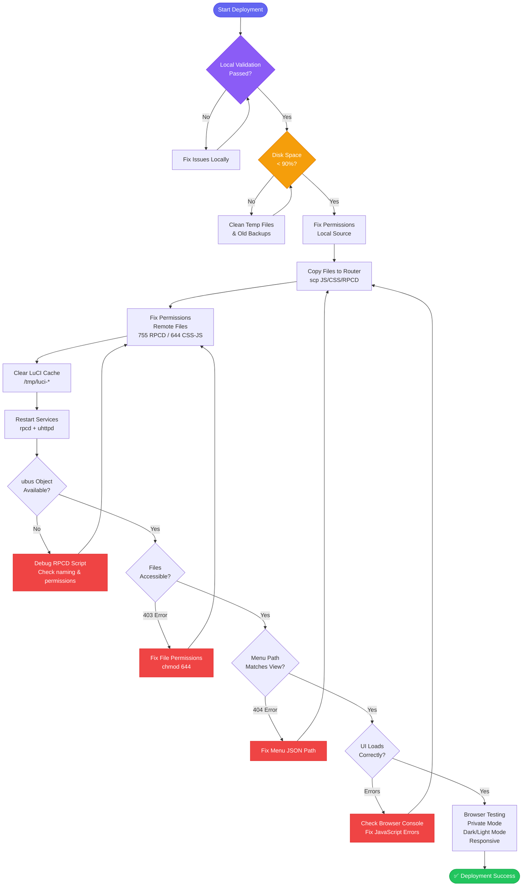

# SecuBox & System Hub - Development Guidelines

**Version:** 1.0.0  
**Last Updated:** 2025-12-28  
**Status:** Active  
**Audience:** Développeurs, IA assistants, mainteneurs

Ce document définit les standards, bonnes pratiques et validations obligatoires pour le développement de modules SecuBox et System Hub dans l'écosystème OpenWrt LuCI.

---

## Table des matières

1. [Design System & UI Guidelines](#design-system--ui-guidelines)
2. [Architecture & Naming Conventions](#architecture--naming-conventions)
3. [RPCD & ubus Best Practices](#rpcd--ubus-best-practices)
4. [ACL & Permissions](#acl--permissions)
5. [JavaScript Patterns](#javascript-patterns)
6. [CSS/Styling Standards](#cssstyling-standards)
7. [Common Errors & Solutions](#common-errors--solutions)
8. [Validation Checklist](#validation-checklist)
9. [Deployment Procedures](#deployment-procedures)

---

## Design System & UI Guidelines

### Color Palette (Demo-inspired)

**IMPORTANT:** Toujours utiliser la palette définie dans `system-hub/common.css`

#### Dark Mode (Primary - Recommended)
```css
--sh-text-primary: #fafafa;
--sh-text-secondary: #a0a0b0;
--sh-bg-primary: #0a0a0f;      /* Fond principal (noir profond) */
--sh-bg-secondary: #12121a;     /* Fond cartes/sections */
--sh-bg-tertiary: #1a1a24;      /* Fond hover/actif */
--sh-bg-card: #12121a;
--sh-border: #2a2a35;
--sh-primary: #6366f1;          /* Indigo */
--sh-primary-end: #8b5cf6;      /* Violet (pour dégradés) */
--sh-success: #22c55e;          /* Vert */
--sh-danger: #ef4444;           /* Rouge */
--sh-warning: #f59e0b;          /* Orange */
```

#### Light Mode (Secondary)
```css
--sh-text-primary: #0f172a;
--sh-text-secondary: #475569;
--sh-bg-primary: #ffffff;
--sh-bg-secondary: #f8fafc;
--sh-bg-tertiary: #f1f5f9;
--sh-bg-card: #ffffff;
--sh-border: #e2e8f0;
```

**✅ TOUJOURS utiliser les CSS variables** - Ne JAMAIS hardcoder les couleurs.

### Typography

#### Fonts Stack
```css
/* Texte général */
font-family: 'Inter', -apple-system, BlinkMacSystemFont, sans-serif;

/* Valeurs numériques, IDs, code */
font-family: 'JetBrains Mono', 'Courier New', monospace;
```

**Import requis** (ajouté dans common.css):
```css
@import url('https://fonts.googleapis.com/css2?family=JetBrains+Mono:wght@400;500;600;700&family=Inter:wght@400;500;600;700&display=swap');
```

#### Font Sizes
```css
/* Titres */
--sh-title-xl: 28px;    /* Page titles */
--sh-title-lg: 20px;    /* Card titles */
--sh-title-md: 16px;    /* Section headers */

/* Texte */
--sh-text-base: 14px;   /* Body text */
--sh-text-sm: 13px;     /* Labels, meta */
--sh-text-xs: 11px;     /* Uppercase labels */

/* Valeurs */
--sh-value-xl: 40px;    /* Large metrics */
--sh-value-lg: 32px;    /* Stats overview */
--sh-value-md: 28px;    /* Badges */
```

### Component Patterns

#### Component Hierarchy

The following diagram shows the standard page structure and component relationships:



**Component Categories:**
1. **Layout Containers:** Page wrapper, header, content sections
2. **Typography:** Titles with gradient effects, subtitles, labels
3. **Data Display:** Stat badges with monospace values, cards with borders
4. **Navigation:** Filter tabs, nav tabs (sticky)
5. **Interactive:** Buttons with gradients and hover effects

**Styling Rules:**
- **Cards:** 3px top border (gradient on hover, or colored for status)
- **Stat Badges:** Minimum 130px width, monospace font for values
- **Buttons:** Gradient backgrounds, shadow on hover, smooth transitions
- **Tabs:** Active state with gradient background and glow
- **Grid Layouts:** Auto-fit with minimums (130px, 240px, or 300px)

---

#### 1. Page Header (Standard)

**HTML Structure:**
```javascript
E('div', { 'class': 'sh-page-header' }, [
    E('div', {}, [
        E('h2', { 'class': 'sh-page-title' }, [
            E('span', { 'class': 'sh-page-title-icon' }, '🎯'),
            'Page Title'
        ]),
        E('p', { 'class': 'sh-page-subtitle' }, 'Description of the page')
    ]),
    E('div', { 'class': 'sh-stats-grid' }, [
        // Stats badges here
    ])
])
```

**CSS Classes:**
- `.sh-page-header` - Container with flex layout
- `.sh-page-title` - Gradient text effect
- `.sh-page-title-icon` - Icon (no gradient)
- `.sh-page-subtitle` - Secondary text
- `.sh-stats-grid` - Grid pour badges (130px min)

#### 2. Stats Badges

**RÈGLE:** Minimum 130px, police monospace pour valeurs

```javascript
E('div', { 'class': 'sh-stat-badge' }, [
    E('div', { 'class': 'sh-stat-value' }, '92'),
    E('div', { 'class': 'sh-stat-label' }, 'CPU %')
])
```

**Grid Layout:**
```css
.sh-stats-grid {
    display: grid;
    grid-template-columns: repeat(auto-fit, minmax(130px, 1fr));
    gap: 12px;
}
```

#### 3. Cards avec bordure colorée

**OBLIGATOIRE:** Toutes les cards doivent avoir une bordure top de 3px

```javascript
E('div', { 'class': 'sh-card sh-card-success' }, [
    E('div', { 'class': 'sh-card-header' }, [
        E('h3', { 'class': 'sh-card-title' }, [
            E('span', { 'class': 'sh-card-title-icon' }, '⚙️'),
            'Card Title'
        ])
    ]),
    E('div', { 'class': 'sh-card-body' }, [
        // Content
    ])
])
```

**Variants de bordure:**
- `.sh-card` - Bordure gradient (visible au hover)
- `.sh-card-success` - Bordure verte permanente
- `.sh-card-danger` - Bordure rouge permanente
- `.sh-card-warning` - Bordure orange permanente

#### 4. Buttons

**Gradient buttons (preferred):**
```javascript
E('button', { 'class': 'sh-btn sh-btn-primary' }, 'Primary Action')
E('button', { 'class': 'sh-btn sh-btn-success' }, 'Success Action')
E('button', { 'class': 'sh-btn sh-btn-danger' }, 'Danger Action')
E('button', { 'class': 'sh-btn sh-btn-secondary' }, 'Secondary Action')
```

**Tous les buttons doivent avoir:**
- Shadow effect (déjà dans CSS)
- Hover animation (translateY(-2px))
- Transition smooth (0.3s cubic-bezier)

#### 5. Filter Tabs

```javascript
E('div', { 'class': 'sh-filter-tabs' }, [
    E('div', {
        'class': 'sh-filter-tab active',
        'data-filter': 'all'
    }, [
        E('span', { 'class': 'sh-tab-icon' }, '📋'),
        E('span', { 'class': 'sh-tab-label' }, 'All')
    ])
])
```

**Active tab styling:**
- Background: gradient indigo-violet
- Color: white
- Box-shadow avec glow

### Grid Systems

#### Stats Overview (Compact)
```css
grid-template-columns: repeat(auto-fit, minmax(130px, 1fr));
gap: 16px;
```

#### Metric Cards (Medium)
```css
grid-template-columns: repeat(auto-fit, minmax(240px, 1fr));
gap: 20px;
```

#### Info Cards (Large)
```css
grid-template-columns: repeat(auto-fit, minmax(300px, 1fr));
gap: 20px;
```

### Gradient Effects

#### Gradient Text (Titles)
```css
background: linear-gradient(135deg, var(--sh-primary), var(--sh-primary-end));
-webkit-background-clip: text;
-webkit-text-fill-color: transparent;
background-clip: text;
```

**Utiliser:** `.sh-gradient-text` class ou `.sh-page-title`

#### Gradient Backgrounds (Buttons, Badges)
```css
background: linear-gradient(135deg, var(--sh-primary), var(--sh-primary-end));
```

#### Gradient Borders (Top)
```css
/* 3px top border avec dégradé */
.element::before {
    content: '';
    position: absolute;
    top: 0;
    left: 0;
    right: 0;
    height: 3px;
    background: linear-gradient(90deg, var(--sh-primary), var(--sh-primary-end));
}
```

### Animation Standards

#### Hover Effects
```css
transition: all 0.3s cubic-bezier(0.4, 0, 0.2, 1);
transform: translateY(-3px);  /* Cards */
transform: translateY(-2px);  /* Buttons, badges */
```

#### Shadow Progression
```css
/* Default */
box-shadow: none;

/* Hover - Subtle */
box-shadow: 0 8px 20px var(--sh-shadow);

/* Hover - Pronounced */
box-shadow: 0 12px 28px var(--sh-hover-shadow);

/* Button Hover */
box-shadow: 0 8px 20px rgba(99, 102, 241, 0.5);
```

---

## Architecture & Naming Conventions

### System Architecture Overview

The following diagram illustrates the complete data flow from browser JavaScript to system backend:



**Key Components:**
1. **Browser Layer:** JavaScript views and API modules handle UI and data requests
2. **LuCI Framework:** RPC layer translates JavaScript calls to ubus protocol
3. **Backend Services:** RPCD executes shell scripts via ubus message bus
4. **System Layer:** UCI configs, system services, and filesystem provide data

**Critical Naming Rule:** The RPCD script name **MUST** match the `object` parameter in JavaScript's `rpc.declare()`.

---

### CRITICAL: RPCD Script Naming

**RÈGLE ABSOLUE:** Le nom du fichier RPCD DOIT correspondre EXACTEMENT au nom de l'objet ubus dans JavaScript.

#### ✅ CORRECT:

**JavaScript:**
```javascript
var callStatus = rpc.declare({
    object: 'luci.system-hub',  // ← Nom objet
    method: 'getHealth'
});
```

**Fichier RPCD:**
```bash
root/usr/libexec/rpcd/luci.system-hub  # ← EXACT MATCH
```

#### ❌ INCORRECT (Causes d'erreur -32000):

```bash
# Mauvais - manque le préfixe
root/usr/libexec/rpcd/system-hub

# Mauvais - underscore au lieu de tiret
root/usr/libexec/rpcd/luci.system_hub

# Mauvais - nom différent
root/usr/libexec/rpcd/systemhub
```

### Menu Path Conventions

**RÈGLE:** Les chemins dans menu.d/*.json doivent correspondre EXACTEMENT aux fichiers de vue.

#### ✅ CORRECT:

**Menu JSON:**
```json
{
    "action": {
        "type": "view",
        "path": "system-hub/overview"
    }
}
```

**Fichier de vue:**
```bash
htdocs/luci-static/resources/view/system-hub/overview.js
```

#### ❌ INCORRECT (Causes 404):

Menu: `"path": "system-hub/overview"` mais fichier: `view/systemhub/overview.js`

### Prefixes Standards

| Type | Prefix | Exemple |
|------|--------|---------|
| ubus objects | `luci.` | `luci.system-hub` |
| CSS classes | `sh-` (System Hub) ou `sb-` (SecuBox) | `.sh-page-header` |
| CSS variables | `--sh-` | `--sh-primary` |
| JavaScript modules | Nom du module | `system-hub/api.js` |

### File Structure Template

```
luci-app-<module-name>/
├── Makefile
├── README.md
├── htdocs/luci-static/resources/
│   ├── view/<module-name>/
│   │   ├── overview.js         # Page principale
│   │   ├── settings.js         # Configuration
│   │   └── *.js                # Autres vues
│   └── <module-name>/
│       ├── api.js              # RPC client
│       ├── theme.js            # Theme helpers (optionnel)
│       ├── common.css          # Styles partagés
│       └── *.css               # Styles spécifiques
└── root/
    ├── usr/
    │   ├── libexec/rpcd/
    │   │   └── luci.<module-name>    # ⚠️ MUST match ubus object
    │   └── share/
    │       ├── luci/menu.d/
    │       │   └── luci-app-<module-name>.json
    │       └── rpcd/acl.d/
    │           └── luci-app-<module-name>.json
    └── etc/config/<module-name> (optionnel)
```

---

## RPCD & ubus Best Practices

### RPCD Script Template (Shell)

**Fichier:** `root/usr/libexec/rpcd/luci.<module-name>`

```bash
#!/bin/sh
# RPCD backend for <module-name>
# ubus object: luci.<module-name>

case "$1" in
    list)
        # Liste des méthodes disponibles
        echo '{
            "getStatus": {},
            "getHealth": {},
            "getServices": {}
        }'
        ;;
    call)
        case "$2" in
            getStatus)
                # TOUJOURS retourner du JSON valide
                printf '{"enabled": true, "version": "1.0.0"}\n'
                ;;
            getHealth)
                # Lire les métriques système
                cpu_usage=$(top -bn1 | grep "CPU:" | awk '{print $2}' | sed 's/%//')
                mem_total=$(free | grep Mem | awk '{print $2}')
                mem_used=$(free | grep Mem | awk '{print $3}')

                printf '{
                    "cpu": {"usage": %s},
                    "memory": {"total_kb": %s, "used_kb": %s}
                }\n' "$cpu_usage" "$mem_total" "$mem_used"
                ;;
            getServices)
                # Exemple avec services
                services='[]'
                for service in /etc/init.d/*; do
                    # Build JSON array
                    :
                done
                echo "$services"
                ;;
            *)
                echo '{"error": "Method not found"}'
                exit 1
                ;;
        esac
        ;;
esac
```

### RPCD Script Validation

**CHECKLIST OBLIGATOIRE:**

1. ✅ Fichier exécutable: `chmod +x root/usr/libexec/rpcd/luci.<module-name>`
2. ✅ Shebang présent: `#!/bin/sh`
3. ✅ Structure case/esac correcte
4. ✅ Méthode `list` retourne JSON avec toutes les méthodes
5. ✅ Méthode `call` gère tous les cas
6. ✅ Toujours retourner du JSON valide
7. ✅ Pas de `echo` de debug (commentés en prod)
8. ✅ Gestion d'erreur pour méthodes inconnues

### Testing RPCD Scripts

**Sur le routeur:**

```bash
# Test direct
/usr/libexec/rpcd/luci.system-hub list

# Via ubus
ubus list luci.system-hub
ubus call luci.system-hub getStatus

# Restart RPCD après modification
/etc/init.d/rpcd restart
```

### Common RPCD Errors

#### Error: "Object not found" (-32000)

**Cause:** Nom du fichier RPCD ne correspond pas à l'objet ubus

**Solution:**
```bash
# Vérifier le nom dans JS
grep -r "object:" htdocs/luci-static/resources/view/ --include="*.js"

# Renommer le fichier RPCD pour correspondre
mv root/usr/libexec/rpcd/wrong-name root/usr/libexec/rpcd/luci.correct-name
```

#### Error: "Method not found" (-32601)

**Cause:** Méthode non déclarée dans `list` ou non implémentée dans `call`

**Solution:**
```bash
# Vérifier que la méthode est dans les deux blocs
grep "getStatus" root/usr/libexec/rpcd/luci.*
```

#### Error: Invalid JSON returned

**Cause:** Output RPCD n'est pas du JSON valide

**Solution:**
```bash
# Tester le JSON
/usr/libexec/rpcd/luci.module-name call getStatus | jsonlint

# Utiliser printf au lieu de echo pour le JSON
printf '{"key": "%s"}\n' "$value"
```

---

## ACL & Permissions

### ACL File Template

**Fichier:** `root/usr/share/rpcd/acl.d/luci-app-<module-name>.json`

```json
{
    "luci-app-<module-name>": {
        "description": "Grant access to <Module Name>",
        "read": {
            "ubus": {
                "luci.<module-name>": [
                    "getStatus",
                    "getHealth",
                    "getServices"
                ]
            },
            "uci": [
                "<module-name>"
            ]
        },
        "write": {
            "ubus": {
                "luci.<module-name>": [
                    "setConfig",
                    "restartService"
                ]
            },
            "uci": [
                "<module-name>"
            ]
        }
    }
}
```

### ACL Best Practices

1. **Séparation read/write:** Ne donnez que les permissions nécessaires
2. **Liste explicite:** Listez toutes les méthodes ubus utilisées
3. **UCI access:** Ajoutez les configs UCI dans `read` et `write`
4. **Validation JSON:** Toujours valider avec `jsonlint`

### Common ACL Errors

#### Error: "Access denied"

**Cause:** Méthode ubus pas dans ACL

**Solution:**
```json
{
    "read": {
        "ubus": {
            "luci.system-hub": [
                "getHealth"  // ← Ajouter la méthode manquante
            ]
        }
    }
}
```

#### Error: "UCI config not accessible"

**Cause:** Config UCI pas dans ACL

**Solution:**
```json
{
    "read": {
        "uci": [
            "system-hub"  // ← Ajouter le config
        ]
    }
}
```

---

## JavaScript Patterns

### API Module Template

**Fichier:** `htdocs/luci-static/resources/<module-name>/api.js`

```javascript
'use strict';
'require rpc';
'require uci';

return L.Class.extend({
    // Déclarer les appels RPC
    callGetStatus: rpc.declare({
        object: 'luci.<module-name>',
        method: 'getStatus',
        expect: { }
    }),

    callGetHealth: rpc.declare({
        object: 'luci.<module-name>',
        method: 'getHealth',
        expect: { }
    }),

    // Méthodes wrapper avec gestion d'erreur
    getStatus: function() {
        return this.callGetStatus().catch(function(err) {
            console.error('Failed to get status:', err);
            return { enabled: false, error: err.message };
        });
    },

    getHealth: function() {
        return this.callGetHealth().catch(function(err) {
            console.error('Failed to get health:', err);
            return {
                cpu: { usage: 0 },
                memory: { usage: 0 },
                error: err.message
            };
        });
    },

    // Utilitaires
    formatBytes: function(bytes) {
        if (bytes === 0) return '0 B';
        var k = 1024;
        var sizes = ['B', 'KB', 'MB', 'GB'];
        var i = Math.floor(Math.log(bytes) / Math.log(k));
        return parseFloat((bytes / Math.pow(k, i)).toFixed(2)) + ' ' + sizes[i];
    }
});
```

### View Template

**Fichier:** `htdocs/luci-static/resources/view/<module-name>/overview.js`

```javascript
'use strict';
'require view';
'require ui';
'require dom';
'require poll';
'require <module-name>/api as API';

return view.extend({
    // State
    healthData: null,
    sysInfo: null,

    // Load data
    load: function() {
        return Promise.all([
            API.getStatus(),
            API.getHealth()
        ]);
    },

    // Render UI
    render: function(data) {
        var self = this;
        this.sysInfo = data[0] || {};
        this.healthData = data[1] || {};

        var container = E('div', { 'class': '<module>-dashboard' }, [
            // Link CSS files
            E('link', { 'rel': 'stylesheet', 'href': L.resource('<module>/common.css') }),
            E('link', { 'rel': 'stylesheet', 'href': L.resource('<module>/overview.css') }),

            // Header
            this.renderHeader(),

            // Content
            this.renderContent()
        ]);

        // Setup auto-refresh
        poll.add(L.bind(function() {
            return Promise.all([
                API.getStatus(),
                API.getHealth()
            ]).then(L.bind(function(refreshData) {
                this.sysInfo = refreshData[0] || {};
                this.healthData = refreshData[1] || {};
                this.updateDashboard();
            }, this));
        }, this), 30); // Refresh every 30s

        return container;
    },

    renderHeader: function() {
        return E('div', { 'class': 'sh-page-header' }, [
            // Header content
        ]);
    },

    renderContent: function() {
        return E('div', { 'class': 'sh-content' }, [
            // Main content
        ]);
    },

    updateDashboard: function() {
        // Update existing DOM elements
        var element = document.querySelector('.my-element');
        if (element) {
            dom.content(element, this.renderContent());
        }
    },

    // Required stubs for LuCI
    handleSaveApply: null,
    handleSave: null,
    handleReset: null
});
```

### Event Handling Pattern

```javascript
// ✅ CORRECT: Bind events après render
render: function(data) {
    var container = E('div', {}, [
        E('button', {
            'id': 'my-button',
            'class': 'sh-btn sh-btn-primary'
        }, 'Click Me')
    ]);

    // Ajouter l'événement après le container est créé
    container.addEventListener('click', function(ev) {
        if (ev.target && ev.target.id === 'my-button') {
            self.handleButtonClick();
        }
    });

    return container;
},

handleButtonClick: function() {
    ui.addNotification(null, E('p', 'Button clicked!'), 'info');
}
```

### Common JavaScript Errors

#### Error: "[object HTMLButtonElement]" affiché

**Cause:** Array imbriqué quand E() attend un array simple

```javascript
// ❌ INCORRECT
E('div', {}, [
    this.renderButtons()  // renderButtons retourne déjà un array
])

// ✅ CORRECT
E('div', {},
    this.renderButtons()  // Pas de [ ] supplémentaire
)
```

#### Error: "Cannot read property of undefined"

**Cause:** Données API non disponibles

```javascript
// ❌ INCORRECT
var cpuUsage = this.healthData.cpu.usage;

// ✅ CORRECT (avec optional chaining)
var cpuUsage = (this.healthData.cpu && this.healthData.cpu.usage) || 0;
// ou
var cpuUsage = this.healthData.cpu?.usage || 0; // ES2020
```

#### Error: "poll callback failed"

**Cause:** Promise non retournée dans poll.add

```javascript
// ❌ INCORRECT
poll.add(function() {
    API.getHealth(); // Pas de return!
}, 30);

// ✅ CORRECT
poll.add(function() {
    return API.getHealth().then(function(data) {
        // Update UI
    });
}, 30);
```

---

## CSS/Styling Standards

### File Organization

```
<module-name>/
├── common.css       # Shared components (headers, buttons, cards, tabs)
├── overview.css     # Overview page specific
├── services.css     # Services page specific
└── *.css            # Other page-specific styles
```

### CSS File Template

```css
/**
 * Module Name - Page/Component Styles
 * Description of what this file styles
 * Version: X.Y.Z
 */

/* === Import shared styles (if needed) === */
/* Not required if loaded in HTML */

/* === Page-specific variables (if needed) === */
:root {
    --page-specific-var: value;
}

/* === Layout === */
.module-page-container {
    /* Layout styles */
}

/* === Components === */
.module-component {
    /* Component styles */
}

/* === Responsive === */
@media (max-width: 768px) {
    /* Mobile styles */
}

/* === Dark Mode Overrides === */
[data-theme="dark"] .module-component {
    /* Dark mode specific */
}
```

### CSS Best Practices

#### 1. TOUJOURS utiliser les variables CSS

```css
/* ❌ INCORRECT */
.my-card {
    background: #12121a;
    color: #fafafa;
}

/* ✅ CORRECT */
.my-card {
    background: var(--sh-bg-card);
    color: var(--sh-text-primary);
}
```

#### 2. Prefix classes par module

```css
/* System Hub */
.sh-page-header { }
.sh-card { }
.sh-btn { }

/* SecuBox */
.sb-module-grid { }
.sb-dashboard { }

/* Module spécifique */
.netdata-chart { }
.crowdsec-alert { }
```

#### 3. Transitions cohérentes

```css
/* Standard transition */
transition: all 0.3s cubic-bezier(0.4, 0, 0.2, 1);

/* Quick transition (hover states) */
transition: all 0.2s ease;

/* Smooth transition (large movements) */
transition: all 0.5s ease;
```

#### 4. Responsive breakpoints

```css
/* Mobile */
@media (max-width: 768px) {
    .sh-stats-grid {
        grid-template-columns: repeat(2, 1fr);
    }
}

/* Tablet */
@media (min-width: 769px) and (max-width: 1024px) {
    /* Tablet specific */
}

/* Desktop */
@media (min-width: 1025px) {
    /* Desktop specific */
}
```

#### 5. Dark mode OBLIGATOIRE

**Toujours fournir des styles dark mode:**

```css
/* Light mode (default) */
.my-component {
    background: var(--sh-bg-card);
    border: 1px solid var(--sh-border);
}

/* Dark mode override */
[data-theme="dark"] .my-component {
    background: var(--sh-bg-card);
    border-color: var(--sh-border);
}
```

### Z-index Scale

**Respecter cette échelle:**

```css
--z-base: 0;
--z-dropdown: 100;
--z-sticky: 200;
--z-fixed: 300;
--z-modal-backdrop: 400;
--z-modal: 500;
--z-popover: 600;
--z-tooltip: 700;
```

---

## Common Errors & Solutions

### 1. RPCD Object Not Found (-32000)

**Erreur complète:**
```
RPC call to luci.system-hub/getHealth failed with error -32000: Object not found
```

**Diagnostic:**
```bash
# 1. Vérifier que le fichier RPCD existe
ls -la /usr/libexec/rpcd/luci.system-hub

# 2. Vérifier qu'il est exécutable
chmod +x /usr/libexec/rpcd/luci.system-hub

# 3. Lister les objets ubus
ubus list | grep system-hub

# 4. Si absent, redémarrer RPCD
/etc/init.d/rpcd restart
ubus list | grep system-hub
```

**Solutions:**
1. Renommer le fichier RPCD pour correspondre exactement
2. Vérifier permissions (755 ou rwxr-xr-x)
3. Redémarrer rpcd

### 2. View Not Found (404)

**Erreur:**
```
HTTP error 404 while loading class file '/luci-static/resources/view/system-hub/overview.js'
```

**Diagnostic:**
```bash
# 1. Vérifier que le fichier existe
ls -la /www/luci-static/resources/view/system-hub/overview.js

# 2. Vérifier le chemin dans menu.d
grep "path" /usr/share/luci/menu.d/luci-app-system-hub.json
```

**Solutions:**
1. Vérifier que le path dans menu JSON correspond au fichier
2. Vérifier permissions du fichier (644)
3. Nettoyer cache: `rm -f /tmp/luci-indexcache /tmp/luci-modulecache/*`

### 3. CSS Not Loading (403 Forbidden)

**Erreur:**
```
GET /luci-static/resources/system-hub/common.css 403 Forbidden
```

**Diagnostic:**
```bash
# Vérifier permissions
ls -la /www/luci-static/resources/system-hub/common.css
```

**Solution:**
```bash
# Corriger permissions
chmod 644 /www/luci-static/resources/system-hub/*.css
```

### 4. Invalid JSON from RPCD

**Erreur dans browser console:**
```
SyntaxError: Unexpected token in JSON at position X
```

**Diagnostic:**
```bash
# Tester le JSON directement
/usr/libexec/rpcd/luci.system-hub call getHealth | jsonlint

# Ou avec jq
/usr/libexec/rpcd/luci.system-hub call getHealth | jq .
```

**Solutions courantes:**
```bash
# ❌ INCORRECT - Quote simple non échappée
echo '{"error": "can't process"}'

# ✅ CORRECT - Utiliser printf et doubles quotes
printf '{"error": "cannot process"}\n'

# ❌ INCORRECT - Variable non quotée
echo "{\"value\": $var}"

# ✅ CORRECT - Variable quotée
printf '{"value": "%s"}\n' "$var"
```

### 5. Browser Cache Issues

**Symptômes:**
- Changements CSS/JS non visibles
- Anciennes données affichées
- Code mis à jour mais interface identique

**Solutions:**
```bash
# 1. Côté serveur - nettoyer cache LuCI
ssh root@router "rm -f /tmp/luci-indexcache /tmp/luci-modulecache/* && /etc/init.d/uhttpd restart"

# 2. Côté client - hard refresh
Ctrl + Shift + R (Chrome/Firefox)
Ctrl + F5 (Windows)
Cmd + Shift + R (Mac)

# 3. Mode privé/incognito pour test
Ctrl + Shift + N (Chrome)
Ctrl + Shift + P (Firefox)
```

### 6. ACL Access Denied

**Erreur:**
```
Access to path '/admin/secubox/system/system-hub' denied
```

**Diagnostic:**
```bash
# Vérifier ACL
cat /usr/share/rpcd/acl.d/luci-app-system-hub.json | jq .

# Vérifier que méthodes ubus sont listées
grep "getHealth" /usr/share/rpcd/acl.d/luci-app-system-hub.json
```

**Solution:**
Ajouter la méthode manquante dans ACL et redémarrer rpcd.

---

## Validation Checklist

### Pre-Commit Checklist

Avant chaque commit, vérifier:

- [ ] **RPCD Script:**
  - [ ] Nom fichier correspond à objet ubus
  - [ ] Exécutable (chmod +x)
  - [ ] Structure list/call correcte
  - [ ] Retourne JSON valide
  - [ ] Toutes méthodes implémentées

- [ ] **Menu & ACL:**
  - [ ] Path menu correspond au fichier vue
  - [ ] ACL liste toutes les méthodes ubus
  - [ ] JSON valide (jsonlint)

- [ ] **JavaScript:**
  - [ ] 'use strict' en première ligne
  - [ ] Imports requis présents
  - [ ] Pas de console.log en prod
  - [ ] Gestion d'erreur sur API calls
  - [ ] Event handlers bindés correctement

- [ ] **CSS:**
  - [ ] Variables CSS utilisées (pas de hardcode)
  - [ ] Classes prefixées (sh-, sb-, module-)
  - [ ] Dark mode supporté
  - [ ] Responsive (max-width: 768px)
  - [ ] Transitions cohérentes

- [ ] **Makefile:**
  - [ ] PKG_VERSION incrémenté
  - [ ] LUCI_DEPENDS correct
  - [ ] Include path correct (../../luci.mk)

### Pre-Deploy Checklist

Avant déploiement sur routeur:

- [ ] **Validation scripts:**
  ```bash
  ./secubox-tools/validate-modules.sh
  ```

- [ ] **Test RPCD local:**
  ```bash
  /usr/libexec/rpcd/luci.module-name list
  /usr/libexec/rpcd/luci.module-name call getStatus
  ```

- [ ] **Test JSON:**
  ```bash
  find . -name "*.json" -exec jsonlint {} \;
  ```

- [ ] **Shellcheck:**
  ```bash
  shellcheck root/usr/libexec/rpcd/*
  ```

- [ ] **Permissions:**
  ```bash
  # RPCD scripts
  chmod 755 root/usr/libexec/rpcd/*

  # CSS/JS files
  chmod 644 htdocs/luci-static/resources/**/*
  ```

### Post-Deploy Checklist

Après déploiement:

- [ ] **Services:**
  ```bash
  /etc/init.d/rpcd status
  /etc/init.d/uhttpd status
  ```

- [ ] **ubus objects:**
  ```bash
  ubus list | grep luci.module-name
  ```

- [ ] **Fichiers présents:**
  ```bash
  ls -la /www/luci-static/resources/view/module-name/
  ls -la /www/luci-static/resources/module-name/
  ```

- [ ] **Permissions correctes:**
  ```bash
  ls -la /usr/libexec/rpcd/luci.module-name
  ls -la /www/luci-static/resources/module-name/*.css
  ```

- [ ] **Test navigateur:**
  - [ ] Ouvrir en mode privé
  - [ ] Vérifier console (F12) - pas d'erreurs
  - [ ] Vérifier Network tab - tous les fichiers chargent (200)
  - [ ] Tester dark/light mode
  - [ ] Tester responsive (mobile view)

---

## Deployment Procedures

### Deployment Workflow

The following flowchart illustrates the complete deployment process with validation checkpoints:



**Deployment Stages:**
1. **Local Validation:** Run `validate-modules.sh` and `fix-permissions.sh --local`
2. **Pre-Flight Checks:** Disk space and permission verification
3. **File Transfer:** Copy JavaScript, CSS, and RPCD scripts
4. **Remote Setup:** Fix permissions and clear caches
5. **Service Restart:** Reload rpcd and uhttpd daemons
6. **Validation:** Multi-stage verification (ubus, files, menu, UI)
7. **Testing:** Browser testing in private mode

**Common Error Recovery Paths:**
- **Object not found (-32000):** Check RPCD script naming and permissions
- **403 Forbidden:** Fix file permissions to 644 for CSS/JS
- **404 Not Found:** Verify menu path matches view file location
- **JavaScript errors:** Check browser console and fix code issues

---

### ⚠️ Pre-Deployment Checks (CRITICAL)

**TOUJOURS exécuter ces vérifications AVANT tout déploiement:**

#### 1. Vérification de l'Espace Disque

```bash
# Sur le routeur cible
ssh root@192.168.8.191 "df -h | grep overlay"

# Vérifier que l'utilisation est < 90%
# Exemple OK:
# /dev/loop0    98.8M    45.2M    53.6M   46% /overlay

# Exemple CRITIQUE (STOP deployment):
# /dev/loop0    98.8M    98.8M       0  100% /overlay  ← PLEIN!
```

**Si l'overlay est plein (≥95%):**
```bash
# Libérer de l'espace avant déploiement
ssh root@192.168.8.191 << 'EOF'
# Supprimer fichiers temporaires
rm -rf /tmp/*.ipk /tmp/luci-* 2>/dev/null

# Supprimer anciens backups (>7 jours)
find /root -name '*.backup-*' -type f -mtime +7 -delete 2>/dev/null

# Vérifier packages inutilisés
opkg list-installed | grep -E 'netdata|unused'

# Après nettoyage, vérifier l'espace libéré
df -h | grep overlay
EOF
```

**Tailles typiques à surveiller:**
- Netdata web UI: ~22MB (considérer suppression si non utilisé)
- Modules LuCI: ~1-2MB chacun
- Fichiers CSS/JS: ~10-50KB chacun

#### 2. Vérification des Permissions (Critique pour Éviter Erreurs 403)

**Permissions OBLIGATOIRES:**

| Type | Permission | Octal | Raison |
|------|-----------|-------|--------|
| **RPCD scripts** | `rwxr-xr-x` | `755` | Exécutable par system |
| **CSS files** | `rw-r--r--` | `644` | Lecture web server |
| **JS files** | `rw-r--r--` | `644` | Lecture web server |
| **JSON files** | `rw-r--r--` | `644` | Lecture rpcd |

**Erreur commune:** Fichiers créés avec `600` (rw-------) au lieu de `644`

**Symptôme:** HTTP 403 Forbidden lors du chargement de fichiers JS/CSS

**Exemple d'erreur:**
```
NetworkError: HTTP error 403 while loading class file
"/luci-static/resources/view/netdata-dashboard/dashboard.js"
```

**Diagnostic rapide:**
```bash
# Vérifier permissions des fichiers déployés
ssh root@192.168.8.191 "ls -la /www/luci-static/resources/view/MODULE_NAME/"

# Chercher fichiers avec permissions incorrectes (600)
ssh root@192.168.8.191 "find /www/luci-static/resources/view/ -type f -name '*.js' -perm 600"

# MAUVAIS (cause 403):
# -rw-------  1 root root  9763 dashboard.js  ← 600 = pas lisible par web!

# BON:
# -rw-r--r--  1 root root  9763 dashboard.js  ← 644 = OK
```

**Correction immédiate:**
```bash
# Corriger TOUS les fichiers CSS/JS
ssh root@192.168.8.191 << 'EOF'
find /www/luci-static/resources/ -name '*.css' -exec chmod 644 {} \;
find /www/luci-static/resources/ -name '*.js' -exec chmod 644 {} \;
find /usr/libexec/rpcd/ -name 'luci.*' -exec chmod 755 {} \;
EOF
```

**⚡ Correction Automatique (Recommandé):**

Utiliser le script automatique qui vérifie et corrige toutes les permissions:

```bash
# Corriger permissions locales (source code)
./secubox-tools/fix-permissions.sh --local

# Corriger permissions sur routeur
./secubox-tools/fix-permissions.sh --remote

# Corriger les deux (local + remote)
./secubox-tools/fix-permissions.sh
```

Le script `fix-permissions.sh` effectue automatiquement:
- ✅ Fixe tous les RPCD scripts à 755
- ✅ Fixe tous les CSS à 644
- ✅ Fixe tous les JS à 644
- ✅ Vérifie qu'aucun fichier 600 ne reste
- ✅ Clear cache et restart services (remote mode)
- ✅ Affiche un rapport complet des changements

**🔍 Validation Automatique des Permissions:**

Le script `validate-modules.sh` inclut maintenant un Check 7 qui vérifie automatiquement les permissions:

```bash
./secubox-tools/validate-modules.sh

# Check 7 validera:
# ✓ Tous les RPCD sont 755
# ✓ Tous les CSS sont 644
# ✓ Tous les JS sont 644
# ❌ Affichera erreurs si permissions incorrectes
```

**Workflow recommandé:**
1. Développer/modifier code
2. `./secubox-tools/fix-permissions.sh --local` (avant commit)
3. `./secubox-tools/validate-modules.sh` (vérifier tout)
4. Commit & push
5. Deploy sur routeur
6. `./secubox-tools/fix-permissions.sh --remote` (après deploy)

#### 3. Post-Deployment Verification

**Checklist après déploiement:**

```bash
#!/bin/bash
ROUTER="root@192.168.8.191"
MODULE="module-name"

echo "🔍 Post-Deployment Verification"
echo ""

# 1. Vérifier espace disque
echo "1. Espace disque restant:"
ssh "$ROUTER" "df -h | grep overlay | awk '{print \$5}'" || echo "❌ FAIL"

# 2. Vérifier permissions CSS/JS
echo "2. Permissions CSS/JS:"
ssh "$ROUTER" "find /www/luci-static/resources/$MODULE -type f \( -name '*.css' -o -name '*.js' \) ! -perm 644" | \
    if [ -z "$(cat)" ]; then echo "✅ OK"; else echo "❌ FAIL - Permissions incorrectes"; fi

# 3. Vérifier permissions RPCD
echo "3. Permissions RPCD:"
ssh "$ROUTER" "ls -l /usr/libexec/rpcd/luci.$MODULE | grep -q rwxr-xr-x" && echo "✅ OK" || echo "❌ FAIL"

# 4. Vérifier ubus object
echo "4. ubus object disponible:"
ssh "$ROUTER" "ubus list | grep -q luci.$MODULE" && echo "✅ OK" || echo "❌ FAIL"

# 5. Vérifier fichiers accessibles (HTTP)
echo "5. Fichiers web accessibles:"
ssh "$ROUTER" "test -r /www/luci-static/resources/$MODULE/common.css" && echo "✅ OK" || echo "⚠️  common.css non trouvé"

# 6. Vérifier cache cleared
echo "6. Cache LuCI cleared:"
ssh "$ROUTER" "test ! -f /tmp/luci-indexcache" && echo "✅ OK" || echo "⚠️  Cache encore présent"

echo ""
echo "✅ Vérification terminée"
```

#### 4. Common Deployment Errors

| Erreur | Cause | Solution Rapide |
|--------|-------|----------------|
| **HTTP 403 Forbidden** | Permissions 600 au lieu de 644 | `chmod 644 *.js *.css` |
| **No space left on device** | Overlay plein | Nettoyer /tmp, supprimer anciens backups |
| **Object not found -32000** | RPCD pas exécutable ou mal nommé | `chmod 755 rpcd/luci.*` + vérifier nom |
| **Module not appearing** | Cache LuCI pas cleared | `rm /tmp/luci-*` + restart services |
| **Changes not visible** | Cache navigateur | Mode privé + Ctrl+Shift+R |

#### 5. Emergency Disk Space Recovery

**Si le déploiement échoue avec "No space left on device":**

```bash
#!/bin/bash
ROUTER="root@192.168.8.191"

echo "🚨 Emergency Disk Space Recovery"
echo ""

# 1. Analyser l'utilisation
echo "Top 10 consumers:"
ssh "$ROUTER" "du -k /overlay/upper 2>/dev/null | sort -rn | head -10"

# 2. Nettoyer temporaires
echo ""
echo "Cleaning temp files..."
ssh "$ROUTER" "rm -rf /tmp/*.ipk /tmp/luci-* /root/*.ipk 2>/dev/null"

# 3. Supprimer anciens backups
echo "Removing old backups (>7 days)..."
ssh "$ROUTER" "find /root -name '*.backup-*' -mtime +7 -delete 2>/dev/null"

# 4. Option: Supprimer Netdata Web UI (libère ~22MB)
echo ""
echo "⚠️  Option: Remove Netdata Web UI (saves ~22MB)?"
read -p "Continue? (y/N) " -n 1 -r
if [[ $REPLY =~ ^[Yy]$ ]]; then
    ssh "$ROUTER" "opkg remove netdata-web 2>/dev/null || rm -rf /usr/share/netdata/web/*"
fi

# 5. Vérifier espace libéré
echo ""
echo "Space after cleanup:"
ssh "$ROUTER" "df -h | grep overlay"
```

### Standard Deployment Script Template

```bash
#!/bin/bash
# Deploy <Module Name>

ROUTER="root@192.168.8.191"
MODULE="<module-name>"
LOCAL_DIR="/path/to/luci-app-$MODULE/htdocs/luci-static/resources"
REMOTE_DIR="/www/luci-static/resources"

echo "📦 Déploiement $MODULE"
echo ""

# 1. Deploy JS files
echo "1. Copie des fichiers JS..."
scp "$LOCAL_DIR/view/$MODULE/"*.js "$ROUTER:$REMOTE_DIR/view/$MODULE/"
scp "$LOCAL_DIR/$MODULE/api.js" "$ROUTER:$REMOTE_DIR/$MODULE/"

# 2. Deploy CSS files
echo "2. Copie des fichiers CSS..."
scp "$LOCAL_DIR/$MODULE/"*.css "$ROUTER:$REMOTE_DIR/$MODULE/"

# 3. Deploy RPCD backend
echo "3. Copie du backend RPCD..."
scp "root/usr/libexec/rpcd/luci.$MODULE" "$ROUTER:/usr/libexec/rpcd/"

# 4. Fix permissions
echo "4. Correction des permissions..."
ssh "$ROUTER" "chmod 755 /usr/libexec/rpcd/luci.$MODULE"
ssh "$ROUTER" "chmod 644 $REMOTE_DIR/$MODULE/*.css"
ssh "$ROUTER" "chmod 644 $REMOTE_DIR/view/$MODULE/*.js"

# 5. Clear cache
echo "5. Nettoyage du cache..."
ssh "$ROUTER" "rm -f /tmp/luci-indexcache /tmp/luci-modulecache/* 2>/dev/null"

# 6. Restart services
echo "6. Redémarrage des services..."
ssh "$ROUTER" "/etc/init.d/rpcd restart"
ssh "$ROUTER" "/etc/init.d/uhttpd restart"

# 7. Verify
echo ""
echo "7. Vérification..."
ssh "$ROUTER" "ubus list | grep luci.$MODULE"

echo ""
echo "✅ Déploiement terminé!"
echo ""
echo "🌐 Testez (mode privé):"
echo "   https://192.168.8.191/cgi-bin/luci/admin/secubox/path/to/$MODULE"
```

### Rollback Procedure

En cas de problème:

```bash
#!/bin/bash
# Rollback to previous version

ROUTER="root@192.168.8.191"
BACKUP_DIR="/root/luci-backups/$(date +%Y%m%d)"

# 1. Créer backup avant deploy
ssh "$ROUTER" "mkdir -p $BACKUP_DIR"
ssh "$ROUTER" "cp -r /www/luci-static/resources/module-name $BACKUP_DIR/"
ssh "$ROUTER" "cp /usr/libexec/rpcd/luci.module-name $BACKUP_DIR/"

# 2. En cas de problème, restore
ssh "$ROUTER" "cp -r $BACKUP_DIR/module-name /www/luci-static/resources/"
ssh "$ROUTER" "cp $BACKUP_DIR/luci.module-name /usr/libexec/rpcd/"
ssh "$ROUTER" "/etc/init.d/rpcd restart && /etc/init.d/uhttpd restart"
```

### Version Control

**Toujours incrémenter les versions:**

```makefile
# Makefile
PKG_VERSION:=0.3.0
PKG_RELEASE:=1
```

```css
/* CSS files */
/**
 * Module - Styles
 * Version: 0.3.0
 */
```

```javascript
// JavaScript
// Version: 0.3.0
```

**Semantic Versioning:**
- MAJOR.MINOR.PATCH (1.2.3)
- MAJOR: Breaking changes
- MINOR: New features (backward compatible)
- PATCH: Bug fixes

---

## Quick Reference

### Essential Commands

```bash
# Validation
./secubox-tools/validate-modules.sh

# Build (local)
./secubox-tools/local-build.sh build luci-app-module-name

# Deploy files
scp file.js root@router:/www/luci-static/resources/

# Fix permissions
ssh root@router "chmod 644 /www/luci-static/resources/**/*.css"
ssh root@router "chmod 755 /usr/libexec/rpcd/luci.*"

# Clear cache
ssh root@router "rm -f /tmp/luci-indexcache /tmp/luci-modulecache/*"

# Restart services
ssh root@router "/etc/init.d/rpcd restart && /etc/init.d/uhttpd restart"

# Test ubus
ssh root@router "ubus list | grep luci"
ssh root@router "ubus call luci.module-name getStatus"

# Validate JSON
jsonlint file.json
jq . file.json
```

### CSS Classes Quick Reference

```css
/* Layout */
.sh-page-header          /* Page header container */
.sh-page-title           /* Page title (gradient text) */
.sh-page-subtitle        /* Page subtitle */

/* Stats */
.sh-stats-grid           /* Grid for stat badges (130px min) */
.sh-stat-badge           /* Stat badge container */
.sh-stat-value           /* Stat value (monospace) */
.sh-stat-label           /* Stat label (uppercase) */

/* Cards */
.sh-card                 /* Card container (with gradient border on hover) */
.sh-card-success         /* Card with green border */
.sh-card-danger          /* Card with red border */
.sh-card-warning         /* Card with orange border */
.sh-card-header          /* Card header */
.sh-card-title           /* Card title */
.sh-card-body            /* Card content */

/* Buttons */
.sh-btn                  /* Base button */
.sh-btn-primary          /* Primary button (gradient) */
.sh-btn-success          /* Success button (green) */
.sh-btn-danger           /* Danger button (red) */
.sh-btn-secondary        /* Secondary button (outline) */

/* Tabs */
.sh-filter-tabs          /* Filter tabs container */
.sh-filter-tab           /* Filter tab */
.sh-filter-tab.active    /* Active filter tab (gradient) */
.sh-nav-tabs             /* Navigation tabs (sticky) */
.sh-nav-tab              /* Navigation tab */
.sh-nav-tab.active       /* Active nav tab (underline) */

/* Utilities */
.sh-gradient-text        /* Gradient text effect */
.sh-id-display           /* Monospace ID display */
.sh-empty-state          /* Empty state placeholder */
```

### Color Variables Quick Reference

```css
/* Text */
var(--sh-text-primary)      /* Main text */
var(--sh-text-secondary)    /* Secondary text */

/* Backgrounds */
var(--sh-bg-primary)        /* Main background */
var(--sh-bg-secondary)      /* Secondary background */
var(--sh-bg-tertiary)       /* Tertiary background */
var(--sh-bg-card)           /* Card background */

/* Borders */
var(--sh-border)            /* Border color */

/* Colors */
var(--sh-primary)           /* Indigo #6366f1 */
var(--sh-primary-end)       /* Violet #8b5cf6 */
var(--sh-success)           /* Green #22c55e */
var(--sh-danger)            /* Red #ef4444 */
var(--sh-warning)           /* Orange #f59e0b */

/* Effects */
var(--sh-shadow)            /* Box shadow */
var(--sh-hover-shadow)      /* Hover shadow */
var(--sh-hover-bg)          /* Hover background */
```

---

## Conclusion

Ce guide doit être consulté **AVANT** de:
1. Créer un nouveau module
2. Modifier des styles existants
3. Ajouter des méthodes RPCD
4. Déployer sur un routeur
5. Débugger des erreurs

**En cas de doute, TOUJOURS:**
1. Consulter ce guide
2. Exécuter validate-modules.sh
3. Tester en mode privé
4. Vérifier la console browser (F12)

**Ressources supplémentaires:**
- CLAUDE.md - Architecture et build
- secubox-tools/validate-modules.sh - Validation automatique
- Templates/ - Templates de code

---

**Dernière mise à jour:** 2025-12-26
**Maintenu par:** CyberMind Studio
**Version du guide:** 1.0.0
