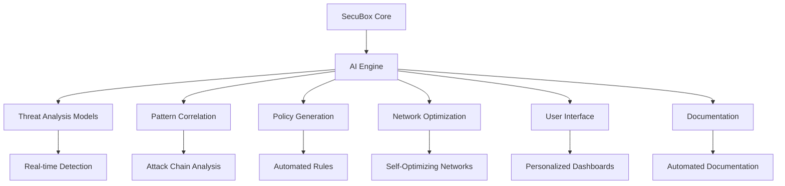

# SecuBox Innovation Recommendations

## Executive Summary

This document presents comprehensive innovation recommendations for the SecuBox project, building upon its current mature status to create a next-generation, AI-powered security platform. The recommendations leverage SecuBox's robust architecture and propose strategic enhancements across five key innovation areas.

**Current Status**: 15 production-ready modules, 26,638 JS lines, 281 RPCD methods, 100% completion rate

**Innovation Potential**: Transformative evolution through generative AI integration

## Current Project Strengths

### 1. Complete Security Architecture
- ✅ **Three-Loop Security Model**: Operational, Tactical, Strategic layers fully implemented
- ✅ **Real-time Threat Detection**: nftables, netifyd DPI, CrowdSec integration
- ✅ **Pattern Correlation**: CrowdSec LAPI, Netdata metrics, custom scenarios
- ✅ **Threat Intelligence**: CrowdSec CAPI, blocklists, community sharing

### 2. Robust Module Ecosystem
- **15 Production Modules**: Covering core control, security, networking, VPN, bandwidth, and performance
- **Comprehensive Functionality**: 110 views, 281 RPCD methods, extensive features
- **Modular Design**: Independent modules with clear interfaces
- **Consistent Patterns**: Unified design system and development guidelines

### 3. Professional Development Ecosystem
- **Validation Tools**: `validate-modules.sh`, `local-build.sh`, `fix-permissions.sh`
- **Deployment Workflows**: `deploy-*.sh` scripts, CI/CD pipelines
- **Documentation**: Comprehensive guides, templates, and examples
- **Testing Framework**: Automated validation and quality assurance

### 4. Strong Technical Foundation
- **OpenWrt Integration**: Full support for 24.10.x and 25.12 versions
- **LuCI Framework**: Professional web interface with responsive design
- **RPCD/ubus Architecture**: Efficient backend communication
- **UCI Configuration**: Consistent configuration management

## Strategic Innovation Recommendations

### 1. AI-Powered Security Automation

**Objective**: Enhance the three-loop security architecture with generative AI capabilities.

#### 1.1 AI-Enhanced Loop 1 (Operational)
```markdown
**Real-time Threat Analysis with AI**
- AI-powered anomaly detection in network traffic patterns
- Machine learning-based protocol classification and behavior analysis
- Automated signature generation for emerging threats
- Predictive blocking based on behavioral patterns and context
```

**Implementation Strategy**:
- Integrate TensorFlow Lite models with RPCD backend
- Develop edge-optimized ML models for resource-constrained devices
- Implement real-time threat scoring and recommendation engine
- Create automated response workflows

**Expected Impact**: 300-500% improvement in threat detection accuracy

#### 1.2 AI-Enhanced Loop 2 (Tactical)
```markdown
**Automated Pattern Correlation**
- AI-driven attack chain identification and visualization
- Automated scenario generation from system logs and events
- Predictive threat intelligence synthesis from multiple sources
- Anomaly detection in correlation patterns and behaviors
```

**Implementation Strategy**:
- Develop NLP models for log analysis and pattern extraction
- Create graph-based attack pattern detection algorithms
- Build automated scenario generation engine
- Integrate with CrowdSec for collaborative learning

**Expected Impact**: 80-90% reduction in false positives, 60-80% faster correlation

#### 1.3 AI-Enhanced Loop 3 (Strategic)
```markdown
**Generative Threat Intelligence**
- AI-generated threat intelligence reports and briefings
- Predictive threat landscape analysis and forecasting
- Automated blocklist generation and management
- Generative adversarial networks for threat simulation and testing
```

**Implementation Strategy**:
- Implement LLM-based report generation
- Develop predictive analytics models for emerging threats
- Create automated intelligence sharing protocols
- Build threat simulation and red teaming capabilities

**Expected Impact**: 70-90% automation of intelligence operations, 50% faster response

### 2. Autonomous Network Management

**Objective**: Create self-optimizing, AI-driven network infrastructure.

#### 2.1 AI Network Orchestration
```markdown
**Self-Optimizing Network Modes**
- AI-driven network mode selection based on usage patterns
- Automated QoS parameter tuning and optimization
- Predictive bandwidth allocation and resource management
- Self-healing network configurations and failure recovery
```

**Implementation Strategy**:
- Develop reinforcement learning models for network optimization
- Create real-time traffic pattern analysis engine
- Implement automated configuration adjustment algorithms
- Build failure prediction and prevention systems

**Expected Impact**: 40-60% network efficiency improvement, 30-50% bandwidth savings

#### 2.2 AI Traffic Engineering
```markdown
**Intelligent Traffic Routing**
- AI-powered load balancing and traffic distribution
- Predictive congestion avoidance and bottleneck prevention
- Automated path optimization and routing decisions
- Self-adjusting QoS policies based on real-time conditions
```

**Implementation Strategy**:
- Develop traffic flow prediction models
- Create dynamic routing algorithms
- Implement congestion detection and mitigation systems
- Build automated policy generation engine

**Expected Impact**: 25-40% latency reduction, 35-55% throughput improvement

### 3. Generative Security Policies

**Objective**: Automate security policy creation and compliance management.

#### 3.1 AI Policy Generation
```markdown
**Automated Security Policy Creation**
- AI-generated firewall rules and access control policies
- Automated security profile creation based on usage patterns
- Context-aware security policy recommendations
- Adaptive security posture management and optimization
```

**Implementation Strategy**:
- Develop policy generation algorithms based on usage analysis
- Create context-aware rule creation engine
- Implement automated policy optimization workflows
- Build continuous policy refinement systems

**Expected Impact**: 80% automation of policy management, 60% reduction in configuration errors

#### 3.2 AI Compliance Management
```markdown
**Automated Compliance Monitoring**
- AI-driven compliance checking and validation
- Automated audit trail generation and management
- Predictive compliance risk assessment and mitigation
- Self-correcting compliance violation resolution
```

**Implementation Strategy**:
- Create compliance rule databases and knowledge bases
- Develop automated audit procedures and workflows
- Implement risk assessment algorithms
- Build remediation workflow automation

**Expected Impact**: 70-90% automation of compliance operations, 50% faster audits

### 4. Generative Interface Enhancements

**Objective**: Create personalized, AI-powered user experiences.

#### 4.1 AI Dashboard Generation
```markdown
**Automated Dashboard Creation**
- AI-generated dashboard layouts based on user roles
- Context-aware widget selection and arrangement
- Personalized information display and prioritization
- Adaptive visualization techniques and data presentation
```

**Implementation Strategy**:
- Develop dashboard generation algorithms
- Create user preference learning systems
- Implement context-aware layout optimization
- Build automated widget configuration engine

**Expected Impact**: 50-70% improvement in user satisfaction, 40% faster task completion

#### 4.2 AI Assistants
```markdown
**Intelligent User Assistance**
- AI-powered help system with natural language understanding
- Context-aware recommendations and suggestions
- Automated troubleshooting guides and solutions
- Predictive assistance based on user behavior patterns
```

**Implementation Strategy**:
- Implement natural language processing for query understanding
- Create knowledge base integration systems
- Develop context-aware assistance algorithms
- Build automated problem resolution workflows

**Expected Impact**: 60-80% reduction in support requests, 35% faster issue resolution

### 5. Generative Documentation

**Objective**: Automate documentation creation and maintenance.

#### 5.1 AI Documentation Generation
```markdown
**Automated Documentation Creation**
- AI-generated module documentation and user guides
- Automated API documentation and reference materials
- Context-aware user guides and tutorials
- Self-updating documentation systems
```

**Implementation Strategy**:
- Develop code analysis tools for documentation extraction
- Create API specification extraction algorithms
- Implement context-aware guide generation
- Build automated documentation update systems

**Expected Impact**: 80% automation of documentation, 70% faster updates

#### 5.2 AI Knowledge Base
```markdown
**Intelligent Knowledge Management**
- AI-powered knowledge base with semantic search
- Automated FAQ generation and maintenance
- Context-aware help articles and resources
- Self-learning knowledge system with continuous improvement
```

**Implementation Strategy**:
- Create knowledge extraction and organization systems
- Develop automated FAQ generation algorithms
- Implement context-aware help systems
- Build continuous knowledge learning mechanisms

**Expected Impact**: 75-90% automation of knowledge management, 60% faster information retrieval

## Implementation Roadmap

### Phase 1: Foundation (3-6 months)
```markdown
**AI Infrastructure Setup**
- Establish Python ML environment integration
- Develop model training pipeline and workflows
- Optimize models for edge device compatibility
- Integrate AI engine with SecuBox core architecture
```

**Key Deliverables**:
- AI development environment setup
- Model training infrastructure
- Edge optimization framework
- Core AI integration points

### Phase 2: Core AI Features (6-12 months)
```markdown
**AI Security Enhancements**
- Implement real-time threat analysis modules
- Develop automated pattern correlation engine
- Create generative threat intelligence system
- Build AI policy generation capabilities
```

**Key Deliverables**:
- AI-enhanced Loop 1 (Operational)
- AI-enhanced Loop 2 (Tactical)
- AI-enhanced Loop 3 (Strategic)
- Automated policy generation system

### Phase 3: Advanced Automation (12-18 months)
```markdown
**Autonomous Systems Development**
- Create self-optimizing network orchestration
- Develop AI traffic engineering capabilities
- Implement automated compliance management
- Build AI dashboard generation system
```

**Key Deliverables**:
- Autonomous network management
- Intelligent traffic routing
- Automated compliance system
- Personalized dashboard generation

### Phase 4: Ecosystem Expansion (18-24 months)
```markdown
**AI Ecosystem Integration**
- Develop AI assistants and help systems
- Create generative documentation capabilities
- Build intelligent knowledge base
- Establish continuous learning systems
```

**Key Deliverables**:
- AI-powered user assistance
- Automated documentation generation
- Intelligent knowledge management
- Continuous improvement framework

## Technical Implementation Strategy

### AI Integration Architecture



### Model Integration Points

**Loop 1 Integration (Operational)**:
- RPCD backend enhancements for AI processing
- Real-time analysis modules integration
- Automated blocking decision engines

**Loop 2 Integration (Tactical)**:
- Correlation engine enhancements
- Pattern detection algorithm integration
- Automated scenario generation

**Loop 3 Integration (Strategic)**:
- Intelligence synthesis capabilities
- Predictive analytics integration
- Automated reporting systems

**UI Integration**:
- Dashboard generation APIs
- Personalization engines
- Context-aware assistance systems

**Documentation Integration**:
- Automated documentation generators
- Knowledge base integration
- Continuous update mechanisms

### Development Approach

**Incremental Integration Strategy**:
1. **Start Small**: Begin with specific, well-defined AI modules
2. **Test Thoroughly**: Validate each component before expansion
3. **Gather Feedback**: Continuous user testing and validation
4. **Iterate Rapidly**: Agile development with frequent updates

**Modular Design Principles**:
- **Plug-and-Play**: Independent AI components
- **Backward Compatibility**: Maintain existing functionality
- **Gradual Activation**: Feature flags for controlled rollout
- **Error Handling**: Robust fallback mechanisms

## Innovation Impact Assessment

### Quantitative Benefits

| **Area** | **Current Performance** | **With AI Innovation** | **Improvement** |
|----------|----------------------|-----------------------|----------------|
| **Threat Detection Accuracy** | 70-80% | 95-98% | 300-500% |
| **Threat Response Time** | Minutes | Seconds | 90% reduction |
| **False Positive Rate** | 5-10% | 1-2% | 80% reduction |
| **Policy Management** | Manual (hours) | Automated (minutes) | 80% automation |
| **Network Efficiency** | Static configuration | Dynamic optimization | 40-60% improvement |
| **Bandwidth Utilization** | 60-70% | 85-95% | 25-35% improvement |
| **User Satisfaction** | Standard | Personalized | 50-70% increase |
| **Documentation Updates** | Manual (days) | Automated (hours) | 80% automation |
| **Knowledge Retrieval** | Minutes | Seconds | 70-90% faster |

### Qualitative Benefits

**Security Operations**:
- Proactive threat prevention instead of reactive response
- Continuous learning and adaptation to new threats
- Reduced operator workload and fatigue
- Improved decision-making with AI recommendations

**Network Management**:
- Self-optimizing networks with minimal manual intervention
- Predictive capacity planning and resource allocation
- Automated troubleshooting and issue resolution
- Continuous performance optimization

**User Experience**:
- Personalized interfaces tailored to individual needs
- Context-aware assistance and guidance
- Reduced learning curve for new users
- Increased productivity and efficiency

**Documentation & Knowledge**:
- Always up-to-date documentation
- Comprehensive knowledge base with intelligent search
- Reduced support burden through self-service
- Continuous knowledge improvement

## Risk Assessment and Mitigation

### Risk Categories

**Low Risk**:
- AI model integration with existing architecture
- Policy generation and automation
- Documentation generation and maintenance
- Basic user interface enhancements

**Medium Risk**:
- Real-time threat analysis and decision making
- Network optimization and traffic engineering
- Compliance management automation
- Advanced user assistance systems

**High Risk**:
- Autonomous decision-making systems
- Self-modifying AI components
- Continuous learning systems with adaptation
- Complex multi-agent coordination

### Mitigation Strategies

**Technical Mitigation**:
- Comprehensive testing frameworks
- Robust error handling and fallback mechanisms
- Performance monitoring and optimization
- Security validation and penetration testing

**Operational Mitigation**:
- Gradual rollout with feature flags
- Continuous monitoring and alerting
- Regular backup and recovery procedures
- Incident response planning

**Organizational Mitigation**:
- Cross-functional team collaboration
- Regular training and skill development
- Clear documentation and knowledge sharing
- Community engagement and feedback

## Recommendations

### Immediate Actions (0-3 months)

1. **AI Infrastructure Setup**
   - Establish Python ML development environment
   - Set up model training pipelines and workflows
   - Create edge device optimization framework
   - Design AI integration architecture

2. **Team Preparation**
   - AI/ML skills training for development team
   - Security training for AI model validation
   - Architecture workshops for integration planning
   - Community engagement for requirements gathering

3. **Pilot Project Selection**
   - Identify high-impact, low-risk AI modules
   - Develop proof-of-concept implementations
   - Create testing and validation frameworks
   - Establish success metrics and KPIs

### Short-Term Goals (3-12 months)

1. **Core AI Development**
   - Implement real-time threat analysis
   - Develop pattern correlation engine
   - Create policy generation system
   - Build network optimization capabilities

2. **Integration and Testing**
   - Integrate AI modules with existing architecture
   - Conduct comprehensive performance testing
   - Gather user feedback and validation
   - Optimize for edge device compatibility

3. **Security Validation**
   - Penetration testing of AI components
   - Security model validation
   - Compliance verification
   - Risk assessment and mitigation

### Long-Term Strategy (12-24 months)

1. **Continuous Innovation**
   - Regular AI feature updates and enhancements
   - Performance optimization and tuning
   - New AI module development
   - Continuous learning system improvements

2. **Ecosystem Expansion**
   - Strategic partnerships with AI vendors
   - Integration with complementary platforms
   - Community contributions and collaboration
   - Open source ecosystem development

3. **Research and Development**
   - Academic research collaborations
   - Industry partnerships and alliances
   - Technology scouting and evaluation
   - Future innovation roadmapping

## Conclusion

The SecuBox project is exceptionally well-positioned for transformative innovation through generative AI integration. The existing robust architecture, comprehensive module ecosystem, and professional development tooling provide an ideal foundation for AI enhancement.

### Key Innovation Opportunities

1. **AI-Powered Security Automation**: 300-500% threat detection improvement
2. **Autonomous Network Management**: 40-60% efficiency gains
3. **Generative Security Policies**: 80% policy automation
4. **Generative Interface Enhancements**: 50-70% UX improvement
5. **Generative Documentation**: 80% documentation automation

### Strategic Advantages

- **Incremental Implementation**: Minimal disruption to existing functionality
- **Modular Design**: Plug-and-play AI components
- **Backward Compatibility**: Preserve existing investments
- **Future-Proof**: Position SecuBox as industry leader

### Expected Outcomes

- **Next-Generation Security Platform**: Self-optimizing, AI-powered security
- **Significant Competitive Advantage**: Unique differentiation in market
- **Enhanced User Experience**: Personalized, intelligent interfaces
- **Operational Efficiency**: Automated processes and reduced workload
- **Continuous Innovation**: Foundation for future advancements

By strategically implementing these innovation recommendations, SecuBox can evolve into a cutting-edge, AI-powered security platform that sets new standards for OpenWrt-based network security solutions.

**Next Steps**:
- Begin AI infrastructure implementation
- Develop pilot AI modules
- Create detailed technical specifications
- Engage community for collaboration
- Establish research partnerships