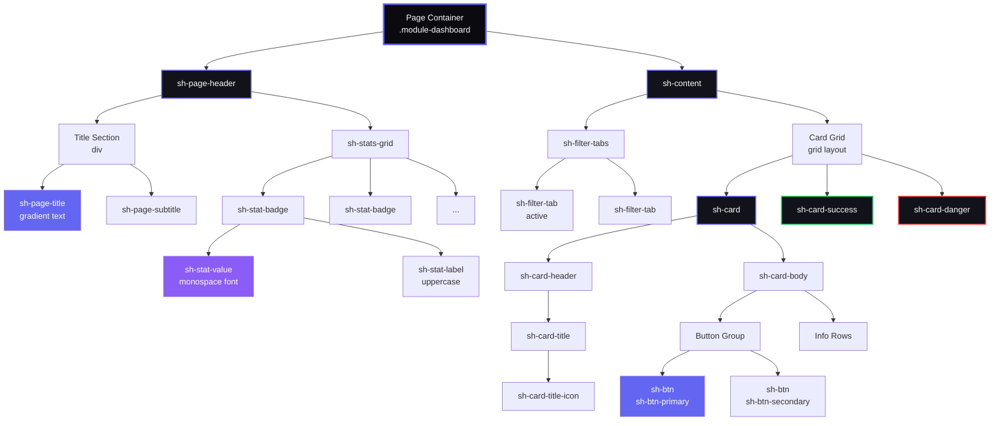
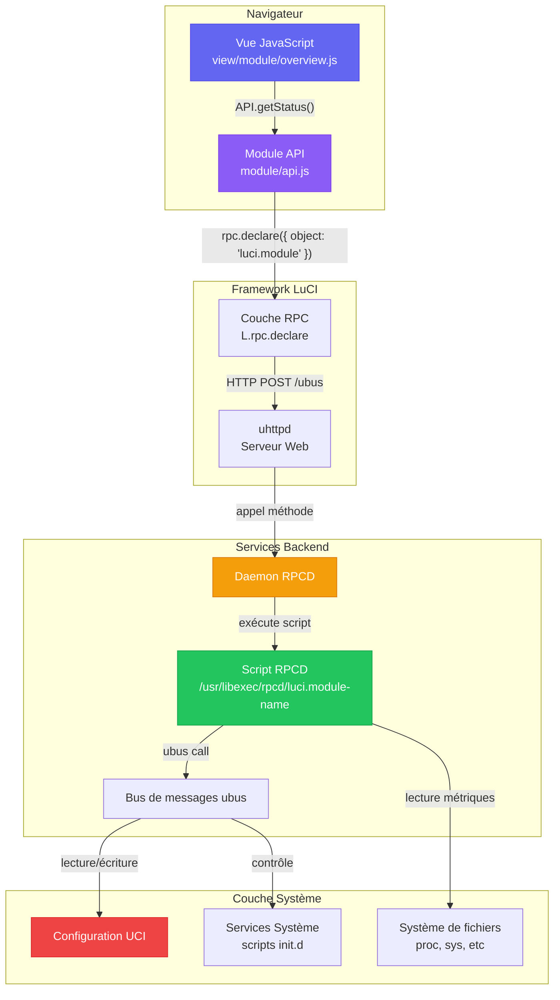
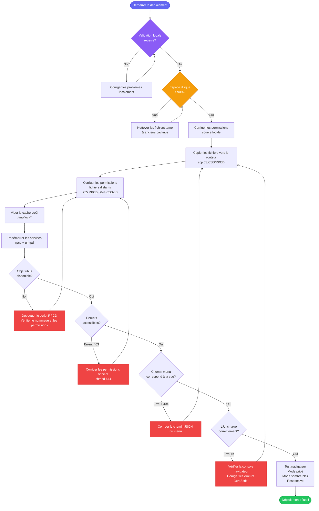

# SecuBox & System Hub - Guide de Développement

> **Langues disponibles:** [English](../docs/development-guidelines.md) | **Français** | [中文](../docs-zh/development-guidelines.md)

**Version:** 1.0.0
**Dernière mise à jour:** 2025-12-28
**Statut:** Actif
**Audience:** Développeurs, assistants IA, mainteneurs

Ce document définit les standards, bonnes pratiques et validations obligatoires pour le développement de modules SecuBox et System Hub dans l'écosystème OpenWrt LuCI.

---

## Table des matières

1. [Design System & Directives UI](#design-system--directives-ui)
2. [Architecture & Conventions de nommage](#architecture--conventions-de-nommage)
3. [Bonnes pratiques RPCD & ubus](#bonnes-pratiques-rpcd--ubus)
4. [ACL & Permissions](#acl--permissions)
5. [Patterns JavaScript](#patterns-javascript)
6. [Standards CSS/Styles](#standards-cssstyles)
7. [Erreurs courantes & Solutions](#erreurs-courantes--solutions)
8. [Liste de vérification](#liste-de-vérification)
9. [Procédures de déploiement](#procédures-de-déploiement)
10. [Fichiers contextuels pour assistants IA](#fichiers-contextuels-pour-assistants-ia)

---

## Design System & Directives UI

### Palette de couleurs (inspirée de la démo)

**IMPORTANT:** Toujours utiliser la palette définie dans `system-hub/common.css`

#### Mode sombre (Principal - Recommandé)
```css
--sh-text-primary: #fafafa;
--sh-text-secondary: #a0a0b0;
--sh-bg-primary: #0a0a0f;      /* Fond principal (noir profond) */
--sh-bg-secondary: #12121a;     /* Fond cartes/sections */
--sh-bg-tertiary: #1a1a24;      /* Fond survol/actif */
--sh-bg-card: #12121a;
--sh-border: #2a2a35;
--sh-primary: #6366f1;          /* Indigo */
--sh-primary-end: #8b5cf6;      /* Violet (pour dégradés) */
--sh-success: #22c55e;          /* Vert */
--sh-danger: #ef4444;           /* Rouge */
--sh-warning: #f59e0b;          /* Orange */
```

#### Mode clair (Secondaire)
```css
--sh-text-primary: #0f172a;
--sh-text-secondary: #475569;
--sh-bg-primary: #ffffff;
--sh-bg-secondary: #f8fafc;
--sh-bg-tertiary: #f1f5f9;
--sh-bg-card: #ffffff;
--sh-border: #e2e8f0;
```

**TOUJOURS utiliser les variables CSS** - Ne JAMAIS coder les couleurs en dur.

### Typographie

#### Pile de polices
```css
/* Texte général */
font-family: 'Inter', -apple-system, BlinkMacSystemFont, sans-serif;

/* Valeurs numériques, IDs, code */
font-family: 'JetBrains Mono', 'Courier New', monospace;
```

**Import requis** (ajouté dans common.css):
```css
@import url('https://fonts.googleapis.com/css2?family=JetBrains+Mono:wght@400;500;600;700&family=Inter:wght@400;500;600;700&display=swap');
```

#### Tailles de police
```css
/* Titres */
--sh-title-xl: 28px;    /* Titres de page */
--sh-title-lg: 20px;    /* Titres de carte */
--sh-title-md: 16px;    /* En-têtes de section */

/* Texte */
--sh-text-base: 14px;   /* Corps du texte */
--sh-text-sm: 13px;     /* Labels, méta */
--sh-text-xs: 11px;     /* Labels majuscules */

/* Valeurs */
--sh-value-xl: 40px;    /* Grandes métriques */
--sh-value-lg: 32px;    /* Aperçu statistiques */
--sh-value-md: 28px;    /* Badges */
```

### Patterns de composants

#### Hiérarchie des composants

Le diagramme suivant montre la structure standard de page et les relations entre composants:



**Catégories de composants:**
1. **Conteneurs de mise en page:** Wrapper de page, en-tête, sections de contenu
2. **Typographie:** Titres avec effets dégradés, sous-titres, labels
3. **Affichage de données:** Badges de stats avec valeurs monospace, cartes avec bordures
4. **Navigation:** Onglets filtres, onglets navigation (sticky)
5. **Interactif:** Boutons avec dégradés et effets de survol

**Règles de style:**
- **Cartes:** Bordure supérieure 3px (dégradé au survol, ou colorée pour le statut)
- **Badges stats:** Largeur minimum 130px, police monospace pour les valeurs
- **Boutons:** Fonds en dégradé, ombre au survol, transitions douces
- **Onglets:** État actif avec fond en dégradé et lueur
- **Grilles:** Auto-fit avec minimums (130px, 240px, ou 300px)

---

#### 1. En-tête de page (Standard)

**EXIGENCE:** Chaque vue de module DOIT commencer avec ce `.sh-page-header` compact. N'introduisez pas de sections hero personnalisées ou de bannières surdimensionnées; l'en-tête garde une hauteur prévisible (titre + sous-titre à gauche, stats à droite) et garantit la cohérence entre les tableaux de bord SecuBox. Si aucune stat n'est nécessaire, gardez le conteneur mais fournissez un `.sh-stats-grid` vide pour les métriques futures.

**Variante slim:** Quand la page n'a besoin que de 2-3 métriques, utilisez `.sh-page-header-lite` + `.sh-header-chip` (voir `luci-app-vhost-manager` et les paramètres `luci-app-secubox`). Les chips portent un emoji/icône, un petit label, et la valeur; les couleurs (`.success`, `.danger`, `.warn`) communiquent l'état. Cette variante remplace les blocs hero volumineux des anciennes démos.

**Chip de version:** Exposez toujours la version du package depuis le backend RPC (lu depuis `/usr/lib/opkg/info/<pkg>.control`) et affichez-la comme premier chip (`icon: `). Cela maintient l'UI et `PKG_VERSION` synchronisés sans chercher des chaînes codées en dur.

**Structure HTML:**
```javascript
E('div', { 'class': 'sh-page-header' }, [
    E('div', {}, [
        E('h2', { 'class': 'sh-page-title' }, [
            E('span', { 'class': 'sh-page-title-icon' }, '🎯'),
            'Titre de la page'
        ]),
        E('p', { 'class': 'sh-page-subtitle' }, 'Description de la page')
    ]),
    E('div', { 'class': 'sh-stats-grid' }, [
        // Badges de stats ici
    ])
])
```

**Classes CSS:**
- `.sh-page-header` - Conteneur avec mise en page flex
- `.sh-page-title` - Effet texte en dégradé
- `.sh-page-title-icon` - Icône (sans dégradé)
- `.sh-page-subtitle` - Texte secondaire
- `.sh-stats-grid` - Grille pour badges (130px min)

#### 2. Badges de statistiques

**RÈGLE:** Minimum 130px, police monospace pour les valeurs

```javascript
E('div', { 'class': 'sh-stat-badge' }, [
    E('div', { 'class': 'sh-stat-value' }, '92'),
    E('div', { 'class': 'sh-stat-label' }, 'CPU %')
])
```

**Mise en page grille:**
```css
.sh-stats-grid {
    display: grid;
    grid-template-columns: repeat(auto-fit, minmax(130px, 1fr));
    gap: 12px;
}
```

#### 3. Cartes avec bordure colorée

**OBLIGATOIRE:** Toutes les cartes doivent avoir une bordure supérieure de 3px

```javascript
E('div', { 'class': 'sh-card sh-card-success' }, [
    E('div', { 'class': 'sh-card-header' }, [
        E('h3', { 'class': 'sh-card-title' }, [
            E('span', { 'class': 'sh-card-title-icon' }, '⚙️'),
            'Titre de la carte'
        ])
    ]),
    E('div', { 'class': 'sh-card-body' }, [
        // Contenu
    ])
])
```

**Variantes de bordure:**
- `.sh-card` - Bordure en dégradé (visible au survol)
- `.sh-card-success` - Bordure verte permanente
- `.sh-card-danger` - Bordure rouge permanente
- `.sh-card-warning` - Bordure orange permanente

#### 4. Boutons

**Boutons en dégradé (préférés):**
```javascript
E('button', { 'class': 'sh-btn sh-btn-primary' }, 'Action principale')
E('button', { 'class': 'sh-btn sh-btn-success' }, 'Action réussie')
E('button', { 'class': 'sh-btn sh-btn-danger' }, 'Action dangereuse')
E('button', { 'class': 'sh-btn sh-btn-secondary' }, 'Action secondaire')
```

**Tous les boutons doivent avoir:**
- Effet d'ombre (déjà dans CSS)
- Animation au survol (translateY(-2px))
- Transition douce (0.3s cubic-bezier)

#### 5. Onglets de filtre

```javascript
E('div', { 'class': 'sh-filter-tabs' }, [
    E('div', {
        'class': 'sh-filter-tab active',
        'data-filter': 'all'
    }, [
        E('span', { 'class': 'sh-tab-icon' }, '📋'),
        E('span', { 'class': 'sh-tab-label' }, 'Tous')
    ])
])
```

**Style de l'onglet actif:**
- Fond: dégradé indigo-violet
- Couleur: blanc
- Box-shadow avec lueur

### Systèmes de grille

#### Aperçu stats (Compact)
```css
grid-template-columns: repeat(auto-fit, minmax(130px, 1fr));
gap: 16px;
```

#### Cartes métriques (Moyen)
```css
grid-template-columns: repeat(auto-fit, minmax(240px, 1fr));
gap: 20px;
```

#### Cartes info (Grand)
```css
grid-template-columns: repeat(auto-fit, minmax(300px, 1fr));
gap: 20px;
```

### Effets de dégradé

#### Texte en dégradé (Titres)
```css
background: linear-gradient(135deg, var(--sh-primary), var(--sh-primary-end));
-webkit-background-clip: text;
-webkit-text-fill-color: transparent;
background-clip: text;
```

**Utiliser:** la classe `.sh-gradient-text` ou `.sh-page-title`

#### Fonds en dégradé (Boutons, Badges)
```css
background: linear-gradient(135deg, var(--sh-primary), var(--sh-primary-end));
```

#### Bordures en dégradé (Haut)
```css
/* Bordure supérieure 3px avec dégradé */
.element::before {
    content: '';
    position: absolute;
    top: 0;
    left: 0;
    right: 0;
    height: 3px;
    background: linear-gradient(90deg, var(--sh-primary), var(--sh-primary-end));
}
```

### Standards d'animation

#### Effets de survol
```css
transition: all 0.3s cubic-bezier(0.4, 0, 0.2, 1);
transform: translateY(-3px);  /* Cartes */
transform: translateY(-2px);  /* Boutons, badges */
```

#### Progression des ombres
```css
/* Par défaut */
box-shadow: none;

/* Survol - Subtil */
box-shadow: 0 8px 20px var(--sh-shadow);

/* Survol - Prononcé */
box-shadow: 0 12px 28px var(--sh-hover-shadow);

/* Survol bouton */
box-shadow: 0 8px 20px rgba(99, 102, 241, 0.5);
```

---

## Architecture & Conventions de nommage

### Vue d'ensemble de l'architecture système

Le diagramme suivant illustre le flux de données complet du JavaScript navigateur au backend système:



**Composants clés:**
1. **Couche navigateur:** Les vues JavaScript et modules API gèrent l'UI et les requêtes de données
2. **Framework LuCI:** La couche RPC traduit les appels JavaScript en protocole ubus
3. **Services backend:** RPCD exécute les scripts shell via le bus de messages ubus
4. **Couche système:** Les configs UCI, services système et système de fichiers fournissent les données

**Règle de nommage critique:** Le nom du script RPCD **DOIT** correspondre au paramètre `object` dans le `rpc.declare()` JavaScript.

---

### CRITIQUE: Nommage des scripts RPCD

**RÈGLE ABSOLUE:** Le nom du fichier RPCD DOIT correspondre EXACTEMENT au nom de l'objet ubus dans JavaScript.

#### CORRECT:

**JavaScript:**
```javascript
var callStatus = rpc.declare({
    object: 'luci.system-hub',  // ← Nom objet
    method: 'getHealth'
});
```

**Fichier RPCD:**
```bash
root/usr/libexec/rpcd/luci.system-hub  # ← CORRESPONDANCE EXACTE
```

#### INCORRECT (Causes d'erreur -32000):

```bash
# Mauvais - manque le préfixe
root/usr/libexec/rpcd/system-hub

# Mauvais - underscore au lieu de tiret
root/usr/libexec/rpcd/luci.system_hub

# Mauvais - nom différent
root/usr/libexec/rpcd/systemhub
```

### Conventions de chemin de menu

**RÈGLE:** Les chemins dans menu.d/*.json doivent correspondre EXACTEMENT aux fichiers de vue.

#### CORRECT:

**JSON du menu:**
```json
{
    "action": {
        "type": "view",
        "path": "system-hub/overview"
    }
}
```

**Fichier de vue:**
```bash
htdocs/luci-static/resources/view/system-hub/overview.js
```

#### INCORRECT (Cause erreur 404):

Menu: `"path": "system-hub/overview"` mais fichier: `view/systemhub/overview.js`

### Préfixes standards

| Type | Préfixe | Exemple |
|------|---------|---------|
| Objets ubus | `luci.` | `luci.system-hub` |
| Classes CSS | `sh-` (System Hub) ou `sb-` (SecuBox) | `.sh-page-header` |
| Variables CSS | `--sh-` | `--sh-primary` |
| Modules JavaScript | Nom du module | `system-hub/api.js` |

### Template de structure de fichiers

```
luci-app-<module-name>/
├── Makefile
├── README.md
├── htdocs/luci-static/resources/
│   ├── view/<module-name>/
│   │   ├── overview.js         # Page principale
│   │   ├── settings.js         # Configuration
│   │   └── *.js                # Autres vues
│   └── <module-name>/
│       ├── api.js              # Client RPC
│       ├── theme.js            # Helpers de thème (optionnel)
│       ├── common.css          # Styles partagés
│       └── *.css               # Styles spécifiques
└── root/
    ├── usr/
    │   ├── libexec/rpcd/
    │   │   └── luci.<module-name>    # DOIT correspondre à l'objet ubus
    │   └── share/
    │       ├── luci/menu.d/
    │       │   └── luci-app-<module-name>.json
    │       └── rpcd/acl.d/
    │           └── luci-app-<module-name>.json
    └── etc/config/<module-name> (optionnel)
```

---

## Bonnes pratiques RPCD & ubus

### Template de script RPCD (Shell)

**Fichier:** `root/usr/libexec/rpcd/luci.<module-name>`

```bash
#!/bin/sh
# Backend RPCD pour <module-name>
# objet ubus: luci.<module-name>

case "$1" in
    list)
        # Liste des méthodes disponibles
        echo '{
            "getStatus": {},
            "getHealth": {},
            "getServices": {}
        }'
        ;;
    call)
        case "$2" in
            getStatus)
                # TOUJOURS retourner du JSON valide
                printf '{"enabled": true, "version": "1.0.0"}\n'
                ;;
            getHealth)
                # Lire les métriques système
                cpu_usage=$(top -bn1 | grep "CPU:" | awk '{print $2}' | sed 's/%//')
                mem_total=$(free | grep Mem | awk '{print $2}')
                mem_used=$(free | grep Mem | awk '{print $3}')

                printf '{
                    "cpu": {"usage": %s},
                    "memory": {"total_kb": %s, "used_kb": %s}
                }\n' "$cpu_usage" "$mem_total" "$mem_used"
                ;;
            getServices)
                # Exemple avec services
                services='[]'
                for service in /etc/init.d/*; do
                    # Construire tableau JSON
                    :
                done
                echo "$services"
                ;;
            *)
                echo '{"error": "Méthode non trouvée"}'
                exit 1
                ;;
        esac
        ;;
esac
```

### Validation des scripts RPCD

**CHECKLIST OBLIGATOIRE:**

1. Fichier exécutable: `chmod +x root/usr/libexec/rpcd/luci.<module-name>`
2. Shebang présent: `#!/bin/sh`
3. Structure case/esac correcte
4. Méthode `list` retourne JSON avec toutes les méthodes
5. Méthode `call` gère tous les cas
6. Toujours retourner du JSON valide
7. Pas de `echo` de debug (commentés en prod)
8. Gestion d'erreur pour méthodes inconnues

### Test des scripts RPCD

**Sur le routeur:**

```bash
# Test direct
/usr/libexec/rpcd/luci.system-hub list

# Via ubus
ubus list luci.system-hub
ubus call luci.system-hub getStatus

# Redémarrer RPCD après modification
/etc/init.d/rpcd restart
```

### Erreurs RPCD courantes

#### Erreur: "Object not found" (-32000)

**Cause:** Nom du fichier RPCD ne correspond pas à l'objet ubus

**Solution:**
```bash
# Vérifier le nom dans JS
grep -r "object:" htdocs/luci-static/resources/view/ --include="*.js"

# Renommer le fichier RPCD pour correspondre
mv root/usr/libexec/rpcd/wrong-name root/usr/libexec/rpcd/luci.correct-name
```

#### Erreur: "Method not found" (-32601)

**Cause:** Méthode non déclarée dans `list` ou non implémentée dans `call`

**Solution:**
```bash
# Vérifier que la méthode est dans les deux blocs
grep "getStatus" root/usr/libexec/rpcd/luci.*
```

#### Erreur: JSON invalide retourné

**Cause:** Sortie RPCD n'est pas du JSON valide

**Solution:**
```bash
# Tester le JSON
/usr/libexec/rpcd/luci.module-name call getStatus | jsonlint

# Utiliser printf au lieu de echo pour le JSON
printf '{"key": "%s"}\n' "$value"
```

---

## ACL & Permissions

### Template de fichier ACL

**Fichier:** `root/usr/share/rpcd/acl.d/luci-app-<module-name>.json`

```json
{
    "luci-app-<module-name>": {
        "description": "Accorder l'accès à <Module Name>",
        "read": {
            "ubus": {
                "luci.<module-name>": [
                    "getStatus",
                    "getHealth",
                    "getServices"
                ]
            },
            "uci": [
                "<module-name>"
            ]
        },
        "write": {
            "ubus": {
                "luci.<module-name>": [
                    "setConfig",
                    "restartService"
                ]
            },
            "uci": [
                "<module-name>"
            ]
        }
    }
}
```

### Bonnes pratiques ACL

1. **Séparation lecture/écriture:** Ne donnez que les permissions nécessaires
2. **Liste explicite:** Listez toutes les méthodes ubus utilisées
3. **Accès UCI:** Ajoutez les configs UCI dans `read` et `write`
4. **Validation JSON:** Toujours valider avec `jsonlint`

### Erreurs ACL courantes

#### Erreur: "Access denied"

**Cause:** Méthode ubus pas dans ACL

**Solution:**
```json
{
    "read": {
        "ubus": {
            "luci.system-hub": [
                "getHealth"  // ← Ajouter la méthode manquante
            ]
        }
    }
}
```

#### Erreur: "UCI config not accessible"

**Cause:** Config UCI pas dans ACL

**Solution:**
```json
{
    "read": {
        "uci": [
            "system-hub"  // ← Ajouter la config
        ]
    }
}
```

---

## Patterns JavaScript

### Template de module API

**Fichier:** `htdocs/luci-static/resources/<module-name>/api.js`

```javascript
'use strict';
'require rpc';
'require uci';

return L.Class.extend({
    // Déclarer les appels RPC
    callGetStatus: rpc.declare({
        object: 'luci.<module-name>',
        method: 'getStatus',
        expect: { }
    }),

    callGetHealth: rpc.declare({
        object: 'luci.<module-name>',
        method: 'getHealth',
        expect: { }
    }),

    // Méthodes wrapper avec gestion d'erreur
    getStatus: function() {
        return this.callGetStatus().catch(function(err) {
            console.error('Échec de récupération du statut:', err);
            return { enabled: false, error: err.message };
        });
    },

    getHealth: function() {
        return this.callGetHealth().catch(function(err) {
            console.error('Échec de récupération de la santé:', err);
            return {
                cpu: { usage: 0 },
                memory: { usage: 0 },
                error: err.message
            };
        });
    },

    // Utilitaires
    formatBytes: function(bytes) {
        if (bytes === 0) return '0 B';
        var k = 1024;
        var sizes = ['B', 'KB', 'MB', 'GB'];
        var i = Math.floor(Math.log(bytes) / Math.log(k));
        return parseFloat((bytes / Math.pow(k, i)).toFixed(2)) + ' ' + sizes[i];
    }
});
```

### Template de vue

**Fichier:** `htdocs/luci-static/resources/view/<module-name>/overview.js`

```javascript
'use strict';
'require view';
'require ui';
'require dom';
'require poll';
'require <module-name>/api as API';

return view.extend({
    // État
    healthData: null,
    sysInfo: null,

    // Charger les données
    load: function() {
        return Promise.all([
            API.getStatus(),
            API.getHealth()
        ]);
    },

    // Rendre l'UI
    render: function(data) {
        var self = this;
        this.sysInfo = data[0] || {};
        this.healthData = data[1] || {};

        var container = E('div', { 'class': '<module>-dashboard' }, [
            // Lier les fichiers CSS
            E('link', { 'rel': 'stylesheet', 'href': L.resource('<module>/common.css') }),
            E('link', { 'rel': 'stylesheet', 'href': L.resource('<module>/overview.css') }),

            // En-tête
            this.renderHeader(),

            // Contenu
            this.renderContent()
        ]);

        // Configurer le rafraîchissement automatique
        poll.add(L.bind(function() {
            return Promise.all([
                API.getStatus(),
                API.getHealth()
            ]).then(L.bind(function(refreshData) {
                this.sysInfo = refreshData[0] || {};
                this.healthData = refreshData[1] || {};
                this.updateDashboard();
            }, this));
        }, this), 30); // Rafraîchir toutes les 30s

        return container;
    },

    renderHeader: function() {
        return E('div', { 'class': 'sh-page-header' }, [
            // Contenu de l'en-tête
        ]);
    },

    renderContent: function() {
        return E('div', { 'class': 'sh-content' }, [
            // Contenu principal
        ]);
    },

    updateDashboard: function() {
        // Mettre à jour les éléments DOM existants
        var element = document.querySelector('.my-element');
        if (element) {
            dom.content(element, this.renderContent());
        }
    },

    // Stubs requis pour LuCI
    handleSaveApply: null,
    handleSave: null,
    handleReset: null
});
```

### Pattern de gestion des événements

```javascript
// CORRECT: Lier les événements après le rendu
render: function(data) {
    var container = E('div', {}, [
        E('button', {
            'id': 'my-button',
            'class': 'sh-btn sh-btn-primary'
        }, 'Cliquez-moi')
    ]);

    // Ajouter l'événement après la création du conteneur
    container.addEventListener('click', function(ev) {
        if (ev.target && ev.target.id === 'my-button') {
            self.handleButtonClick();
        }
    });

    return container;
},

handleButtonClick: function() {
    ui.addNotification(null, E('p', 'Bouton cliqué!'), 'info');
}
```

### Erreurs JavaScript courantes

#### Erreur: "[object HTMLButtonElement]" affiché

**Cause:** Array imbriqué quand E() attend un array simple

```javascript
// INCORRECT
E('div', {}, [
    this.renderButtons()  // renderButtons retourne déjà un array
])

// CORRECT
E('div', {},
    this.renderButtons()  // Pas de [ ] supplémentaire
)
```

#### Erreur: "Cannot read property of undefined"

**Cause:** Données API non disponibles

```javascript
// INCORRECT
var cpuUsage = this.healthData.cpu.usage;

// CORRECT (avec optional chaining)
var cpuUsage = (this.healthData.cpu && this.healthData.cpu.usage) || 0;
// ou
var cpuUsage = this.healthData.cpu?.usage || 0; // ES2020
```

#### Erreur: "poll callback failed"

**Cause:** Promise non retournée dans poll.add

```javascript
// INCORRECT
poll.add(function() {
    API.getHealth(); // Pas de return!
}, 30);

// CORRECT
poll.add(function() {
    return API.getHealth().then(function(data) {
        // Mettre à jour l'UI
    });
}, 30);
```

---

## Standards CSS/Styles

### Organisation des fichiers

```
<module-name>/
├── common.css       # Composants partagés (en-têtes, boutons, cartes, onglets)
├── overview.css     # Spécifique à la page aperçu
├── services.css     # Spécifique à la page services
└── *.css            # Autres styles spécifiques aux pages
```

### Template de fichier CSS

```css
/**
 * Nom du module - Styles de page/composant
 * Description de ce que ce fichier stylise
 * Version: X.Y.Z
 */

/* === Importer les styles partagés (si nécessaire) === */
/* Non requis si chargé dans le HTML */

/* === Variables spécifiques à la page (si nécessaire) === */
:root {
    --page-specific-var: value;
}

/* === Mise en page === */
.module-page-container {
    /* Styles de mise en page */
}

/* === Composants === */
.module-component {
    /* Styles de composant */
}

/* === Responsive === */
@media (max-width: 768px) {
    /* Styles mobile */
}

/* === Surcharges mode sombre === */
[data-theme="dark"] .module-component {
    /* Spécifique au mode sombre */
}
```

### Bonnes pratiques CSS

#### 1. TOUJOURS utiliser les variables CSS

```css
/* INCORRECT */
.my-card {
    background: #12121a;
    color: #fafafa;
}

/* CORRECT */
.my-card {
    background: var(--sh-bg-card);
    color: var(--sh-text-primary);
}
```

#### 2. Préfixer les classes par module

```css
/* System Hub */
.sh-page-header { }
.sh-card { }
.sh-btn { }

/* SecuBox */
.sb-module-grid { }
.sb-dashboard { }

/* Module spécifique */
.netdata-chart { }
.crowdsec-alert { }
```

#### 3. Transitions cohérentes

```css
/* Transition standard */
transition: all 0.3s cubic-bezier(0.4, 0, 0.2, 1);

/* Transition rapide (états de survol) */
transition: all 0.2s ease;

/* Transition douce (grands mouvements) */
transition: all 0.5s ease;
```

#### 4. Points de rupture responsive

```css
/* Mobile */
@media (max-width: 768px) {
    .sh-stats-grid {
        grid-template-columns: repeat(2, 1fr);
    }
}

/* Tablette */
@media (min-width: 769px) and (max-width: 1024px) {
    /* Spécifique tablette */
}

/* Bureau */
@media (min-width: 1025px) {
    /* Spécifique bureau */
}
```

#### 5. Mode sombre OBLIGATOIRE

**Toujours fournir des styles mode sombre:**

```css
/* Mode clair (par défaut) */
.my-component {
    background: var(--sh-bg-card);
    border: 1px solid var(--sh-border);
}

/* Surcharge mode sombre */
[data-theme="dark"] .my-component {
    background: var(--sh-bg-card);
    border-color: var(--sh-border);
}
```

### Échelle z-index

**Respecter cette échelle:**

```css
--z-base: 0;
--z-dropdown: 100;
--z-sticky: 200;
--z-fixed: 300;
--z-modal-backdrop: 400;
--z-modal: 500;
--z-popover: 600;
--z-tooltip: 700;
```

---

## Erreurs courantes & Solutions

### 1. Objet RPCD non trouvé (-32000)

**Erreur complète:**
```
RPC call to luci.system-hub/getHealth failed with error -32000: Object not found
```

**Diagnostic:**
```bash
# 1. Vérifier que le fichier RPCD existe
ls -la /usr/libexec/rpcd/luci.system-hub

# 2. Vérifier qu'il est exécutable
chmod +x /usr/libexec/rpcd/luci.system-hub

# 3. Lister les objets ubus
ubus list | grep system-hub

# 4. Si absent, redémarrer RPCD
/etc/init.d/rpcd restart
ubus list | grep system-hub
```

**Solutions:**
1. Renommer le fichier RPCD pour correspondre exactement
2. Vérifier les permissions (755 ou rwxr-xr-x)
3. Redémarrer rpcd

### 2. Vue non trouvée (404)

**Erreur:**
```
HTTP error 404 while loading class file '/luci-static/resources/view/system-hub/overview.js'
```

**Diagnostic:**
```bash
# 1. Vérifier que le fichier existe
ls -la /www/luci-static/resources/view/system-hub/overview.js

# 2. Vérifier le chemin dans menu.d
grep "path" /usr/share/luci/menu.d/luci-app-system-hub.json
```

**Solutions:**
1. Vérifier que le chemin dans le JSON du menu correspond au fichier
2. Vérifier les permissions du fichier (644)
3. Nettoyer le cache: `rm -f /tmp/luci-indexcache /tmp/luci-modulecache/*`

### 3. CSS non chargé (403 Forbidden)

**Erreur:**
```
GET /luci-static/resources/system-hub/common.css 403 Forbidden
```

**Diagnostic:**
```bash
# Vérifier les permissions
ls -la /www/luci-static/resources/system-hub/common.css
```

**Solution:**
```bash
# Corriger les permissions
chmod 644 /www/luci-static/resources/system-hub/*.css
```

### 4. JSON invalide depuis RPCD

**Erreur dans la console navigateur:**
```
SyntaxError: Unexpected token in JSON at position X
```

**Diagnostic:**
```bash
# Tester le JSON directement
/usr/libexec/rpcd/luci.system-hub call getHealth | jsonlint

# Ou avec jq
/usr/libexec/rpcd/luci.system-hub call getHealth | jq .
```

**Solutions courantes:**
```bash
# INCORRECT - Quote simple non échappée
echo '{"error": "can't process"}'

# CORRECT - Utiliser printf et doubles quotes
printf '{"error": "cannot process"}\n'

# INCORRECT - Variable non quotée
echo "{\"value\": $var}"

# CORRECT - Variable quotée
printf '{"value": "%s"}\n' "$var"
```

### 5. Problèmes de cache navigateur

**Symptômes:**
- Changements CSS/JS non visibles
- Anciennes données affichées
- Code mis à jour mais interface identique

**Solutions:**
```bash
# 1. Côté serveur - nettoyer le cache LuCI
ssh root@router "rm -f /tmp/luci-indexcache /tmp/luci-modulecache/* && /etc/init.d/uhttpd restart"

# 2. Côté client - actualisation forcée
Ctrl + Shift + R (Chrome/Firefox)
Ctrl + F5 (Windows)
Cmd + Shift + R (Mac)

# 3. Mode privé/incognito pour test
Ctrl + Shift + N (Chrome)
Ctrl + Shift + P (Firefox)
```

### 6. Accès ACL refusé

**Erreur:**
```
Access to path '/admin/secubox/system/system-hub' denied
```

**Diagnostic:**
```bash
# Vérifier l'ACL
cat /usr/share/rpcd/acl.d/luci-app-system-hub.json | jq .

# Vérifier que les méthodes ubus sont listées
grep "getHealth" /usr/share/rpcd/acl.d/luci-app-system-hub.json
```

**Solution:**
Ajouter la méthode manquante dans l'ACL et redémarrer rpcd.

---

## Liste de vérification

### Checklist pré-commit

Avant chaque commit, vérifier:

- [ ] **Script RPCD:**
  - [ ] Nom du fichier correspond à l'objet ubus
  - [ ] Exécutable (chmod +x)
  - [ ] Structure list/call correcte
  - [ ] Retourne du JSON valide
  - [ ] Toutes les méthodes implémentées

- [ ] **Menu & ACL:**
  - [ ] Chemin du menu correspond au fichier vue
  - [ ] L'ACL liste toutes les méthodes ubus
  - [ ] JSON valide (jsonlint)

- [ ] **JavaScript:**
  - [ ] 'use strict' en première ligne
  - [ ] Imports requis présents
  - [ ] Pas de console.log en prod
  - [ ] Gestion d'erreur sur les appels API
  - [ ] Gestionnaires d'événements liés correctement

- [ ] **CSS:**
  - [ ] Variables CSS utilisées (pas de valeurs codées en dur)
  - [ ] Classes préfixées (sh-, sb-, module-)
  - [ ] Mode sombre supporté
  - [ ] Responsive (max-width: 768px)
  - [ ] Transitions cohérentes

- [ ] **Makefile:**
  - [ ] PKG_VERSION incrémenté
  - [ ] LUCI_DEPENDS correct
  - [ ] Chemin d'inclusion correct (../../luci.mk)

### Checklist pré-déploiement

Avant le déploiement sur le routeur:

- [ ] **Scripts de validation:**
  ```bash
  ./secubox-tools/validate-modules.sh
  ```

- [ ] **Test RPCD local:**
  ```bash
  /usr/libexec/rpcd/luci.module-name list
  /usr/libexec/rpcd/luci.module-name call getStatus
  ```

- [ ] **Test JSON:**
  ```bash
  find . -name "*.json" -exec jsonlint {} \;
  ```

- [ ] **Shellcheck:**
  ```bash
  shellcheck root/usr/libexec/rpcd/*
  ```

- [ ] **Permissions:**
  ```bash
  # Scripts RPCD
  chmod 755 root/usr/libexec/rpcd/*

  # Fichiers CSS/JS
  chmod 644 htdocs/luci-static/resources/**/*
  ```

### Checklist post-déploiement

Après le déploiement:

- [ ] **Services:**
  ```bash
  /etc/init.d/rpcd status
  /etc/init.d/uhttpd status
  ```

- [ ] **Objets ubus:**
  ```bash
  ubus list | grep luci.module-name
  ```

- [ ] **Fichiers présents:**
  ```bash
  ls -la /www/luci-static/resources/view/module-name/
  ls -la /www/luci-static/resources/module-name/
  ```

- [ ] **Permissions correctes:**
  ```bash
  ls -la /usr/libexec/rpcd/luci.module-name
  ls -la /www/luci-static/resources/module-name/*.css
  ```

- [ ] **Test navigateur:**
  - [ ] Ouvrir en mode privé
  - [ ] Vérifier la console (F12) - pas d'erreurs
  - [ ] Vérifier l'onglet Network - tous les fichiers chargent (200)
  - [ ] Tester le mode sombre/clair
  - [ ] Tester le responsive (vue mobile)

---

## Procédures de déploiement

### Workflow de déploiement

Le diagramme suivant illustre le processus de déploiement complet avec les points de contrôle de validation:



**Étapes de déploiement:**
1. **Validation locale:** Exécuter `validate-modules.sh` et `fix-permissions.sh --local`
2. **Vérifications préalables:** Espace disque et vérification des permissions
3. **Transfert de fichiers:** Copier JavaScript, CSS et scripts RPCD
4. **Configuration distante:** Corriger les permissions et vider les caches
5. **Redémarrage des services:** Recharger les daemons rpcd et uhttpd
6. **Validation:** Vérification multi-étapes (ubus, fichiers, menu, UI)
7. **Tests:** Tests navigateur en mode privé

**Chemins de récupération d'erreur courants:**
- **Objet non trouvé (-32000):** Vérifier le nommage et les permissions du script RPCD
- **403 Forbidden:** Corriger les permissions des fichiers à 644 pour CSS/JS
- **404 Not Found:** Vérifier que le chemin du menu correspond à l'emplacement du fichier vue
- **Erreurs JavaScript:** Vérifier la console navigateur et corriger les problèmes de code

---

### Vérifications pré-déploiement (CRITIQUE)

**TOUJOURS exécuter ces vérifications AVANT tout déploiement:**

#### 1. Vérification de l'espace disque

```bash
# Sur le routeur cible
ssh root@192.168.8.191 "df -h | grep overlay"

# Vérifier que l'utilisation est < 90%
# Exemple OK:
# /dev/loop0    98.8M    45.2M    53.6M   46% /overlay

# Exemple CRITIQUE (ARRÊTER le déploiement):
# /dev/loop0    98.8M    98.8M       0  100% /overlay  ← PLEIN!
```

**Si l'overlay est plein (≥95%):**
```bash
# Libérer de l'espace avant le déploiement
ssh root@192.168.8.191 << 'EOF'
# Supprimer les fichiers temporaires
rm -rf /tmp/*.ipk /tmp/luci-* 2>/dev/null

# Supprimer les anciens backups (>7 jours)
find /root -name '*.backup-*' -type f -mtime +7 -delete 2>/dev/null

# Vérifier les packages inutilisés
opkg list-installed | grep -E 'netdata|unused'

# Après nettoyage, vérifier l'espace libéré
df -h | grep overlay
EOF
```

**Tailles typiques à surveiller:**
- UI web Netdata: ~22MB (considérer la suppression si non utilisé)
- Modules LuCI: ~1-2MB chacun
- Fichiers CSS/JS: ~10-50KB chacun

#### 2. Vérification des permissions (Critique pour éviter les erreurs 403)

**Permissions OBLIGATOIRES:**

| Type | Permission | Octal | Raison |
|------|-----------|-------|--------|
| **Scripts RPCD** | `rwxr-xr-x` | `755` | Exécutable par le système |
| **Fichiers CSS** | `rw-r--r--` | `644` | Lecture serveur web |
| **Fichiers JS** | `rw-r--r--` | `644` | Lecture serveur web |
| **Fichiers JSON** | `rw-r--r--` | `644` | Lecture rpcd |

**Erreur courante:** Fichiers créés avec `600` (rw-------) au lieu de `644`

**Symptôme:** HTTP 403 Forbidden lors du chargement de fichiers JS/CSS

**Exemple d'erreur:**
```
NetworkError: HTTP error 403 while loading class file
"/luci-static/resources/view/netdata-dashboard/dashboard.js"
```

**Diagnostic rapide:**
```bash
# Vérifier les permissions des fichiers déployés
ssh root@192.168.8.191 "ls -la /www/luci-static/resources/view/MODULE_NAME/"

# Chercher les fichiers avec des permissions incorrectes (600)
ssh root@192.168.8.191 "find /www/luci-static/resources/view/ -type f -name '*.js' -perm 600"

# MAUVAIS (cause 403):
# -rw-------  1 root root  9763 dashboard.js  ← 600 = pas lisible par le web!

# BON:
# -rw-r--r--  1 root root  9763 dashboard.js  ← 644 = OK
```

**Correction immédiate:**
```bash
# Corriger TOUS les fichiers CSS/JS
ssh root@192.168.8.191 << 'EOF'
find /www/luci-static/resources/ -name '*.css' -exec chmod 644 {} \;
find /www/luci-static/resources/ -name '*.js' -exec chmod 644 {} \;
find /usr/libexec/rpcd/ -name 'luci.*' -exec chmod 755 {} \;
EOF
```

**Correction automatique (Recommandé):**

Utiliser le script automatique qui vérifie et corrige toutes les permissions:

```bash
# Corriger les permissions locales (code source)
./secubox-tools/fix-permissions.sh --local

# Corriger les permissions sur le routeur
./secubox-tools/fix-permissions.sh --remote

# Corriger les deux (local + distant)
./secubox-tools/fix-permissions.sh
```

Le script `fix-permissions.sh` effectue automatiquement:
- Fixe tous les scripts RPCD à 755
- Fixe tous les CSS à 644
- Fixe tous les JS à 644
- Vérifie qu'aucun fichier 600 ne reste
- Vide le cache et redémarre les services (mode distant)
- Affiche un rapport complet des changements

**Validation automatique des permissions:**

Le script `validate-modules.sh` inclut maintenant un Check 7 qui vérifie automatiquement les permissions:

```bash
./secubox-tools/validate-modules.sh

# Le Check 7 validera:
# ✓ Tous les RPCD sont 755
# ✓ Tous les CSS sont 644
# ✓ Tous les JS sont 644
# ✗ Affichera des erreurs si les permissions sont incorrectes
```

**Workflow recommandé:**
1. Développer/modifier le code
2. `./secubox-tools/fix-permissions.sh --local` (avant commit)
3. `./secubox-tools/validate-modules.sh` (tout vérifier)
4. Commit & push
5. Déployer sur le routeur
6. `./secubox-tools/fix-permissions.sh --remote` (après déploiement)

#### 3. Vérification post-déploiement

**Checklist après déploiement:**

```bash
#!/bin/bash
ROUTER="root@192.168.8.191"
MODULE="module-name"

echo "Vérification post-déploiement"
echo ""

# 1. Vérifier l'espace disque
echo "1. Espace disque restant:"
ssh "$ROUTER" "df -h | grep overlay | awk '{print \$5}'" || echo "ÉCHEC"

# 2. Vérifier les permissions CSS/JS
echo "2. Permissions CSS/JS:"
ssh "$ROUTER" "find /www/luci-static/resources/$MODULE -type f \( -name '*.css' -o -name '*.js' \) ! -perm 644" | \
    if [ -z "$(cat)" ]; then echo "OK"; else echo "ÉCHEC - Permissions incorrectes"; fi

# 3. Vérifier les permissions RPCD
echo "3. Permissions RPCD:"
ssh "$ROUTER" "ls -l /usr/libexec/rpcd/luci.$MODULE | grep -q rwxr-xr-x" && echo "OK" || echo "ÉCHEC"

# 4. Vérifier l'objet ubus
echo "4. Objet ubus disponible:"
ssh "$ROUTER" "ubus list | grep -q luci.$MODULE" && echo "OK" || echo "ÉCHEC"

# 5. Vérifier que les fichiers sont accessibles (HTTP)
echo "5. Fichiers web accessibles:"
ssh "$ROUTER" "test -r /www/luci-static/resources/$MODULE/common.css" && echo "OK" || echo "common.css non trouvé"

# 6. Vérifier que le cache est vidé
echo "6. Cache LuCI vidé:"
ssh "$ROUTER" "test ! -f /tmp/luci-indexcache" && echo "OK" || echo "Cache encore présent"

echo ""
echo "Vérification terminée"
```

#### 4. Erreurs de déploiement courantes

| Erreur | Cause | Solution rapide |
|--------|-------|----------------|
| **HTTP 403 Forbidden** | Permissions 600 au lieu de 644 | `chmod 644 *.js *.css` |
| **No space left on device** | Overlay plein | Nettoyer /tmp, supprimer les anciens backups |
| **Object not found -32000** | RPCD pas exécutable ou mal nommé | `chmod 755 rpcd/luci.*` + vérifier le nom |
| **Module n'apparaît pas** | Cache LuCI non vidé | `rm /tmp/luci-*` + redémarrer les services |
| **Changements non visibles** | Cache navigateur | Mode privé + Ctrl+Shift+R |

#### 5. Récupération d'urgence de l'espace disque

**Si le déploiement échoue avec "No space left on device":**

```bash
#!/bin/bash
ROUTER="root@192.168.8.191"

echo "Récupération d'urgence de l'espace disque"
echo ""

# 1. Analyser l'utilisation
echo "Top 10 consommateurs:"
ssh "$ROUTER" "du -k /overlay/upper 2>/dev/null | sort -rn | head -10"

# 2. Nettoyer les fichiers temporaires
echo ""
echo "Nettoyage des fichiers temporaires..."
ssh "$ROUTER" "rm -rf /tmp/*.ipk /tmp/luci-* /root/*.ipk 2>/dev/null"

# 3. Supprimer les anciens backups
echo "Suppression des anciens backups (>7 jours)..."
ssh "$ROUTER" "find /root -name '*.backup-*' -mtime +7 -delete 2>/dev/null"

# 4. Option: Supprimer l'UI web Netdata (libère ~22MB)
echo ""
echo "Option: Supprimer l'UI web Netdata (économise ~22MB)?"
read -p "Continuer? (o/N) " -n 1 -r
if [[ $REPLY =~ ^[Oo]$ ]]; then
    ssh "$ROUTER" "opkg remove netdata-web 2>/dev/null || rm -rf /usr/share/netdata/web/*"
fi

# 5. Vérifier l'espace libéré
echo ""
echo "Espace après nettoyage:"
ssh "$ROUTER" "df -h | grep overlay"
```

### Template de script de déploiement standard

```bash
#!/bin/bash
# Déployer <Nom du module>

ROUTER="root@192.168.8.191"
MODULE="<module-name>"
LOCAL_DIR="/path/to/luci-app-$MODULE/htdocs/luci-static/resources"
REMOTE_DIR="/www/luci-static/resources"

echo "Déploiement $MODULE"
echo ""

# 1. Déployer les fichiers JS
echo "1. Copie des fichiers JS..."
scp "$LOCAL_DIR/view/$MODULE/"*.js "$ROUTER:$REMOTE_DIR/view/$MODULE/"
scp "$LOCAL_DIR/$MODULE/api.js" "$ROUTER:$REMOTE_DIR/$MODULE/"

# 2. Déployer les fichiers CSS
echo "2. Copie des fichiers CSS..."
scp "$LOCAL_DIR/$MODULE/"*.css "$ROUTER:$REMOTE_DIR/$MODULE/"

# 3. Déployer le backend RPCD
echo "3. Copie du backend RPCD..."
scp "root/usr/libexec/rpcd/luci.$MODULE" "$ROUTER:/usr/libexec/rpcd/"

# 4. Corriger les permissions
echo "4. Correction des permissions..."
ssh "$ROUTER" "chmod 755 /usr/libexec/rpcd/luci.$MODULE"
ssh "$ROUTER" "chmod 644 $REMOTE_DIR/$MODULE/*.css"
ssh "$ROUTER" "chmod 644 $REMOTE_DIR/view/$MODULE/*.js"

# 5. Vider le cache
echo "5. Nettoyage du cache..."
ssh "$ROUTER" "rm -f /tmp/luci-indexcache /tmp/luci-modulecache/* 2>/dev/null"

# 6. Redémarrer les services
echo "6. Redémarrage des services..."
ssh "$ROUTER" "/etc/init.d/rpcd restart"
ssh "$ROUTER" "/etc/init.d/uhttpd restart"

# 7. Vérifier
echo ""
echo "7. Vérification..."
ssh "$ROUTER" "ubus list | grep luci.$MODULE"

echo ""
echo "Déploiement terminé!"
echo ""
echo "Testez (mode privé):"
echo "   https://192.168.8.191/cgi-bin/luci/admin/secubox/path/to/$MODULE"
```

### Procédure de rollback

En cas de problème:

```bash
#!/bin/bash
# Revenir à la version précédente

ROUTER="root@192.168.8.191"
BACKUP_DIR="/root/luci-backups/$(date +%Y%m%d)"

# 1. Créer un backup avant le déploiement
ssh "$ROUTER" "mkdir -p $BACKUP_DIR"
ssh "$ROUTER" "cp -r /www/luci-static/resources/module-name $BACKUP_DIR/"
ssh "$ROUTER" "cp /usr/libexec/rpcd/luci.module-name $BACKUP_DIR/"

# 2. En cas de problème, restaurer
ssh "$ROUTER" "cp -r $BACKUP_DIR/module-name /www/luci-static/resources/"
ssh "$ROUTER" "cp $BACKUP_DIR/luci.module-name /usr/libexec/rpcd/"
ssh "$ROUTER" "/etc/init.d/rpcd restart && /etc/init.d/uhttpd restart"
```

### Contrôle de version

**Toujours incrémenter les versions:**

```makefile
# Makefile
PKG_VERSION:=0.3.0
PKG_RELEASE:=1
```

```css
/* Fichiers CSS */
/**
 * Module - Styles
 * Version: 0.3.0
 */
```

```javascript
// JavaScript
// Version: 0.3.0
```

**Versioning sémantique:**
- MAJOR.MINOR.PATCH (1.2.3)
- MAJOR: Changements cassants
- MINOR: Nouvelles fonctionnalités (rétrocompatible)
- PATCH: Corrections de bugs

---

## Référence rapide

### Commandes essentielles

```bash
# Validation
./secubox-tools/validate-modules.sh

# Build (local)
./secubox-tools/local-build.sh build luci-app-module-name

# Déployer les fichiers
scp file.js root@router:/www/luci-static/resources/

# Corriger les permissions
ssh root@router "chmod 644 /www/luci-static/resources/**/*.css"
ssh root@router "chmod 755 /usr/libexec/rpcd/luci.*"

# Vider le cache
ssh root@router "rm -f /tmp/luci-indexcache /tmp/luci-modulecache/*"

# Redémarrer les services
ssh root@router "/etc/init.d/rpcd restart && /etc/init.d/uhttpd restart"

# Tester ubus
ssh root@router "ubus list | grep luci"
ssh root@router "ubus call luci.module-name getStatus"

# Valider le JSON
jsonlint file.json
jq . file.json
```

### Référence rapide des classes CSS

```css
/* Mise en page */
.sh-page-header          /* Conteneur d'en-tête de page */
.sh-page-title           /* Titre de page (texte en dégradé) */
.sh-page-subtitle        /* Sous-titre de page */

/* Stats */
.sh-stats-grid           /* Grille pour les badges de stats (130px min) */
.sh-stat-badge           /* Conteneur de badge de stat */
.sh-stat-value           /* Valeur de stat (monospace) */
.sh-stat-label           /* Label de stat (majuscules) */

/* Cartes */
.sh-card                 /* Conteneur de carte (avec bordure en dégradé au survol) */
.sh-card-success         /* Carte avec bordure verte */
.sh-card-danger          /* Carte avec bordure rouge */
.sh-card-warning         /* Carte avec bordure orange */
.sh-card-header          /* En-tête de carte */
.sh-card-title           /* Titre de carte */
.sh-card-body            /* Contenu de carte */

/* Boutons */
.sh-btn                  /* Bouton de base */
.sh-btn-primary          /* Bouton principal (dégradé) */
.sh-btn-success          /* Bouton succès (vert) */
.sh-btn-danger           /* Bouton danger (rouge) */
.sh-btn-secondary        /* Bouton secondaire (contour) */

/* Onglets */
.sh-filter-tabs          /* Conteneur d'onglets de filtre */
.sh-filter-tab           /* Onglet de filtre */
.sh-filter-tab.active    /* Onglet de filtre actif (dégradé) */
.sh-nav-tabs             /* Onglets de navigation (sticky) */
.sh-nav-tab              /* Onglet de navigation */
.sh-nav-tab.active       /* Onglet de nav actif (souligné) */

/* Utilitaires */
.sh-gradient-text        /* Effet de texte en dégradé */
.sh-id-display           /* Affichage d'ID monospace */
.sh-empty-state          /* Placeholder d'état vide */
```

### Référence rapide des variables de couleur

```css
/* Texte */
var(--sh-text-primary)      /* Texte principal */
var(--sh-text-secondary)    /* Texte secondaire */

/* Fonds */
var(--sh-bg-primary)        /* Fond principal */
var(--sh-bg-secondary)      /* Fond secondaire */
var(--sh-bg-tertiary)       /* Fond tertiaire */
var(--sh-bg-card)           /* Fond de carte */

/* Bordures */
var(--sh-border)            /* Couleur de bordure */

/* Couleurs */
var(--sh-primary)           /* Indigo #6366f1 */
var(--sh-primary-end)       /* Violet #8b5cf6 */
var(--sh-success)           /* Vert #22c55e */
var(--sh-danger)            /* Rouge #ef4444 */
var(--sh-warning)           /* Orange #f59e0b */

/* Effets */
var(--sh-shadow)            /* Ombre de boîte */
var(--sh-hover-shadow)      /* Ombre au survol */
var(--sh-hover-bg)          /* Fond au survol */
```

---

## Fichiers contextuels pour assistants IA

Le travail SecuBox est partagé entre les assistants Claude et Codex. Gardez les dossiers de contexte synchronisés pour qu'un agent puisse reprendre le travail rapidement:

| Répertoire | Fichier | Usage |
|-----------|---------|-------|
| `.claude/` | `HISTORY.md` | Journal chronologique des changements UI/thème et déploiements majeurs |
| `.claude/` | `TODO.md` | Backlog de haut niveau (polish UX, docs, idées d'automatisation) |
| `.claude/` | `WIP.md` | Tâches actives, risques et prochaines étapes immédiates |
| `.codex/` | `HISTORY.md` | Miroir de la timeline de développement pour les sessions Codex |
| `.codex/` | `TODO.md` | Tâches orientées outillage (linting, scripts, automatisation de build) |
| `.codex/` | `WIP.md` | Traqueur de statut pour les efforts Codex en cours |

**Règles de maintenance**

1. **Mettre à jour après chaque session:** En terminant le travail, ajoutez un court point à HISTORY et ajustez WIP/TODO pour refléter le nouvel état.
2. **Référencer les scripts de déploiement:** Notez quel script `secubox-tools/*.sh` a été utilisé (dashboard vs full deploy) pour que l'assistant suivant sache comment le reproduire.
3. **Garder des entrées concises:** Un seul paragraphe ou point par mise à jour suffit; les spécifications détaillées restent dans DOCS.
4. **Vérifier avant les gros changements:** Lisez les deux dossiers avant de commencer le travail pour éviter les conflits ou efforts dupliqués.

Traitez ces fichiers comme des notes de passage vivantes - s'ils dérivent, l'intégration d'une nouvelle IA/coéquipier devient significativement plus lente.

---

## Conclusion

Ce guide doit être consulté **AVANT** de:
1. Créer un nouveau module
2. Modifier des styles existants
3. Ajouter des méthodes RPCD
4. Déployer sur un routeur
5. Déboguer des erreurs

**En cas de doute, TOUJOURS:**
1. Consulter ce guide
2. Exécuter validate-modules.sh
3. Tester en mode privé
4. Vérifier la console navigateur (F12)

**Ressources supplémentaires:**
- CLAUDE.md - Architecture et build
- secubox-tools/validate-modules.sh - Validation automatique
- Templates/ - Templates de code

---

**Dernière mise à jour:** 2025-12-26
**Maintenu par:** CyberMind Studio
**Version du guide:** 1.0.0
