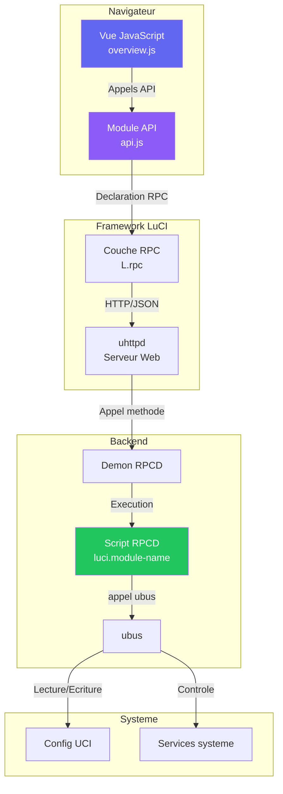
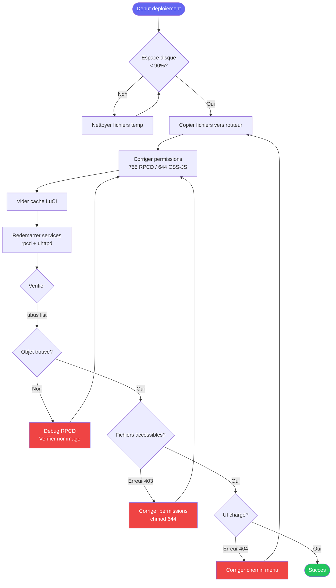
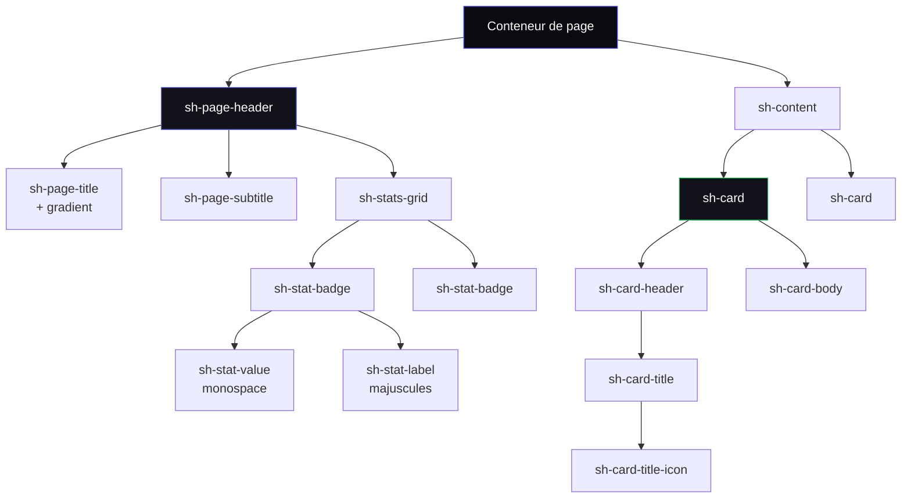

# Liste des Ameliorations de la Documentation

> **Languages:** [English](../docs/todo-analyse.md) | Francais | [中文](../docs-zh/todo-analyse.md)

**Version:** 1.0.0
**Derniere mise a jour:** 2025-12-28
**Statut:** Actif


**Genere le:** 2025-12-28
**Base sur:** Rapport d'analyse de la documentation
**Sante globale:** 8.5/10 (Excellent)
**Statut:** Phase de planification

---

## Table des matieres

1. [Actions immediates (Cette semaine)](#actions-immediates-cette-semaine)
2. [Actions a court terme (Ce mois-ci)](#actions-a-court-terme-ce-mois-ci)
3. Actions a long terme (Ce trimestre)
4. [Ameliorations optionnelles](#ameliorations-optionnelles)
5. [Suivi et metriques](#suivi-et-metriques)

---

## Actions immediates (Cette semaine)

### Priorite: HAUTE | Effort: Faible | Impact: Eleve

### 1. Standardiser les versions et dates des documents

**Statut:** Non commence
**Responsable:** _A definir_
**Temps estime:** 30 minutes

**Probleme:**
- Incoherences de versions entre les documents
- Certains documents sans en-tete de version/date
- Differents formats de date utilises

**Actions a realiser:**
- [ ] Ajouter un en-tete de version a tous les fichiers `.md`
- [ ] Utiliser un format de date coherent: `YYYY-MM-DD`
- [ ] Definir tous les documents a la version v1.0.0 comme reference
- [ ] Documenter la politique de versionnage

**Fichiers a mettre a jour:**
```markdown
En-tetes de version manquants:
- CLAUDE.md
- BUILD_ISSUES.md
- LUCI_DEVELOPMENT_REFERENCE.md
- MODULE-ENABLE-DISABLE-DESIGN.md

Dates incoherentes:
- DOCUMENTATION-INDEX.md: 2025-12-27
- DEVELOPMENT-GUIDELINES.md: 2025-12-26
- QUICK-START.md: 2025-12-26
```

**Modele:**
```markdown
# Titre du document

**Version:** 1.0.0
**Derniere mise a jour:** 2025-12-28
**Statut:** Actif | Archive | Brouillon
```

**Criteres d'acceptation:**
- Tous les fichiers `.md` ont un en-tete de version
- Les dates utilisent le format YYYY-MM-DD
- La politique de versionnage est documentee dans DOCUMENTATION-INDEX.md

---

### 2. Ajouter des references croisees entre les documents

**Statut:** Non commence
**Responsable:** _A definir_
**Temps estime:** 1 heure

**Probleme:**
- Contenu redondant dans plusieurs documents
- Aucune indication claire sur ou trouver l'information complete
- Les utilisateurs peuvent manquer du contenu connexe

**Actions a realiser:**
- [ ] Ajouter des sections "Voir aussi" a tous les documents principaux
- [ ] Lier les references rapides aux guides detailles
- [ ] Ajouter des fils d'Ariane de navigation
- [ ] Creer des liens bidirectionnels

**References croisees specifiques a ajouter:**

**QUICK-START.md:**
```markdown
## Voir aussi

- **Guide complet:** [DEVELOPMENT-GUIDELINES.md](development-guidelines.md)
- **Details d'architecture:** [CLAUDE.md](claude.md) paragraphes 2-6
- **Exemples de code:** [CODE-TEMPLATES.md](code-templates.md)
- **Specifications des modules:** [FEATURE-REGENERATION-PROMPTS.md](feature-regeneration-prompts.md)
```

**PERMISSIONS-GUIDE.md:**
```markdown
> **Ceci est un guide de reference rapide.**
> Pour les procedures de deploiement completes, voir [DEVELOPMENT-GUIDELINES.md paragraphe 9](development-guidelines.md#deployment-procedures)
```

**VALIDATION-GUIDE.md:**
```markdown
> **Liens connexes:**
> - Liste de verification pre-commit: [DEVELOPMENT-GUIDELINES.md paragraphe 8.1](development-guidelines.md#pre-commit-checklist)
> - Validation du deploiement: [DEVELOPMENT-GUIDELINES.md paragraphe 8.3](development-guidelines.md#post-deploy-checklist)
```

**Criteres d'acceptation:**
- Tous les documents ont des sections "Voir aussi"
- Les references rapides renvoient aux guides detailles
- Aucun document orphelin

---

### 3. Archiver les documents historiques

**Statut:** Non commence
**Responsable:** _A definir_
**Temps estime:** 15 minutes

**Probleme:**
- Documents historiques melanges avec les documents de travail actifs
- Repertoire racine encombre (15 fichiers markdown)
- Confusion sur les documents actuels

**Actions a realiser:**
- [ ] Creer le repertoire `docs/archive/`
- [ ] Deplacer les documents historiques
- [ ] Mettre a jour DOCUMENTATION-INDEX.md
- [ ] Ajouter un README dans l'archive expliquant le contenu

**Documents a archiver:**

```bash
mkdir -p docs/archive

# Documents historiques/termines
mv COMPLETION_REPORT.md docs/archive/
mv MODULE-ENABLE-DISABLE-DESIGN.md docs/archive/

# Potentiellement fusionner/archiver
# (Verifier avant de deplacer)
mv BUILD_ISSUES.md docs/archive/  # Fusionner dans CLAUDE.md d'abord?
mv LUCI_DEVELOPMENT_REFERENCE.md docs/archive/  # Reference externe
```

**Creer le README de l'archive:**
```markdown
# docs/archive/README.md

# Archives de documentation

Ce repertoire contient la documentation historique et terminee.

## Contenu

- **COMPLETION_REPORT.md** - Rapport de fin de projet (2025-12-26)
- **MODULE-ENABLE-DISABLE-DESIGN.md** - Document de conception pour la fonctionnalite d'activation/desactivation
- **BUILD_ISSUES.md** - Problemes de build historiques (fusionne dans CLAUDE.md)
- **LUCI_DEVELOPMENT_REFERENCE.md** - Reference externe de developpement LuCI

## Documentation active

Pour la documentation actuelle, voir le repertoire racine ou [DOCUMENTATION-INDEX.md](../DOCUMENTATION-INDEX.md)
```

**Criteres d'acceptation:**
- Repertoire d'archive cree
- Documents historiques deplaces
- README de l'archive existe
- DOCUMENTATION-INDEX mis a jour

---

## Actions a court terme (Ce mois-ci)

### Priorite: MOYENNE | Effort: Moyen | Impact: Eleve

### 4. Ajouter des diagrammes d'architecture

**Statut:** Non commence
**Responsable:** _A definir_
**Temps estime:** 3-4 heures

**Probleme:**
- Pas de documentation visuelle
- Architecture complexe difficile a comprendre a partir du texte seul
- Les nouveaux contributeurs ont besoin d'une reference visuelle

**Actions a realiser:**
- [ ] Creer un diagramme d'architecture (flux RPCD - ubus - JavaScript)
- [ ] Creer un organigramme du flux de deploiement
- [ ] Creer un diagramme de hierarchie des composants
- [ ] Ajouter des exemples de composants UI avec captures d'ecran

**Diagrammes a creer:**

#### 4.1. Diagramme d'architecture systeme

**Emplacement:** DEVELOPMENT-GUIDELINES.md paragraphe 2 ou nouveau fichier ARCHITECTURE.md



#### 4.2. Diagramme du flux de deploiement

**Emplacement:** DEVELOPMENT-GUIDELINES.md paragraphe 9



#### 4.3. Diagramme de hierarchie des composants

**Emplacement:** DEVELOPMENT-GUIDELINES.md paragraphe 1 (Systeme de design)



**Criteres d'acceptation:**
- 3+ diagrammes Mermaid ajoutes
- Les diagrammes s'affichent correctement sur GitHub
- Les diagrammes sont inclus dans les sections de documentation pertinentes
- Texte alternatif fourni pour l'accessibilite

---

### 5. Creer les guides de documentation manquants

**Statut:** Non commence
**Responsable:** _A definir_
**Temps estime:** 6-8 heures

**Probleme:**
- Pratiques de test non documentees
- Bonnes pratiques de securite manquantes
- Optimisation des performances non couverte

#### 5.1. Creer TESTING.md

**Statut:** Non commence
**Temps estime:** 2-3 heures

**Plan:**
```markdown
# Guide de test SecuBox

## 1. Philosophie de test
- Tests unitaires pour les scripts RPCD
- Tests d'integration pour les modules API
- Tests E2E pour les flux UI
- Liste de verification des tests manuels

## 2. Test des scripts RPCD
- Tester la validite de la sortie JSON
- Tester la gestion des erreurs
- Tester les cas limites
- Simuler les appels ubus

## 3. Test JavaScript
- Tester les modules API
- Tester le rendu des vues
- Tester les gestionnaires d'evenements
- Verifications de la console du navigateur

## 4. Tests d'integration
- Tester le flux RPCD - JavaScript
- Tester la lecture/ecriture de la config UCI
- Tester les redemarrages de service
- Tester les scenarios de permissions

## 5. Test de l'interface utilisateur
- Liste de verification des tests manuels
- Compatibilite navigateur
- Verification du design responsive
- Verification du mode sombre/clair

## 6. Tests automatises
- Integration GitHub Actions
- Hooks pre-commit
- Flux de test CI/CD
- Rapport de couverture de tests

## 7. Outils de test
- shellcheck pour RPCD
- jsonlint pour JSON
- DevTools du navigateur
- curl pour les tests API
```

**Actions a realiser:**
- [ ] Ecrire TESTING.md (suivre le plan ci-dessus)
- [ ] Ajouter des exemples de tests pour les scripts RPCD
- [ ] Ajouter des exemples de tests pour JavaScript
- [ ] Documenter le flux de test
- [ ] Ajouter a DOCUMENTATION-INDEX.md

#### 5.2. Creer SECURITY.md

**Statut:** Non commence
**Temps estime:** 2-3 heures

**Plan:**
```markdown
# Guide de securite SecuBox

## 1. Principes de securite
- Principe du moindre privilege
- Validation des entrees
- Assainissement des sorties
- Valeurs par defaut securisees

## 2. Securite RPCD
- Validation des entrees dans les scripts shell
- Prevention de l'injection de commandes
- Prevention de l'injection JSON
- Securite des permissions de fichiers (755 vs 644)

## 3. Securite ACL
- Permissions minimales
- Separation lecture vs ecriture
- Gestion des groupes d'utilisateurs
- Audit des permissions

## 4. Securite JavaScript
- Prevention XSS
- Protection CSRF
- Assainissement des entrees
- Manipulation DOM securisee

## 5. Vulnerabilites courantes
- Injection de commandes (scripts shell)
- Traversee de chemin
- eval() non securise
- Identifiants codes en dur

## 6. Liste de verification de securite
- Revue de securite pre-deploiement
- Validation ACL
- Audit des permissions
- Gestion des identifiants

## 7. Reponse aux incidents
- Signalement des problemes de securite
- Procedures de correctifs
- Procedures de retour arriere
```

**Actions a realiser:**
- [ ] Ecrire SECURITY.md (suivre le plan ci-dessus)
- [ ] Ajouter des exemples de securite (bon vs mauvais)
- [ ] Documenter le processus de revue de securite
- [ ] Ajouter a DOCUMENTATION-INDEX.md

#### 5.3. Creer PERFORMANCE.md

**Statut:** Non commence
**Temps estime:** 2 heures

**Plan:**
```markdown
# Guide de performance SecuBox

## 1. Objectifs de performance
- Chargement de page < 2s
- Reponse API < 500ms
- Animations fluides (60fps)
- Empreinte memoire minimale

## 2. Optimisation RPCD
- Scripts shell efficaces
- Strategies de mise en cache
- Eviter les operations couteuses
- Optimiser la generation JSON

## 3. Optimisation JavaScript
- Minimiser la manipulation DOM
- Debounce/throttle des evenements
- Polling efficace
- Fractionnement du code

## 4. Optimisation CSS
- Minimiser les repeintures
- Utiliser les variables CSS
- Optimiser les animations
- Reduire la specificite

## 5. Optimisation reseau
- Minimiser les appels API
- Regrouper les requetes
- Mettre en cache les ressources statiques
- Compresser les reponses

## 6. Profilage et surveillance
- Profilage DevTools du navigateur
- Analyse de l'onglet reseau
- Profilage memoire
- Metriques de performance

## 7. Problemes de performance courants
- Polling excessif
- Fuites memoire
- Selecteurs inefficaces
- Charges utiles volumineuses
```

**Actions a realiser:**
- [ ] Ecrire PERFORMANCE.md (suivre le plan ci-dessus)
- [ ] Ajouter des benchmarks de performance
- [ ] Documenter les outils de profilage
- [ ] Ajouter a DOCUMENTATION-INDEX.md

**Criteres d'acceptation:**
- TESTING.md cree et complet
- SECURITY.md cree et complet
- PERFORMANCE.md cree et complet
- Tous ajoutes a DOCUMENTATION-INDEX.md
- References croisees ajoutees aux documents existants

---

### 6. Consolider la documentation de validation

**Statut:** Non commence
**Responsable:** _A definir_
**Temps estime:** 2 heures

**Probleme:**
- Contenu de validation duplique dans plusieurs documents
- VALIDATION-GUIDE.md (495 lignes) chevauche DEVELOPMENT-GUIDELINES paragraphe 8
- PERMISSIONS-GUIDE.md (229 lignes) chevauche DEVELOPMENT-GUIDELINES paragraphe 8.2

**Strategie: Source unique + References rapides**

#### 6.1. Mettre a jour DEVELOPMENT-GUIDELINES.md

**Actions a realiser:**
- [ ] Etendre le paragraphe 8 "Liste de verification de validation" avec le contenu de VALIDATION-GUIDE.md
- [ ] S'assurer que les 7 verifications de validation sont documentees
- [ ] Ajouter des exemples d'utilisation du script de validation
- [ ] Marquer comme "Reference complete"

#### 6.2. Convertir VALIDATION-GUIDE.md en reference rapide

**Actions a realiser:**
- [ ] Reduire a environ 200 lignes (reference rapide de commandes)
- [ ] Ajouter un lien visible vers DEVELOPMENT-GUIDELINES paragraphe 8
- [ ] Garder uniquement les exemples de commandes
- [ ] Supprimer les explications detaillees (lier au guide principal)

**Nouvelle structure:**
```markdown
# Reference rapide de validation

> **Guide complet:** [DEVELOPMENT-GUIDELINES.md paragraphe 8](development-guidelines.md#validation-checklist)

## Commandes rapides

### Executer toutes les verifications
```bash
./secubox-tools/validate-modules.sh
```

### Verifications individuelles
```bash
# Verification 1: Nommage RPCD
# Verification 2: Chemins de menu
# ...
```

## Voir aussi
- Guide de validation detaille: [DEVELOPMENT-GUIDELINES.md paragraphe 8]
- Liste de verification pre-commit: [DEVELOPMENT-GUIDELINES.md paragraphe 8.1]
- Liste de verification post-deploiement: [DEVELOPMENT-GUIDELINES.md paragraphe 8.3]
```

#### 6.3. Convertir PERMISSIONS-GUIDE.md en reference rapide

**Actions a realiser:**
- [ ] Reduire a environ 150 lignes
- [ ] Ajouter un lien visible vers DEVELOPMENT-GUIDELINES paragraphe 9.2
- [ ] Garder uniquement les corrections rapides
- [ ] Mettre en avant le script de correction automatique

**Nouvelle structure:**
```markdown
# Reference rapide des permissions

> **Guide complet:** [DEVELOPMENT-GUIDELINES.md paragraphe 9](development-guidelines.md#deployment-procedures)

## Correction rapide (automatisee)

```bash
# Local (avant commit)
./secubox-tools/fix-permissions.sh --local

# Distant (apres deploiement)
./secubox-tools/fix-permissions.sh --remote
```

## Correction manuelle

```bash
# RPCD = 755
chmod 755 /usr/libexec/rpcd/luci.*

# CSS/JS = 644
chmod 644 /www/luci-static/resources/**/*.{css,js}
```

## Voir aussi
- Guide de deploiement complet: [DEVELOPMENT-GUIDELINES.md paragraphe 9]
- Validation des permissions: [DEVELOPMENT-GUIDELINES.md paragraphe 8.2]
```

**Criteres d'acceptation:**
- DEVELOPMENT-GUIDELINES paragraphe 8 est la reference complete
- VALIDATION-GUIDE reduit a environ 200 lignes
- PERMISSIONS-GUIDE reduit a environ 150 lignes
- Toutes les references rapides renvoient au guide principal
- Aucune perte de contenu (deplace vers le guide principal)

---

### 7. Ajouter des exemples de composants UI

**Statut:** Non commence
**Responsable:** _A definir_
**Temps estime:** 3 heures

**Probleme:**
- Systeme de design documente mais pas d'exemples visuels
- Difficile de comprendre l'apparence des composants a partir du CSS seul
- Pas de reference de capture d'ecran pour les contributeurs

**Actions a realiser:**
- [ ] Creer le repertoire `docs/images/`
- [ ] Prendre des captures d'ecran des composants UI cles
- [ ] Ajouter a DEVELOPMENT-GUIDELINES paragraphe 1
- [ ] Creer une page de bibliotheque de composants visuels

**Captures d'ecran necessaires:**

- `docs/images/components/page-header-light.png`
- `docs/images/components/page-header-dark.png`
- `docs/images/components/stat-badges.png`
- `docs/images/components/card-gradient-border.png`
- `docs/images/components/card-success-border.png`
- `docs/images/components/buttons-all-variants.png`
- `docs/images/components/filter-tabs-active.png`
- `docs/images/components/nav-tabs-sticky.png`
- `docs/images/components/grid-layouts.png`
- `docs/images/components/dark-light-comparison.png`

**Ajouter a DEVELOPMENT-GUIDELINES.md:** Une fois les captures d'ecran existantes, les integrer directement dans le paragraphe 1 (modeles de composants) avec de courtes legendes decrivant les styles requis et le comportement de la grille.

**Optionnel: Bibliotheque de composants interactive**

Creer `docs/components/index.html` - Vitrine interactive:
- Exemples en direct de tous les composants
- Extraits de code
- Basculement mode sombre/clair
- Apercu responsive

**Criteres d'acceptation:**
- 10+ captures d'ecran de composants ajoutees
- Images ajoutees aux sections de documentation pertinentes
- Exemples en mode sombre et clair
- Exemples responsive inclus

---

<div id="actions-a-long-terme-ce-trimestre"></div>
## Actions a long terme (Ce trimestre) {#actions-a-long-terme-ce-trimestre}

### Priorite: BASSE | Effort: Eleve | Impact: Moyen

### 8. Automatisation de la documentation

**Statut:** Non commence
**Responsable:** _A definir_
**Temps estime:** 8-12 heures

#### 8.1. Script de synchronisation des versions

**Probleme:** Les mises a jour manuelles de version sont sujettes a erreur

**Creer:** `scripts/sync-doc-versions.sh`

```bash
#!/bin/bash
# Synchroniser les versions de documentation

VERSION=${1:-"1.0.0"}
DATE=$(date +%Y-%m-%d)

echo "Synchronisation des docs vers la version $VERSION (date: $DATE)"

# Mettre a jour tous les fichiers markdown
find . -maxdepth 1 -name "*.md" -type f | while read -r file; do
    if grep -q "^**Version:**" "$file"; then
        sed -i "s/^\*\*Version:\*\*.*/\*\*Version:\*\* $VERSION/" "$file"
        sed -i "s/^\*\*Last Updated:\*\*.*/\*\*Last Updated:\*\* $DATE/" "$file"
        echo "Mis a jour $file"
    fi
done
```

**Actions a realiser:**
- [ ] Creer le script de synchronisation de version
- [ ] Ajouter a la liste de verification pre-release
- [ ] Documenter dans DOCUMENTATION-INDEX.md

#### 8.2. Detection de contenu obsolete

**Probleme:** Pas de moyen de detecter la documentation obsolete

**Creer:** `scripts/check-stale-docs.sh`

```bash
#!/bin/bash
# Verifier la documentation obsolete

WARN_DAYS=90  # Avertir si non mis a jour depuis 90 jours
ERROR_DAYS=180  # Erreur si non mis a jour depuis 180 jours

find . -maxdepth 1 -name "*.md" -type f | while read -r file; do
    # Extraire la date du fichier
    date_str=$(grep "Last Updated:" "$file" | grep -oP '\d{4}-\d{2}-\d{2}')

    if [ -n "$date_str" ]; then
        # Calculer l'age
        age_days=$(( ($(date +%s) - $(date -d "$date_str" +%s)) / 86400 ))

        if [ $age_days -gt $ERROR_DAYS ]; then
            echo "$file a $age_days jours (>$ERROR_DAYS)"
        elif [ $age_days -gt $WARN_DAYS ]; then
            echo "$file a $age_days jours (>$WARN_DAYS)"
        fi
    fi
done
```

**Actions a realiser:**
- [ ] Creer le detecteur de contenu obsolete
- [ ] Ajouter au pipeline CI/CD
- [ ] Configurer des rappels de revue mensuelle

#### 8.3. Generation automatique de documentation API

**Probleme:** Documentation API maintenue manuellement

**Outils a evaluer:**
- JSDoc pour JavaScript
- ShellDoc pour les scripts shell
- Script personnalise pour les methodes RPCD

**Actions a realiser:**
- [ ] Evaluer les generateurs de documentation
- [ ] Creer un script de generation de documentation API
- [ ] Integrer au processus de build
- [ ] Ajouter au CI/CD

**Criteres d'acceptation:**
- Script de synchronisation de version fonctionnel
- Detection de contenu obsolete dans CI
- Documentation API generee automatiquement a partir du code

---

### 9. Documentation interactive

**Statut:** Non commence
**Responsable:** _A definir_
**Temps estime:** 12-16 heures

#### 9.1. Site de documentation avec recherche

**Options:**
- GitHub Pages avec mkdocs
- Docusaurus
- VuePress
- Site statique personnalise

**Fonctionnalites:**
- Recherche plein texte
- Selecteur de version
- Theme sombre/clair
- Mobile responsive
- Barre laterale table des matieres

**Actions a realiser:**
- [ ] Evaluer les frameworks de documentation
- [ ] Choisir la plateforme (recommande: mkdocs-material)
- [ ] Configurer et deployer
- [ ] Configurer le deploiement automatique

#### 9.2. Exemples de code interactifs

**Fonctionnalites:**
- Editeur de code en direct (embeds CodePen/JSFiddle)
- Terrain de jeu pour composants
- Validateur JSON RPCD
- Terrain de jeu pour variables CSS

**Actions a realiser:**
- [ ] Creer des exemples interactifs pour les composants cles
- [ ] Integrer dans le site de documentation
- [ ] Ajouter a CODE-TEMPLATES.md

#### 9.3. Tutoriels video

**Sujets:**
- Demarrage (10 min)
- Creer un nouveau module (20 min)
- Deboguer les erreurs courantes (15 min)
- Flux de deploiement (10 min)

**Actions a realiser:**
- [ ] Rediger le contenu video
- [ ] Enregistrer les screencasts
- [ ] Heberger sur YouTube
- [ ] Integrer dans la documentation

**Criteres d'acceptation:**
- Site de documentation deploye
- Recherche plein texte fonctionnelle
- 5+ exemples interactifs
- 2+ tutoriels video

---

### 10. Internationalisation

**Statut:** Non commence
**Responsable:** _A definir_
**Temps estime:** 20+ heures

**Probleme:**
- Les documents actuels melangent francais et anglais
- DEVELOPMENT-GUIDELINES principalement en francais
- Autres documents principalement en anglais

**Decision requise:**
- Option A: Anglais uniquement (traduire les sections francaises)
- Option B: Bilingue (versions francaise + anglaise completes)
- Option C: Tel quel (mixte, cible les developpeurs francais)

**Si Option A (anglais uniquement):**
- [ ] Traduire DEVELOPMENT-GUIDELINES en anglais
- [ ] Standardiser tous les documents en anglais
- [ ] Garder le francais uniquement dans les commentaires de code

**Si Option B (bilingue):**
```
docs/
├── en/
│   ├── DEVELOPMENT-GUIDELINES.md
│   ├── QUICK-START.md
│   └── ...
└── fr/
    ├── DEVELOPMENT-GUIDELINES.md
    ├── QUICK-START.md
    └── ...
```

**Actions a realiser:**
- [ ] Decider de la strategie i18n
- [ ] Documenter la decision dans DOCUMENTATION-INDEX.md
- [ ] Implementer la strategie choisie
- [ ] Configurer le processus de maintenance des traductions

**Criteres d'acceptation:**
- Strategie linguistique documentee
- Utilisation coherente de la langue dans les documents
- Navigation supportant l'approche choisie

---

## Ameliorations optionnelles

### Priorite: OPTIONNEL | Effort: Variable | Impact: Faible-Moyen

### 11. Metriques de qualite de la documentation

**Outils:**
- Vale (linter de prose)
- markdownlint (linter markdown)
- write-good (verificateur de style d'ecriture)

**Actions a realiser:**
- [ ] Configurer le linting automatise
- [ ] Configurer le guide de style (Microsoft, Google ou personnalise)
- [ ] Ajouter au CI/CD
- [ ] Corriger les problemes existants

---

### 12. Guide d'integration des contributeurs

**Creer:** `CONTRIBUTING.md`

**Sections:**
- Comment contribuer
- Code de conduite
- Standards de documentation
- Processus de PR
- Directives de revue

---

### 13. Document FAQ

**Creer:** `FAQ.md`

**Sections:**
- Questions courantes de DEVELOPMENT-GUIDELINES paragraphe 7
- Liens rapides de depannage
- Resume des bonnes pratiques

---

### 14. Journal des modifications

**Creer:** `CHANGELOG.md`

Suivre les modifications de documentation:
```markdown
# Journal des modifications

## [1.1.0] - 2025-XX-XX

### Ajoute
- TESTING.md - Guide de test complet
- SECURITY.md - Bonnes pratiques de securite
- Diagrammes d'architecture

### Modifie
- VALIDATION-GUIDE.md - Reduit a une reference rapide
- DEVELOPMENT-GUIDELINES.md - Section validation etendue

### Supprime
- COMPLETION_REPORT.md - Deplace vers docs/archive/
```

---

## Suivi et metriques {#suivi-et-metriques}

### Metriques de succes

| Metrique | Actuel | Cible | Statut |
|----------|--------|-------|--------|
| **Couverture de documentation** | 90% | 95% | En cours |
| **Age moyen des documents** | <30 jours | <60 jours | OK |
| **Densite des references croisees** | Faible | Elevee | A faire |
| **Documentation visuelle** | 0% | 30% | A faire |
| **Satisfaction utilisateur** | N/A | 4.5/5 | - |

### Suivi de progression

**Immediat (Semaine 1):**
- [ ] Tache 1: Standardisation des versions (30 min)
- [ ] Tache 2: References croisees (1 h)
- [ ] Tache 3: Archiver les documents historiques (15 min)

**Progression:** 0/3 (0%)

**Court terme (Mois 1):**
- [ ] Tache 4: Diagrammes d'architecture (4 h)
- [ ] Tache 5.1: TESTING.md (3 h)
- [ ] Tache 5.2: SECURITY.md (3 h)
- [ ] Tache 5.3: PERFORMANCE.md (2 h)
- [ ] Tache 6: Consolider les documents de validation (2 h)
- [ ] Tache 7: Exemples de composants UI (3 h)

**Progression:** 0/6 (0%)

**Long terme (Trimestre 1):**
- [ ] Tache 8: Automatisation de la documentation (12 h)
- [ ] Tache 9: Documentation interactive (16 h)
- [ ] Tache 10: Internationalisation (20 h)

**Progression:** 0/3 (0%)

### Calendrier de revue

| Type de revue | Frequence | Prochaine revue |
|---------------|-----------|-----------------|
| **Revue rapide** | Hebdomadaire | A definir |
| **Revue approfondie** | Mensuelle | A definir |
| **Audit** | Trimestriel | A definir |

---

## Notes et decisions

### Journal des decisions

| Date | Decision | Justification | Statut |
|------|----------|---------------|--------|
| 2025-12-28 | Garder le modele de redondance actuel | Utilisabilite autonome importante | Accepte |
| A definir | Strategie i18n (EN/FR/Mixte) | En attente des parties prenantes | En attente |
| A definir | Plateforme de site de documentation | En attente d'evaluation | En attente |

### Risques et preoccupations

1. **Charge de maintenance:** Plus de documentation = plus de maintenance
   - Attenuation: Automatisation (Tache 8)

2. **Cout de traduction:** Les documents bilingues doublent l'effort
   - Attenuation: Choisir anglais uniquement ou utiliser des outils de traduction

3. **Maintenance des diagrammes:** Les diagrammes peuvent devenir obsoletes
   - Attenuation: Generer a partir du code si possible

### Dependances

- **Externe:** GitHub Pages (si choisi pour le site de documentation)
- **Interne:** Les scripts secubox-tools doivent etre stables
- **Humain:** Redacteur technique pour les tutoriels video (optionnel)

---

## Guide de demarrage rapide (Utilisation de ce TODO)

### Pour une action immediate:
```bash
# 1. Commencer par les taches immediates
# Completer les taches 1-3 cette semaine (2 heures au total)

# 2. Revoir et prioriser le court terme
# Planifier 4-7 sur le mois prochain

# 3. Planifier les initiatives a long terme
# Planification trimestrielle pour 8-10
```

### Pour la gestion de projet:
- Copier les taches vers GitHub Issues/Projects
- Assigner les responsables
- Definir les dates limites
- Suivre dans un tableau Kanban

### Pour les mises a jour de progression:
Mettre a jour ce fichier chaque semaine:
- Cocher les elements termines: `- [x]`
- Mettre a jour les pourcentages de progression
- Ajouter des notes au journal des decisions

---

**Derniere mise a jour:** 2025-12-28
**Prochaine revue:** A definir
**Responsable:** A definir
**Statut:** Planification active
