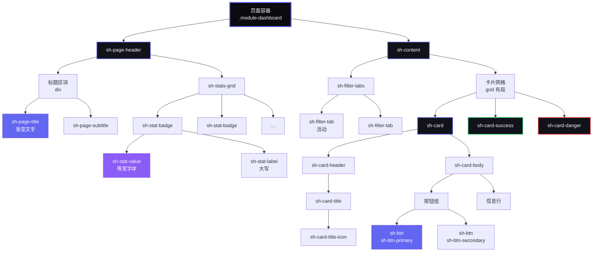
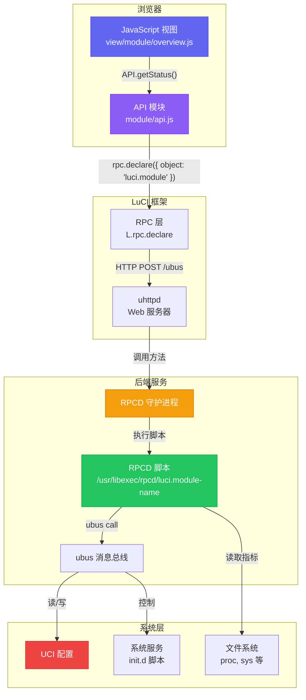
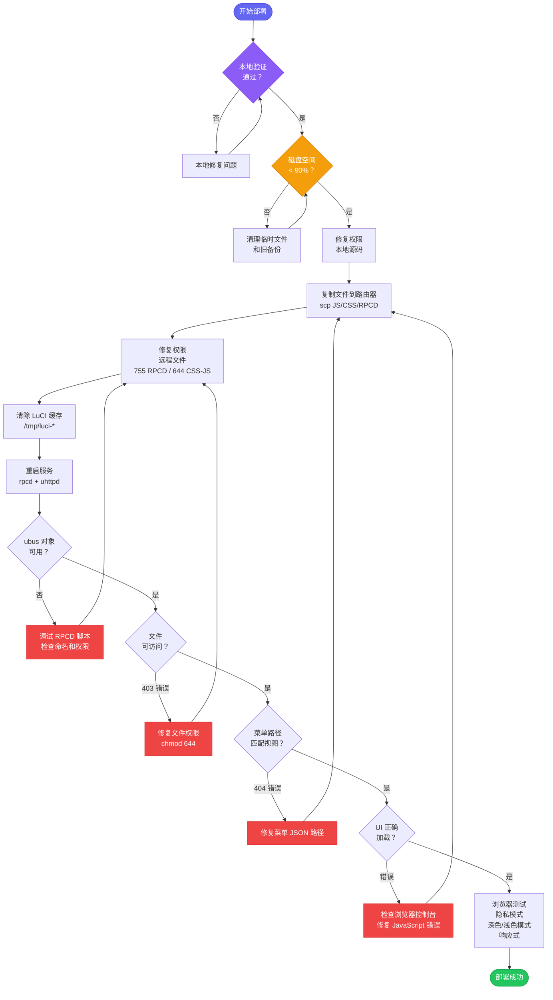

# SecuBox 与 System Hub - 开发指南

> **可用语言:** [English](../docs/development-guidelines.md) | [Français](../docs-fr/development-guidelines.md) | **中文**

**版本:** 1.0.0
**最后更新:** 2025-12-28
**状态:** 活跃
**受众:** 开发人员、AI 助手、维护人员

本文档定义了在 OpenWrt LuCI 生态系统中开发 SecuBox 和 System Hub 模块的标准、最佳实践和强制性验证要求。

---

## 目录

1. [设计系统与 UI 指南](#设计系统与-ui-指南)
2. [架构与命名约定](#架构与命名约定)
3. [RPCD 与 ubus 最佳实践](#rpcd-与-ubus-最佳实践)
4. [ACL 与权限](#acl-与权限)
5. [JavaScript 模式](#javascript-模式)
6. [CSS/样式标准](#css样式标准)
7. [常见错误与解决方案](#常见错误与解决方案)
8. [验证清单](#验证清单)
9. [部署流程](#部署流程)
10. [AI 助手上下文文件](#ai-助手上下文文件)

---

## 设计系统与 UI 指南

### 颜色调色板（基于演示版）

**重要:** 始终使用 `system-hub/common.css` 中定义的调色板

#### 深色模式（主要 - 推荐）
```css
--sh-text-primary: #fafafa;
--sh-text-secondary: #a0a0b0;
--sh-bg-primary: #0a0a0f;      /* 主背景（深黑色） */
--sh-bg-secondary: #12121a;     /* 卡片/区块背景 */
--sh-bg-tertiary: #1a1a24;      /* 悬停/活动背景 */
--sh-bg-card: #12121a;
--sh-border: #2a2a35;
--sh-primary: #6366f1;          /* 靛蓝色 */
--sh-primary-end: #8b5cf6;      /* 紫色（用于渐变） */
--sh-success: #22c55e;          /* 绿色 */
--sh-danger: #ef4444;           /* 红色 */
--sh-warning: #f59e0b;          /* 橙色 */
```

#### 浅色模式（次要）
```css
--sh-text-primary: #0f172a;
--sh-text-secondary: #475569;
--sh-bg-primary: #ffffff;
--sh-bg-secondary: #f8fafc;
--sh-bg-tertiary: #f1f5f9;
--sh-bg-card: #ffffff;
--sh-border: #e2e8f0;
```

**始终使用 CSS 变量** - 绝不硬编码颜色。

### 字体排版

#### 字体栈
```css
/* 常规文本 */
font-family: 'Inter', -apple-system, BlinkMacSystemFont, sans-serif;

/* 数值、ID、代码 */
font-family: 'JetBrains Mono', 'Courier New', monospace;
```

**必需的导入**（在 common.css 中添加）：
```css
@import url('https://fonts.googleapis.com/css2?family=JetBrains+Mono:wght@400;500;600;700&family=Inter:wght@400;500;600;700&display=swap');
```

#### 字体大小
```css
/* 标题 */
--sh-title-xl: 28px;    /* 页面标题 */
--sh-title-lg: 20px;    /* 卡片标题 */
--sh-title-md: 16px;    /* 区块标题 */

/* 文本 */
--sh-text-base: 14px;   /* 正文 */
--sh-text-sm: 13px;     /* 标签、元数据 */
--sh-text-xs: 11px;     /* 大写标签 */

/* 数值 */
--sh-value-xl: 40px;    /* 大型指标 */
--sh-value-lg: 32px;    /* 统计概览 */
--sh-value-md: 28px;    /* 徽章 */
```

### 组件模式

#### 组件层次结构

下图展示了标准页面结构和组件关系：



**组件类别：**
1. **布局容器：** 页面包装器、标题、内容区块
2. **字体排版：** 带渐变效果的标题、副标题、标签
3. **数据展示：** 带等宽数值的统计徽章、带边框的卡片
4. **导航：** 过滤选项卡、导航选项卡（固定）
5. **交互元素：** 带渐变和悬停效果的按钮

**样式规则：**
- **卡片：** 3px 顶部边框（悬停时渐变，或根据状态着色）
- **统计徽章：** 最小宽度 130px，数值使用等宽字体
- **按钮：** 渐变背景，悬停时阴影，平滑过渡
- **选项卡：** 活动状态带渐变背景和发光效果
- **网格布局：** 自适应最小值（130px、240px 或 300px）

---

#### 1. 页面标题（标准）

**要求：** 每个模块视图必须以这个紧凑的 `.sh-page-header` 开始。不要引入定制的大横幅或超大标题区；标题保持可预测的高度（左侧标题+副标题，右侧统计数据），确保 SecuBox 仪表板的一致性。如果不需要统计数据，保留容器但提供空的 `.sh-stats-grid` 以备将来添加指标。

**精简变体：** 当页面只需要 2-3 个指标时，使用 `.sh-page-header-lite` + `.sh-header-chip`（参见 `luci-app-vhost-manager` 和 `luci-app-secubox` 设置）。芯片包含表情符号/图标、小标签和值；颜色（`.success`、`.danger`、`.warn`）传达状态。此变体替代了旧演示版中的大型标题区块。

**版本芯片：** 始终从 RPC 后端公开包版本（从 `/usr/lib/opkg/info/<pkg>.control` 读取）并将其显示为第一个芯片（`icon: `）。这使 UI 和 `PKG_VERSION` 保持同步，无需查找硬编码的字符串。

**HTML 结构：**
```javascript
E('div', { 'class': 'sh-page-header' }, [
    E('div', {}, [
        E('h2', { 'class': 'sh-page-title' }, [
            E('span', { 'class': 'sh-page-title-icon' }, '🎯'),
            '页面标题'
        ]),
        E('p', { 'class': 'sh-page-subtitle' }, '页面描述')
    ]),
    E('div', { 'class': 'sh-stats-grid' }, [
        // 统计徽章放这里
    ])
])
```

**CSS 类：**
- `.sh-page-header` - Flex 布局容器
- `.sh-page-title` - 渐变文字效果
- `.sh-page-title-icon` - 图标（无渐变）
- `.sh-page-subtitle` - 次要文本
- `.sh-stats-grid` - 徽章网格（最小 130px）

#### 2. 统计徽章

**规则：** 最小 130px，数值使用等宽字体

```javascript
E('div', { 'class': 'sh-stat-badge' }, [
    E('div', { 'class': 'sh-stat-value' }, '92'),
    E('div', { 'class': 'sh-stat-label' }, 'CPU %')
])
```

**网格布局：**
```css
.sh-stats-grid {
    display: grid;
    grid-template-columns: repeat(auto-fit, minmax(130px, 1fr));
    gap: 12px;
}
```

#### 3. 带彩色边框的卡片

**必需：** 所有卡片必须有 3px 顶部边框

```javascript
E('div', { 'class': 'sh-card sh-card-success' }, [
    E('div', { 'class': 'sh-card-header' }, [
        E('h3', { 'class': 'sh-card-title' }, [
            E('span', { 'class': 'sh-card-title-icon' }, '⚙️'),
            '卡片标题'
        ])
    ]),
    E('div', { 'class': 'sh-card-body' }, [
        // 内容
    ])
])
```

**边框变体：**
- `.sh-card` - 渐变边框（悬停时可见）
- `.sh-card-success` - 永久绿色边框
- `.sh-card-danger` - 永久红色边框
- `.sh-card-warning` - 永久橙色边框

#### 4. 按钮

**渐变按钮（首选）：**
```javascript
E('button', { 'class': 'sh-btn sh-btn-primary' }, '主要操作')
E('button', { 'class': 'sh-btn sh-btn-success' }, '成功操作')
E('button', { 'class': 'sh-btn sh-btn-danger' }, '危险操作')
E('button', { 'class': 'sh-btn sh-btn-secondary' }, '次要操作')
```

**所有按钮必须有：**
- 阴影效果（已在 CSS 中）
- 悬停动画（translateY(-2px)）
- 平滑过渡（0.3s cubic-bezier）

#### 5. 过滤选项卡

```javascript
E('div', { 'class': 'sh-filter-tabs' }, [
    E('div', {
        'class': 'sh-filter-tab active',
        'data-filter': 'all'
    }, [
        E('span', { 'class': 'sh-tab-icon' }, '📋'),
        E('span', { 'class': 'sh-tab-label' }, '全部')
    ])
])
```

**活动选项卡样式：**
- 背景：靛蓝-紫色渐变
- 颜色：白色
- Box-shadow 带发光效果

### 网格系统

#### 统计概览（紧凑）
```css
grid-template-columns: repeat(auto-fit, minmax(130px, 1fr));
gap: 16px;
```

#### 指标卡片（中等）
```css
grid-template-columns: repeat(auto-fit, minmax(240px, 1fr));
gap: 20px;
```

#### 信息卡片（大型）
```css
grid-template-columns: repeat(auto-fit, minmax(300px, 1fr));
gap: 20px;
```

### 渐变效果

#### 渐变文字（标题）
```css
background: linear-gradient(135deg, var(--sh-primary), var(--sh-primary-end));
-webkit-background-clip: text;
-webkit-text-fill-color: transparent;
background-clip: text;
```

**使用：** `.sh-gradient-text` 类或 `.sh-page-title`

#### 渐变背景（按钮、徽章）
```css
background: linear-gradient(135deg, var(--sh-primary), var(--sh-primary-end));
```

#### 渐变边框（顶部）
```css
/* 带渐变的 3px 顶部边框 */
.element::before {
    content: '';
    position: absolute;
    top: 0;
    left: 0;
    right: 0;
    height: 3px;
    background: linear-gradient(90deg, var(--sh-primary), var(--sh-primary-end));
}
```

### 动画标准

#### 悬停效果
```css
transition: all 0.3s cubic-bezier(0.4, 0, 0.2, 1);
transform: translateY(-3px);  /* 卡片 */
transform: translateY(-2px);  /* 按钮、徽章 */
```

#### 阴影渐进
```css
/* 默认 */
box-shadow: none;

/* 悬停 - 微妙 */
box-shadow: 0 8px 20px var(--sh-shadow);

/* 悬停 - 明显 */
box-shadow: 0 12px 28px var(--sh-hover-shadow);

/* 按钮悬停 */
box-shadow: 0 8px 20px rgba(99, 102, 241, 0.5);
```

---

## 架构与命名约定

### 系统架构概览

下图说明了从浏览器 JavaScript 到系统后端的完整数据流：



**关键组件：**
1. **浏览器层：** JavaScript 视图和 API 模块处理 UI 和数据请求
2. **LuCI 框架：** RPC 层将 JavaScript 调用转换为 ubus 协议
3. **后端服务：** RPCD 通过 ubus 消息总线执行 shell 脚本
4. **系统层：** UCI 配置、系统服务和文件系统提供数据

**关键命名规则：** RPCD 脚本名称**必须**与 JavaScript `rpc.declare()` 中的 `object` 参数匹配。

---

### 关键：RPCD 脚本命名

**绝对规则：** RPCD 文件名必须与 JavaScript 中的 ubus 对象名完全匹配。

#### 正确：

**JavaScript：**
```javascript
var callStatus = rpc.declare({
    object: 'luci.system-hub',  // ← 对象名
    method: 'getHealth'
});
```

**RPCD 文件：**
```bash
root/usr/libexec/rpcd/luci.system-hub  # ← 完全匹配
```

#### 错误（导致 -32000 错误）：

```bash
# 错误 - 缺少前缀
root/usr/libexec/rpcd/system-hub

# 错误 - 下划线而非连字符
root/usr/libexec/rpcd/luci.system_hub

# 错误 - 名称不同
root/usr/libexec/rpcd/systemhub
```

### 菜单路径约定

**规则：** menu.d/*.json 中的路径必须与视图文件完全匹配。

#### 正确：

**菜单 JSON：**
```json
{
    "action": {
        "type": "view",
        "path": "system-hub/overview"
    }
}
```

**视图文件：**
```bash
htdocs/luci-static/resources/view/system-hub/overview.js
```

#### 错误（导致 404）：

菜单：`"path": "system-hub/overview"` 但文件是：`view/systemhub/overview.js`

### 标准前缀

| 类型 | 前缀 | 示例 |
|------|------|------|
| ubus 对象 | `luci.` | `luci.system-hub` |
| CSS 类 | `sh-`（System Hub）或 `sb-`（SecuBox） | `.sh-page-header` |
| CSS 变量 | `--sh-` | `--sh-primary` |
| JavaScript 模块 | 模块名 | `system-hub/api.js` |

### 文件结构模板

```
luci-app-<module-name>/
├── Makefile
├── README.md
├── htdocs/luci-static/resources/
│   ├── view/<module-name>/
│   │   ├── overview.js         # 主页面
│   │   ├── settings.js         # 配置
│   │   └── *.js                # 其他视图
│   └── <module-name>/
│       ├── api.js              # RPC 客户端
│       ├── theme.js            # 主题辅助函数（可选）
│       ├── common.css          # 共享样式
│       └── *.css               # 特定样式
└── root/
    ├── usr/
    │   ├── libexec/rpcd/
    │   │   └── luci.<module-name>    # 必须匹配 ubus 对象
    │   └── share/
    │       ├── luci/menu.d/
    │       │   └── luci-app-<module-name>.json
    │       └── rpcd/acl.d/
    │           └── luci-app-<module-name>.json
    └── etc/config/<module-name>（可选）
```

---

## RPCD 与 ubus 最佳实践

### RPCD 脚本模板（Shell）

**文件：** `root/usr/libexec/rpcd/luci.<module-name>`

```bash
#!/bin/sh
# <module-name> 的 RPCD 后端
# ubus 对象：luci.<module-name>

case "$1" in
    list)
        # 列出可用方法
        echo '{
            "getStatus": {},
            "getHealth": {},
            "getServices": {}
        }'
        ;;
    call)
        case "$2" in
            getStatus)
                # 始终返回有效的 JSON
                printf '{"enabled": true, "version": "1.0.0"}\n'
                ;;
            getHealth)
                # 读取系统指标
                cpu_usage=$(top -bn1 | grep "CPU:" | awk '{print $2}' | sed 's/%//')
                mem_total=$(free | grep Mem | awk '{print $2}')
                mem_used=$(free | grep Mem | awk '{print $3}')

                printf '{
                    "cpu": {"usage": %s},
                    "memory": {"total_kb": %s, "used_kb": %s}
                }\n' "$cpu_usage" "$mem_total" "$mem_used"
                ;;
            getServices)
                # 服务示例
                services='[]'
                for service in /etc/init.d/*; do
                    # 构建 JSON 数组
                    :
                done
                echo "$services"
                ;;
            *)
                echo '{"error": "方法未找到"}'
                exit 1
                ;;
        esac
        ;;
esac
```

### RPCD 脚本验证

**必须检查清单：**

1. 文件可执行：`chmod +x root/usr/libexec/rpcd/luci.<module-name>`
2. 存在 shebang：`#!/bin/sh`
3. case/esac 结构正确
4. `list` 方法返回包含所有方法的 JSON
5. `call` 方法处理所有情况
6. 始终返回有效的 JSON
7. 没有调试用的 `echo`（生产环境注释掉）
8. 对未知方法进行错误处理

### 测试 RPCD 脚本

**在路由器上：**

```bash
# 直接测试
/usr/libexec/rpcd/luci.system-hub list

# 通过 ubus
ubus list luci.system-hub
ubus call luci.system-hub getStatus

# 修改后重启 RPCD
/etc/init.d/rpcd restart
```

### 常见 RPCD 错误

#### 错误："Object not found"（-32000）

**原因：** RPCD 文件名与 ubus 对象不匹配

**解决方案：**
```bash
# 检查 JS 中的名称
grep -r "object:" htdocs/luci-static/resources/view/ --include="*.js"

# 重命名 RPCD 文件以匹配
mv root/usr/libexec/rpcd/wrong-name root/usr/libexec/rpcd/luci.correct-name
```

#### 错误："Method not found"（-32601）

**原因：** 方法未在 `list` 中声明或未在 `call` 中实现

**解决方案：**
```bash
# 验证方法在两个块中都存在
grep "getStatus" root/usr/libexec/rpcd/luci.*
```

#### 错误：返回无效的 JSON

**原因：** RPCD 输出不是有效的 JSON

**解决方案：**
```bash
# 测试 JSON
/usr/libexec/rpcd/luci.module-name call getStatus | jsonlint

# 使用 printf 而非 echo 来生成 JSON
printf '{"key": "%s"}\n' "$value"
```

---

## ACL 与权限

### ACL 文件模板

**文件：** `root/usr/share/rpcd/acl.d/luci-app-<module-name>.json`

```json
{
    "luci-app-<module-name>": {
        "description": "授予对 <Module Name> 的访问权限",
        "read": {
            "ubus": {
                "luci.<module-name>": [
                    "getStatus",
                    "getHealth",
                    "getServices"
                ]
            },
            "uci": [
                "<module-name>"
            ]
        },
        "write": {
            "ubus": {
                "luci.<module-name>": [
                    "setConfig",
                    "restartService"
                ]
            },
            "uci": [
                "<module-name>"
            ]
        }
    }
}
```

### ACL 最佳实践

1. **读/写分离：** 只授予必要的权限
2. **显式列表：** 列出所有使用的 ubus 方法
3. **UCI 访问：** 在 `read` 和 `write` 中添加 UCI 配置
4. **JSON 验证：** 始终使用 `jsonlint` 验证

### 常见 ACL 错误

#### 错误："Access denied"

**原因：** ubus 方法不在 ACL 中

**解决方案：**
```json
{
    "read": {
        "ubus": {
            "luci.system-hub": [
                "getHealth"  // ← 添加缺失的方法
            ]
        }
    }
}
```

#### 错误："UCI config not accessible"

**原因：** UCI 配置不在 ACL 中

**解决方案：**
```json
{
    "read": {
        "uci": [
            "system-hub"  // ← 添加配置
        ]
    }
}
```

---

## JavaScript 模式

### API 模块模板

**文件：** `htdocs/luci-static/resources/<module-name>/api.js`

```javascript
'use strict';
'require rpc';
'require uci';

return L.Class.extend({
    // 声明 RPC 调用
    callGetStatus: rpc.declare({
        object: 'luci.<module-name>',
        method: 'getStatus',
        expect: { }
    }),

    callGetHealth: rpc.declare({
        object: 'luci.<module-name>',
        method: 'getHealth',
        expect: { }
    }),

    // 带错误处理的包装方法
    getStatus: function() {
        return this.callGetStatus().catch(function(err) {
            console.error('获取状态失败:', err);
            return { enabled: false, error: err.message };
        });
    },

    getHealth: function() {
        return this.callGetHealth().catch(function(err) {
            console.error('获取健康状态失败:', err);
            return {
                cpu: { usage: 0 },
                memory: { usage: 0 },
                error: err.message
            };
        });
    },

    // 工具函数
    formatBytes: function(bytes) {
        if (bytes === 0) return '0 B';
        var k = 1024;
        var sizes = ['B', 'KB', 'MB', 'GB'];
        var i = Math.floor(Math.log(bytes) / Math.log(k));
        return parseFloat((bytes / Math.pow(k, i)).toFixed(2)) + ' ' + sizes[i];
    }
});
```

### 视图模板

**文件：** `htdocs/luci-static/resources/view/<module-name>/overview.js`

```javascript
'use strict';
'require view';
'require ui';
'require dom';
'require poll';
'require <module-name>/api as API';

return view.extend({
    // 状态
    healthData: null,
    sysInfo: null,

    // 加载数据
    load: function() {
        return Promise.all([
            API.getStatus(),
            API.getHealth()
        ]);
    },

    // 渲染 UI
    render: function(data) {
        var self = this;
        this.sysInfo = data[0] || {};
        this.healthData = data[1] || {};

        var container = E('div', { 'class': '<module>-dashboard' }, [
            // 链接 CSS 文件
            E('link', { 'rel': 'stylesheet', 'href': L.resource('<module>/common.css') }),
            E('link', { 'rel': 'stylesheet', 'href': L.resource('<module>/overview.css') }),

            // 标题
            this.renderHeader(),

            // 内容
            this.renderContent()
        ]);

        // 设置自动刷新
        poll.add(L.bind(function() {
            return Promise.all([
                API.getStatus(),
                API.getHealth()
            ]).then(L.bind(function(refreshData) {
                this.sysInfo = refreshData[0] || {};
                this.healthData = refreshData[1] || {};
                this.updateDashboard();
            }, this));
        }, this), 30); // 每 30 秒刷新

        return container;
    },

    renderHeader: function() {
        return E('div', { 'class': 'sh-page-header' }, [
            // 标题内容
        ]);
    },

    renderContent: function() {
        return E('div', { 'class': 'sh-content' }, [
            // 主要内容
        ]);
    },

    updateDashboard: function() {
        // 更新现有 DOM 元素
        var element = document.querySelector('.my-element');
        if (element) {
            dom.content(element, this.renderContent());
        }
    },

    // LuCI 必需的存根
    handleSaveApply: null,
    handleSave: null,
    handleReset: null
});
```

### 事件处理模式

```javascript
// 正确：渲染后绑定事件
render: function(data) {
    var container = E('div', {}, [
        E('button', {
            'id': 'my-button',
            'class': 'sh-btn sh-btn-primary'
        }, '点击我')
    ]);

    // 在容器创建后添加事件
    container.addEventListener('click', function(ev) {
        if (ev.target && ev.target.id === 'my-button') {
            self.handleButtonClick();
        }
    });

    return container;
},

handleButtonClick: function() {
    ui.addNotification(null, E('p', '按钮已点击！'), 'info');
}
```

### 常见 JavaScript 错误

#### 错误：显示 "[object HTMLButtonElement]"

**原因：** 当 E() 期望简单数组时使用了嵌套数组

```javascript
// 错误
E('div', {}, [
    this.renderButtons()  // renderButtons 已经返回数组
])

// 正确
E('div', {},
    this.renderButtons()  // 不要额外的 [ ]
)
```

#### 错误："Cannot read property of undefined"

**原因：** API 数据不可用

```javascript
// 错误
var cpuUsage = this.healthData.cpu.usage;

// 正确（使用可选链）
var cpuUsage = (this.healthData.cpu && this.healthData.cpu.usage) || 0;
// 或
var cpuUsage = this.healthData.cpu?.usage || 0; // ES2020
```

#### 错误："poll callback failed"

**原因：** poll.add 中没有返回 Promise

```javascript
// 错误
poll.add(function() {
    API.getHealth(); // 没有 return！
}, 30);

// 正确
poll.add(function() {
    return API.getHealth().then(function(data) {
        // 更新 UI
    });
}, 30);
```

---

## CSS/样式标准

### 文件组织

```
<module-name>/
├── common.css       # 共享组件（标题、按钮、卡片、选项卡）
├── overview.css     # 概览页面专用
├── services.css     # 服务页面专用
└── *.css            # 其他页面专用样式
```

### CSS 文件模板

```css
/**
 * 模块名 - 页面/组件样式
 * 此文件样式化的内容描述
 * 版本：X.Y.Z
 */

/* === 导入共享样式（如需要）=== */
/* 如果在 HTML 中加载则不需要 */

/* === 页面特定变量（如需要）=== */
:root {
    --page-specific-var: value;
}

/* === 布局 === */
.module-page-container {
    /* 布局样式 */
}

/* === 组件 === */
.module-component {
    /* 组件样式 */
}

/* === 响应式 === */
@media (max-width: 768px) {
    /* 移动端样式 */
}

/* === 深色模式覆盖 === */
[data-theme="dark"] .module-component {
    /* 深色模式专用 */
}
```

### CSS 最佳实践

#### 1. 始终使用 CSS 变量

```css
/* 错误 */
.my-card {
    background: #12121a;
    color: #fafafa;
}

/* 正确 */
.my-card {
    background: var(--sh-bg-card);
    color: var(--sh-text-primary);
}
```

#### 2. 按模块添加类前缀

```css
/* System Hub */
.sh-page-header { }
.sh-card { }
.sh-btn { }

/* SecuBox */
.sb-module-grid { }
.sb-dashboard { }

/* 特定模块 */
.netdata-chart { }
.crowdsec-alert { }
```

#### 3. 一致的过渡效果

```css
/* 标准过渡 */
transition: all 0.3s cubic-bezier(0.4, 0, 0.2, 1);

/* 快速过渡（悬停状态）*/
transition: all 0.2s ease;

/* 平滑过渡（大范围移动）*/
transition: all 0.5s ease;
```

#### 4. 响应式断点

```css
/* 移动端 */
@media (max-width: 768px) {
    .sh-stats-grid {
        grid-template-columns: repeat(2, 1fr);
    }
}

/* 平板 */
@media (min-width: 769px) and (max-width: 1024px) {
    /* 平板专用 */
}

/* 桌面 */
@media (min-width: 1025px) {
    /* 桌面专用 */
}
```

#### 5. 深色模式必需

**始终提供深色模式样式：**

```css
/* 浅色模式（默认）*/
.my-component {
    background: var(--sh-bg-card);
    border: 1px solid var(--sh-border);
}

/* 深色模式覆盖 */
[data-theme="dark"] .my-component {
    background: var(--sh-bg-card);
    border-color: var(--sh-border);
}
```

### Z-index 层级

**遵循此层级：**

```css
--z-base: 0;
--z-dropdown: 100;
--z-sticky: 200;
--z-fixed: 300;
--z-modal-backdrop: 400;
--z-modal: 500;
--z-popover: 600;
--z-tooltip: 700;
```

---

## 常见错误与解决方案

### 1. RPCD 对象未找到（-32000）

**完整错误：**
```
RPC call to luci.system-hub/getHealth failed with error -32000: Object not found
```

**诊断：**
```bash
# 1. 验证 RPCD 文件存在
ls -la /usr/libexec/rpcd/luci.system-hub

# 2. 验证它是可执行的
chmod +x /usr/libexec/rpcd/luci.system-hub

# 3. 列出 ubus 对象
ubus list | grep system-hub

# 4. 如果不存在，重启 RPCD
/etc/init.d/rpcd restart
ubus list | grep system-hub
```

**解决方案：**
1. 重命名 RPCD 文件以完全匹配
2. 验证权限（755 或 rwxr-xr-x）
3. 重启 rpcd

### 2. 视图未找到（404）

**错误：**
```
HTTP error 404 while loading class file '/luci-static/resources/view/system-hub/overview.js'
```

**诊断：**
```bash
# 1. 验证文件存在
ls -la /www/luci-static/resources/view/system-hub/overview.js

# 2. 检查 menu.d 中的路径
grep "path" /usr/share/luci/menu.d/luci-app-system-hub.json
```

**解决方案：**
1. 验证菜单 JSON 中的路径与文件匹配
2. 验证文件权限（644）
3. 清除缓存：`rm -f /tmp/luci-indexcache /tmp/luci-modulecache/*`

### 3. CSS 未加载（403 Forbidden）

**错误：**
```
GET /luci-static/resources/system-hub/common.css 403 Forbidden
```

**诊断：**
```bash
# 验证权限
ls -la /www/luci-static/resources/system-hub/common.css
```

**解决方案：**
```bash
# 修正权限
chmod 644 /www/luci-static/resources/system-hub/*.css
```

### 4. RPCD 返回无效 JSON

**浏览器控制台错误：**
```
SyntaxError: Unexpected token in JSON at position X
```

**诊断：**
```bash
# 直接测试 JSON
/usr/libexec/rpcd/luci.system-hub call getHealth | jsonlint

# 或使用 jq
/usr/libexec/rpcd/luci.system-hub call getHealth | jq .
```

**常见解决方案：**
```bash
# 错误 - 未转义的单引号
echo '{"error": "can't process"}'

# 正确 - 使用 printf 和双引号
printf '{"error": "cannot process"}\n'

# 错误 - 变量未加引号
echo "{\"value\": $var}"

# 正确 - 变量加引号
printf '{"value": "%s"}\n' "$var"
```

### 5. 浏览器缓存问题

**症状：**
- CSS/JS 更改不可见
- 显示旧数据
- 代码更新但界面相同

**解决方案：**
```bash
# 1. 服务器端 - 清除 LuCI 缓存
ssh root@router "rm -f /tmp/luci-indexcache /tmp/luci-modulecache/* && /etc/init.d/uhttpd restart"

# 2. 客户端 - 强制刷新
Ctrl + Shift + R（Chrome/Firefox）
Ctrl + F5（Windows）
Cmd + Shift + R（Mac）

# 3. 测试用隐私/无痕模式
Ctrl + Shift + N（Chrome）
Ctrl + Shift + P（Firefox）
```

### 6. ACL 访问被拒绝

**错误：**
```
Access to path '/admin/secubox/system/system-hub' denied
```

**诊断：**
```bash
# 验证 ACL
cat /usr/share/rpcd/acl.d/luci-app-system-hub.json | jq .

# 验证 ubus 方法已列出
grep "getHealth" /usr/share/rpcd/acl.d/luci-app-system-hub.json
```

**解决方案：**
在 ACL 中添加缺失的方法并重启 rpcd。

---

## 验证清单

### 提交前清单

每次提交前，验证：

- [ ] **RPCD 脚本：**
  - [ ] 文件名与 ubus 对象匹配
  - [ ] 可执行（chmod +x）
  - [ ] list/call 结构正确
  - [ ] 返回有效的 JSON
  - [ ] 所有方法已实现

- [ ] **菜单和 ACL：**
  - [ ] 菜单路径与视图文件匹配
  - [ ] ACL 列出所有 ubus 方法
  - [ ] JSON 有效（jsonlint）

- [ ] **JavaScript：**
  - [ ] 第一行是 'use strict'
  - [ ] 必需的导入存在
  - [ ] 生产环境无 console.log
  - [ ] API 调用有错误处理
  - [ ] 事件处理器正确绑定

- [ ] **CSS：**
  - [ ] 使用 CSS 变量（无硬编码）
  - [ ] 类有前缀（sh-、sb-、module-）
  - [ ] 支持深色模式
  - [ ] 响应式（max-width: 768px）
  - [ ] 一致的过渡效果

- [ ] **Makefile：**
  - [ ] PKG_VERSION 已增加
  - [ ] LUCI_DEPENDS 正确
  - [ ] Include 路径正确（../../luci.mk）

### 部署前清单

部署到路由器前：

- [ ] **验证脚本：**
  ```bash
  ./secubox-tools/validate-modules.sh
  ```

- [ ] **本地测试 RPCD：**
  ```bash
  /usr/libexec/rpcd/luci.module-name list
  /usr/libexec/rpcd/luci.module-name call getStatus
  ```

- [ ] **测试 JSON：**
  ```bash
  find . -name "*.json" -exec jsonlint {} \;
  ```

- [ ] **Shellcheck：**
  ```bash
  shellcheck root/usr/libexec/rpcd/*
  ```

- [ ] **权限：**
  ```bash
  # RPCD 脚本
  chmod 755 root/usr/libexec/rpcd/*

  # CSS/JS 文件
  chmod 644 htdocs/luci-static/resources/**/*
  ```

### 部署后清单

部署后：

- [ ] **服务：**
  ```bash
  /etc/init.d/rpcd status
  /etc/init.d/uhttpd status
  ```

- [ ] **ubus 对象：**
  ```bash
  ubus list | grep luci.module-name
  ```

- [ ] **文件存在：**
  ```bash
  ls -la /www/luci-static/resources/view/module-name/
  ls -la /www/luci-static/resources/module-name/
  ```

- [ ] **权限正确：**
  ```bash
  ls -la /usr/libexec/rpcd/luci.module-name
  ls -la /www/luci-static/resources/module-name/*.css
  ```

- [ ] **浏览器测试：**
  - [ ] 在隐私模式打开
  - [ ] 检查控制台（F12）- 无错误
  - [ ] 检查网络选项卡 - 所有文件加载（200）
  - [ ] 测试深色/浅色模式
  - [ ] 测试响应式（移动视图）

---

## 部署流程

### 部署工作流

下图说明了带验证检查点的完整部署流程：



**部署阶段：**
1. **本地验证：** 运行 `validate-modules.sh` 和 `fix-permissions.sh --local`
2. **预检：** 磁盘空间和权限验证
3. **文件传输：** 复制 JavaScript、CSS 和 RPCD 脚本
4. **远程设置：** 修复权限并清除缓存
5. **服务重启：** 重新加载 rpcd 和 uhttpd 守护进程
6. **验证：** 多阶段验证（ubus、文件、菜单、UI）
7. **测试：** 隐私模式下的浏览器测试

**常见错误恢复路径：**
- **对象未找到（-32000）：** 检查 RPCD 脚本命名和权限
- **403 Forbidden：** 将 CSS/JS 文件权限修复为 644
- **404 Not Found：** 验证菜单路径与视图文件位置匹配
- **JavaScript 错误：** 检查浏览器控制台并修复代码问题

---

### 部署前检查（关键）

**在任何部署之前始终执行这些检查：**

#### 1. 磁盘空间检查

```bash
# 在目标路由器上
ssh root@192.168.8.191 "df -h | grep overlay"

# 验证使用率 < 90%
# 正常示例：
# /dev/loop0    98.8M    45.2M    53.6M   46% /overlay

# 危险示例（停止部署）：
# /dev/loop0    98.8M    98.8M       0  100% /overlay  ← 满了！
```

**如果 overlay 满了（≥95%）：**
```bash
# 部署前释放空间
ssh root@192.168.8.191 << 'EOF'
# 删除临时文件
rm -rf /tmp/*.ipk /tmp/luci-* 2>/dev/null

# 删除旧备份（>7 天）
find /root -name '*.backup-*' -type f -mtime +7 -delete 2>/dev/null

# 检查未使用的包
opkg list-installed | grep -E 'netdata|unused'

# 清理后，验证释放的空间
df -h | grep overlay
EOF
```

**需要监控的典型大小：**
- Netdata Web UI：~22MB（如果不使用考虑删除）
- LuCI 模块：每个约 1-2MB
- CSS/JS 文件：每个约 10-50KB

#### 2. 权限检查（避免 403 错误的关键）

**必需的权限：**

| 类型 | 权限 | 八进制 | 原因 |
|------|------|--------|------|
| **RPCD 脚本** | `rwxr-xr-x` | `755` | 系统可执行 |
| **CSS 文件** | `rw-r--r--` | `644` | Web 服务器可读 |
| **JS 文件** | `rw-r--r--` | `644` | Web 服务器可读 |
| **JSON 文件** | `rw-r--r--` | `644` | rpcd 可读 |

**常见错误：** 文件创建为 `600`（rw-------）而非 `644`

**症状：** 加载 JS/CSS 文件时 HTTP 403 Forbidden

**错误示例：**
```
NetworkError: HTTP error 403 while loading class file
"/luci-static/resources/view/netdata-dashboard/dashboard.js"
```

**快速诊断：**
```bash
# 验证已部署文件的权限
ssh root@192.168.8.191 "ls -la /www/luci-static/resources/view/MODULE_NAME/"

# 查找权限不正确的文件（600）
ssh root@192.168.8.191 "find /www/luci-static/resources/view/ -type f -name '*.js' -perm 600"

# 错误（导致 403）：
# -rw-------  1 root root  9763 dashboard.js  ← 600 = web 不可读！

# 正确：
# -rw-r--r--  1 root root  9763 dashboard.js  ← 644 = OK
```

**立即修复：**
```bash
# 修复所有 CSS/JS 文件
ssh root@192.168.8.191 << 'EOF'
find /www/luci-static/resources/ -name '*.css' -exec chmod 644 {} \;
find /www/luci-static/resources/ -name '*.js' -exec chmod 644 {} \;
find /usr/libexec/rpcd/ -name 'luci.*' -exec chmod 755 {} \;
EOF
```

**自动修复（推荐）：**

使用自动脚本检查并修复所有权限：

```bash
# 修复本地权限（源代码）
./secubox-tools/fix-permissions.sh --local

# 修复路由器权限
./secubox-tools/fix-permissions.sh --remote

# 修复两者（本地 + 远程）
./secubox-tools/fix-permissions.sh
```

`fix-permissions.sh` 脚本自动执行：
- 将所有 RPCD 脚本修复为 755
- 将所有 CSS 修复为 644
- 将所有 JS 修复为 644
- 验证没有 600 文件存在
- 清除缓存并重启服务（远程模式）
- 显示更改的完整报告

**权限自动验证：**

`validate-modules.sh` 脚本现在包含 Check 7，自动验证权限：

```bash
./secubox-tools/validate-modules.sh

# Check 7 将验证：
# ✓ 所有 RPCD 是 755
# ✓ 所有 CSS 是 644
# ✓ 所有 JS 是 644
# ✗ 如果权限不正确将显示错误
```

**推荐工作流：**
1. 开发/修改代码
2. `./secubox-tools/fix-permissions.sh --local`（提交前）
3. `./secubox-tools/validate-modules.sh`（验证所有）
4. 提交并推送
5. 部署到路由器
6. `./secubox-tools/fix-permissions.sh --remote`（部署后）

#### 3. 部署后验证

**部署后清单：**

```bash
#!/bin/bash
ROUTER="root@192.168.8.191"
MODULE="module-name"

echo "部署后验证"
echo ""

# 1. 验证磁盘空间
echo "1. 剩余磁盘空间："
ssh "$ROUTER" "df -h | grep overlay | awk '{print \$5}'" || echo "失败"

# 2. 验证 CSS/JS 权限
echo "2. CSS/JS 权限："
ssh "$ROUTER" "find /www/luci-static/resources/$MODULE -type f \( -name '*.css' -o -name '*.js' \) ! -perm 644" | \
    if [ -z "$(cat)" ]; then echo "OK"; else echo "失败 - 权限不正确"; fi

# 3. 验证 RPCD 权限
echo "3. RPCD 权限："
ssh "$ROUTER" "ls -l /usr/libexec/rpcd/luci.$MODULE | grep -q rwxr-xr-x" && echo "OK" || echo "失败"

# 4. 验证 ubus 对象
echo "4. ubus 对象可用："
ssh "$ROUTER" "ubus list | grep -q luci.$MODULE" && echo "OK" || echo "失败"

# 5. 验证文件可访问（HTTP）
echo "5. Web 文件可访问："
ssh "$ROUTER" "test -r /www/luci-static/resources/$MODULE/common.css" && echo "OK" || echo "未找到 common.css"

# 6. 验证缓存已清除
echo "6. LuCI 缓存已清除："
ssh "$ROUTER" "test ! -f /tmp/luci-indexcache" && echo "OK" || echo "缓存仍存在"

echo ""
echo "验证完成"
```

#### 4. 常见部署错误

| 错误 | 原因 | 快速解决 |
|------|------|----------|
| **HTTP 403 Forbidden** | 权限 600 而非 644 | `chmod 644 *.js *.css` |
| **No space left on device** | Overlay 满了 | 清理 /tmp，删除旧备份 |
| **Object not found -32000** | RPCD 不可执行或名称错误 | `chmod 755 rpcd/luci.*` + 检查名称 |
| **模块不显示** | LuCI 缓存未清除 | `rm /tmp/luci-*` + 重启服务 |
| **更改不可见** | 浏览器缓存 | 隐私模式 + Ctrl+Shift+R |

#### 5. 紧急磁盘空间恢复

**如果部署因 "No space left on device" 失败：**

```bash
#!/bin/bash
ROUTER="root@192.168.8.191"

echo "紧急磁盘空间恢复"
echo ""

# 1. 分析使用情况
echo "前 10 大消耗者："
ssh "$ROUTER" "du -k /overlay/upper 2>/dev/null | sort -rn | head -10"

# 2. 清理临时文件
echo ""
echo "清理临时文件..."
ssh "$ROUTER" "rm -rf /tmp/*.ipk /tmp/luci-* /root/*.ipk 2>/dev/null"

# 3. 删除旧备份
echo "删除旧备份（>7 天）..."
ssh "$ROUTER" "find /root -name '*.backup-*' -mtime +7 -delete 2>/dev/null"

# 4. 选项：删除 Netdata Web UI（释放 ~22MB）
echo ""
echo "选项：删除 Netdata Web UI（节省 ~22MB）？"
read -p "继续？（y/N）" -n 1 -r
if [[ $REPLY =~ ^[Yy]$ ]]; then
    ssh "$ROUTER" "opkg remove netdata-web 2>/dev/null || rm -rf /usr/share/netdata/web/*"
fi

# 5. 验证释放的空间
echo ""
echo "清理后的空间："
ssh "$ROUTER" "df -h | grep overlay"
```

### 标准部署脚本模板

```bash
#!/bin/bash
# 部署 <模块名>

ROUTER="root@192.168.8.191"
MODULE="<module-name>"
LOCAL_DIR="/path/to/luci-app-$MODULE/htdocs/luci-static/resources"
REMOTE_DIR="/www/luci-static/resources"

echo "部署 $MODULE"
echo ""

# 1. 部署 JS 文件
echo "1. 复制 JS 文件..."
scp "$LOCAL_DIR/view/$MODULE/"*.js "$ROUTER:$REMOTE_DIR/view/$MODULE/"
scp "$LOCAL_DIR/$MODULE/api.js" "$ROUTER:$REMOTE_DIR/$MODULE/"

# 2. 部署 CSS 文件
echo "2. 复制 CSS 文件..."
scp "$LOCAL_DIR/$MODULE/"*.css "$ROUTER:$REMOTE_DIR/$MODULE/"

# 3. 部署 RPCD 后端
echo "3. 复制 RPCD 后端..."
scp "root/usr/libexec/rpcd/luci.$MODULE" "$ROUTER:/usr/libexec/rpcd/"

# 4. 修复权限
echo "4. 修复权限..."
ssh "$ROUTER" "chmod 755 /usr/libexec/rpcd/luci.$MODULE"
ssh "$ROUTER" "chmod 644 $REMOTE_DIR/$MODULE/*.css"
ssh "$ROUTER" "chmod 644 $REMOTE_DIR/view/$MODULE/*.js"

# 5. 清除缓存
echo "5. 清除缓存..."
ssh "$ROUTER" "rm -f /tmp/luci-indexcache /tmp/luci-modulecache/* 2>/dev/null"

# 6. 重启服务
echo "6. 重启服务..."
ssh "$ROUTER" "/etc/init.d/rpcd restart"
ssh "$ROUTER" "/etc/init.d/uhttpd restart"

# 7. 验证
echo ""
echo "7. 验证..."
ssh "$ROUTER" "ubus list | grep luci.$MODULE"

echo ""
echo "部署完成！"
echo ""
echo "测试（隐私模式）："
echo "   https://192.168.8.191/cgi-bin/luci/admin/secubox/path/to/$MODULE"
```

### 回滚流程

出现问题时：

```bash
#!/bin/bash
# 回滚到之前的版本

ROUTER="root@192.168.8.191"
BACKUP_DIR="/root/luci-backups/$(date +%Y%m%d)"

# 1. 部署前创建备份
ssh "$ROUTER" "mkdir -p $BACKUP_DIR"
ssh "$ROUTER" "cp -r /www/luci-static/resources/module-name $BACKUP_DIR/"
ssh "$ROUTER" "cp /usr/libexec/rpcd/luci.module-name $BACKUP_DIR/"

# 2. 出现问题时恢复
ssh "$ROUTER" "cp -r $BACKUP_DIR/module-name /www/luci-static/resources/"
ssh "$ROUTER" "cp $BACKUP_DIR/luci.module-name /usr/libexec/rpcd/"
ssh "$ROUTER" "/etc/init.d/rpcd restart && /etc/init.d/uhttpd restart"
```

### 版本控制

**始终增加版本：**

```makefile
# Makefile
PKG_VERSION:=0.3.0
PKG_RELEASE:=1
```

```css
/* CSS 文件 */
/**
 * 模块 - 样式
 * 版本：0.3.0
 */
```

```javascript
// JavaScript
// 版本：0.3.0
```

**语义化版本：**
- MAJOR.MINOR.PATCH（1.2.3）
- MAJOR：破坏性更改
- MINOR：新功能（向后兼容）
- PATCH：错误修复

---

## 快速参考

### 基本命令

```bash
# 验证
./secubox-tools/validate-modules.sh

# 构建（本地）
./secubox-tools/local-build.sh build luci-app-module-name

# 部署文件
scp file.js root@router:/www/luci-static/resources/

# 修复权限
ssh root@router "chmod 644 /www/luci-static/resources/**/*.css"
ssh root@router "chmod 755 /usr/libexec/rpcd/luci.*"

# 清除缓存
ssh root@router "rm -f /tmp/luci-indexcache /tmp/luci-modulecache/*"

# 重启服务
ssh root@router "/etc/init.d/rpcd restart && /etc/init.d/uhttpd restart"

# 测试 ubus
ssh root@router "ubus list | grep luci"
ssh root@router "ubus call luci.module-name getStatus"

# 验证 JSON
jsonlint file.json
jq . file.json
```

### CSS 类快速参考

```css
/* 布局 */
.sh-page-header          /* 页面标题容器 */
.sh-page-title           /* 页面标题（渐变文字）*/
.sh-page-subtitle        /* 页面副标题 */

/* 统计 */
.sh-stats-grid           /* 统计徽章网格（最小 130px）*/
.sh-stat-badge           /* 统计徽章容器 */
.sh-stat-value           /* 统计值（等宽）*/
.sh-stat-label           /* 统计标签（大写）*/

/* 卡片 */
.sh-card                 /* 卡片容器（悬停时渐变边框）*/
.sh-card-success         /* 绿色边框卡片 */
.sh-card-danger          /* 红色边框卡片 */
.sh-card-warning         /* 橙色边框卡片 */
.sh-card-header          /* 卡片标题 */
.sh-card-title           /* 卡片标题 */
.sh-card-body            /* 卡片内容 */

/* 按钮 */
.sh-btn                  /* 基础按钮 */
.sh-btn-primary          /* 主要按钮（渐变）*/
.sh-btn-success          /* 成功按钮（绿色）*/
.sh-btn-danger           /* 危险按钮（红色）*/
.sh-btn-secondary        /* 次要按钮（轮廓）*/

/* 选项卡 */
.sh-filter-tabs          /* 过滤选项卡容器 */
.sh-filter-tab           /* 过滤选项卡 */
.sh-filter-tab.active    /* 活动过滤选项卡（渐变）*/
.sh-nav-tabs             /* 导航选项卡（固定）*/
.sh-nav-tab              /* 导航选项卡 */
.sh-nav-tab.active       /* 活动导航选项卡（下划线）*/

/* 工具 */
.sh-gradient-text        /* 渐变文字效果 */
.sh-id-display           /* 等宽 ID 显示 */
.sh-empty-state          /* 空状态占位符 */
```

### 颜色变量快速参考

```css
/* 文字 */
var(--sh-text-primary)      /* 主要文字 */
var(--sh-text-secondary)    /* 次要文字 */

/* 背景 */
var(--sh-bg-primary)        /* 主背景 */
var(--sh-bg-secondary)      /* 次要背景 */
var(--sh-bg-tertiary)       /* 第三背景 */
var(--sh-bg-card)           /* 卡片背景 */

/* 边框 */
var(--sh-border)            /* 边框颜色 */

/* 颜色 */
var(--sh-primary)           /* 靛蓝 #6366f1 */
var(--sh-primary-end)       /* 紫色 #8b5cf6 */
var(--sh-success)           /* 绿色 #22c55e */
var(--sh-danger)            /* 红色 #ef4444 */
var(--sh-warning)           /* 橙色 #f59e0b */

/* 效果 */
var(--sh-shadow)            /* 盒子阴影 */
var(--sh-hover-shadow)      /* 悬停阴影 */
var(--sh-hover-bg)          /* 悬停背景 */
```

---

## AI 助手上下文文件

SecuBox 工作在 Claude 和 Codex 助手之间共享。保持上下文文件夹同步，以便任何代理都能快速恢复工作：

| 目录 | 文件 | 用途 |
|------|------|------|
| `.claude/` | `HISTORY.md` | UI/主题更改和主要部署的时间日志 |
| `.claude/` | `TODO.md` | 高级待办事项（UX 改进、文档、自动化想法）|
| `.claude/` | `WIP.md` | 活动任务、风险和即时下一步 |
| `.codex/` | `HISTORY.md` | Codex 会话的开发时间线镜像 |
| `.codex/` | `TODO.md` | 面向工具的任务（linting、脚本、构建自动化）|
| `.codex/` | `WIP.md` | 正在进行的 Codex 工作状态跟踪器 |

**维护规则**

1. **每次会话后更新：** 完成工作时，在 HISTORY 中添加简短条目并调整 WIP/TODO 以反映新状态。
2. **引用部署脚本：** 记录使用了哪个 `secubox-tools/*.sh` 脚本（仪表板 vs 完整部署），以便下一个助手知道如何重现。
3. **保持条目简洁：** 每次更新一个段落或要点即可；详细规范保留在 DOCS 中。
4. **重大更改前交叉检查：** 开始工作前阅读两个文件夹以避免冲突或重复工作。

将这些文件视为活的交接笔记——如果它们偏离，新 AI/团队成员的入职将显著变慢。

---

## 结论

本指南应在以下情况**之前**查阅：
1. 创建新模块
2. 修改现有样式
3. 添加 RPCD 方法
4. 部署到路由器
5. 调试错误

**如有疑问，始终：**
1. 查阅本指南
2. 执行 validate-modules.sh
3. 在隐私模式测试
4. 检查浏览器控制台（F12）

**补充资源：**
- CLAUDE.md - 架构和构建
- secubox-tools/validate-modules.sh - 自动验证
- Templates/ - 代码模板

---

**最后更新：** 2025-12-26
**维护者：** CyberMind Studio
**指南版本：** 1.0.0
