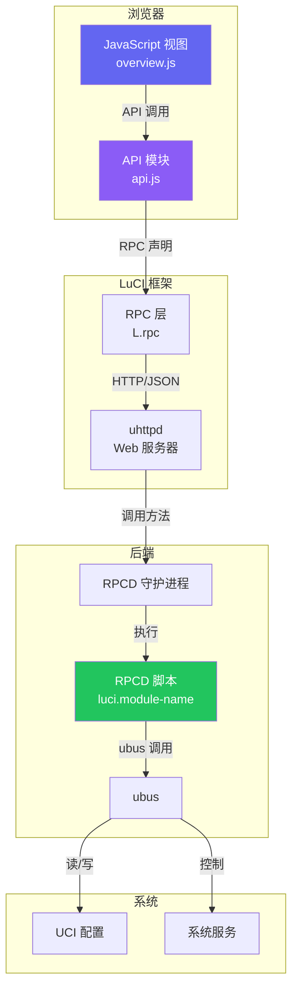
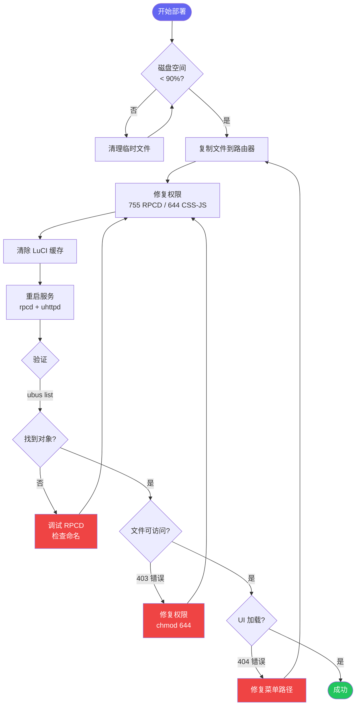
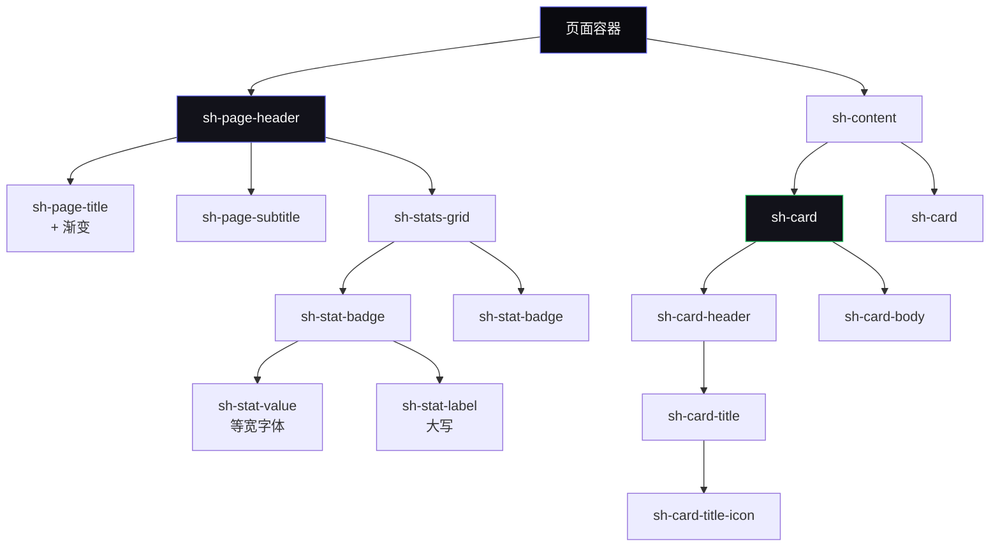

# 文档改进待办事项

> **Languages:** [English](../docs/todo-analyse.md) | [Francais](../docs-fr/todo-analyse.md) | 中文

**版本:** 1.0.0
**最后更新:** 2025-12-28
**状态:** 活跃


**生成日期:** 2025-12-28
**基于:** 文档分析报告
**整体健康度:** 8.5/10 (优秀)
**状态:** 规划阶段

---

## 目录

1. [即时行动 (本周)](#即时行动-本周)
2. [短期行动 (本月)](#短期行动-本月)
3. 长期行动 (本季度)
4. [可选增强](#可选增强)
5. [跟踪与指标](#跟踪与指标)

---

## 即时行动 (本周)

### 优先级: 高 | 工作量: 低 | 影响: 高

### 1. 标准化文档版本和日期

**状态:** 未开始
**负责人:** _待定_
**预计时间:** 30 分钟

**问题:**
- 文档之间版本不一致
- 某些文档缺少版本/日期标题
- 使用了不同的日期格式

**行动项:**
- [ ] 为所有 `.md` 文件添加版本标题
- [ ] 使用一致的日期格式: `YYYY-MM-DD`
- [ ] 将所有文档设置为 v1.0.0 基准版本
- [ ] 记录版本管理策略

**需要更新的文件:**
```markdown
缺少版本标题:
- CLAUDE.md
- BUILD_ISSUES.md
- LUCI_DEVELOPMENT_REFERENCE.md
- MODULE-ENABLE-DISABLE-DESIGN.md

日期不一致:
- DOCUMENTATION-INDEX.md: 2025-12-27
- DEVELOPMENT-GUIDELINES.md: 2025-12-26
- QUICK-START.md: 2025-12-26
```

**模板:**
```markdown
# 文档标题

**版本:** 1.0.0
**最后更新:** 2025-12-28
**状态:** 活跃 | 归档 | 草稿
```

**验收标准:**
- 所有 `.md` 文件都有版本标题
- 日期使用 YYYY-MM-DD 格式
- 版本策略记录在 DOCUMENTATION-INDEX.md 中

---

### 2. 添加文档之间的交叉引用

**状态:** 未开始
**负责人:** _待定_
**预计时间:** 1 小时

**问题:**
- 多个文档中存在重复内容
- 没有清楚说明在哪里可以找到完整信息
- 用户可能会错过相关内容

**行动项:**
- [ ] 为所有主要文档添加"另请参阅"部分
- [ ] 将快速参考链接到详细指南
- [ ] 添加导航面包屑
- [ ] 创建双向链接

**需要添加的特定交叉引用:**

**QUICK-START.md:**
```markdown
## 另请参阅

- **完整指南:** [DEVELOPMENT-GUIDELINES.md](development-guidelines.md)
- **架构详情:** [CLAUDE.md](claude.md) 第2-6节
- **代码示例:** [CODE-TEMPLATES.md](code-templates.md)
- **模块规格:** [FEATURE-REGENERATION-PROMPTS.md](feature-regeneration-prompts.md)
```

**PERMISSIONS-GUIDE.md:**
```markdown
> **这是一个快速参考指南。**
> 有关完整的部署流程，请参阅 [DEVELOPMENT-GUIDELINES.md 第9节](development-guidelines.md#deployment-procedures)
```

**VALIDATION-GUIDE.md:**
```markdown
> **相关链接:**
> - 预提交检查清单: [DEVELOPMENT-GUIDELINES.md 第8.1节](development-guidelines.md#pre-commit-checklist)
> - 部署验证: [DEVELOPMENT-GUIDELINES.md 第8.3节](development-guidelines.md#post-deploy-checklist)
```

**验收标准:**
- 所有文档都有"另请参阅"部分
- 快速参考链接到详细指南
- 没有孤立文档

---

### 3. 归档历史文档

**状态:** 未开始
**负责人:** _待定_
**预计时间:** 15 分钟

**问题:**
- 历史文档与活跃工作文档混在一起
- 根目录混乱（15个 markdown 文件）
- 对当前文档感到困惑

**行动项:**
- [ ] 创建 `docs/archive/` 目录
- [ ] 移动历史文档
- [ ] 更新 DOCUMENTATION-INDEX.md
- [ ] 在归档目录中添加说明内容的 README

**要归档的文档:**

```bash
mkdir -p docs/archive

# 历史/已完成的文档
mv COMPLETION_REPORT.md docs/archive/
mv MODULE-ENABLE-DISABLE-DESIGN.md docs/archive/

# 可能需要合并/归档
# (移动前先检查)
mv BUILD_ISSUES.md docs/archive/  # 先合并到 CLAUDE.md?
mv LUCI_DEVELOPMENT_REFERENCE.md docs/archive/  # 外部参考
```

**创建归档 README:**
```markdown
# docs/archive/README.md

# 文档归档

此目录包含历史和已完成的文档。

## 内容

- **COMPLETION_REPORT.md** - 项目完成报告 (2025-12-26)
- **MODULE-ENABLE-DISABLE-DESIGN.md** - 启用/禁用功能的设计文档
- **BUILD_ISSUES.md** - 历史构建问题（已合并到 CLAUDE.md）
- **LUCI_DEVELOPMENT_REFERENCE.md** - 外部 LuCI 开发参考

## 活跃文档

有关当前文档，请参阅根目录或 [DOCUMENTATION-INDEX.md](../DOCUMENTATION-INDEX.md)
```

**验收标准:**
- 归档目录已创建
- 历史文档已移动
- 归档 README 存在
- DOCUMENTATION-INDEX 已更新

---

## 短期行动 (本月)

### 优先级: 中 | 工作量: 中 | 影响: 高

### 4. 添加架构图

**状态:** 未开始
**负责人:** _待定_
**预计时间:** 3-4 小时

**问题:**
- 没有可视化文档
- 仅从文本难以理解复杂的架构
- 新贡献者需要视觉参考

**行动项:**
- [ ] 创建架构图（RPCD - ubus - JavaScript 流程）
- [ ] 创建部署工作流程图
- [ ] 创建组件层次结构图
- [ ] 添加带截图的 UI 组件示例

**需要创建的图表:**

#### 4.1. 系统架构图

**位置:** DEVELOPMENT-GUIDELINES.md 第2节或新建 ARCHITECTURE.md



#### 4.2. 部署工作流程图

**位置:** DEVELOPMENT-GUIDELINES.md 第9节



#### 4.3. 组件层次结构图

**位置:** DEVELOPMENT-GUIDELINES.md 第1节（设计系统）



**验收标准:**
- 添加 3+ 个 Mermaid 图表
- 图表在 GitHub 上正确渲染
- 图表包含在相关文档部分中
- 提供替代文本以确保可访问性

---

### 5. 创建缺失的文档指南

**状态:** 未开始
**负责人:** _待定_
**预计时间:** 6-8 小时

**问题:**
- 测试实践未记录
- 缺少安全最佳实践
- 未涵盖性能优化

#### 5.1. 创建 TESTING.md

**状态:** 未开始
**预计时间:** 2-3 小时

**大纲:**
```markdown
# SecuBox 测试指南

## 1. 测试理念
- RPCD 脚本的单元测试
- API 模块的集成测试
- UI 工作流的端到端测试
- 手动测试检查清单

## 2. RPCD 脚本测试
- 测试 JSON 输出有效性
- 测试错误处理
- 测试边界情况
- 模拟 ubus 调用

## 3. JavaScript 测试
- 测试 API 模块
- 测试视图渲染
- 测试事件处理程序
- 浏览器控制台检查

## 4. 集成测试
- 测试 RPCD - JavaScript 流程
- 测试 UCI 配置读/写
- 测试服务重启
- 测试权限场景

## 5. UI 测试
- 手动测试检查清单
- 浏览器兼容性
- 响应式设计验证
- 深色/浅色模式验证

## 6. 自动化测试
- GitHub Actions 集成
- 预提交钩子
- CI/CD 测试工作流
- 测试覆盖率报告

## 7. 测试工具
- shellcheck 用于 RPCD
- jsonlint 用于 JSON
- 浏览器开发工具
- curl 用于 API 测试
```

**行动项:**
- [ ] 编写 TESTING.md（遵循上述大纲）
- [ ] 添加 RPCD 脚本的测试示例
- [ ] 添加 JavaScript 的测试示例
- [ ] 记录测试工作流程
- [ ] 添加到 DOCUMENTATION-INDEX.md

#### 5.2. 创建 SECURITY.md

**状态:** 未开始
**预计时间:** 2-3 小时

**大纲:**
```markdown
# SecuBox 安全指南

## 1. 安全原则
- 最小权限原则
- 输入验证
- 输出净化
- 安全的默认值

## 2. RPCD 安全
- Shell 脚本中的输入验证
- 命令注入防护
- JSON 注入防护
- 文件权限安全（755 vs 644）

## 3. ACL 安全
- 最小权限
- 读写分离
- 用户组管理
- 权限审计

## 4. JavaScript 安全
- XSS 防护
- CSRF 保护
- 输入净化
- 安全的 DOM 操作

## 5. 常见漏洞
- 命令注入（shell 脚本）
- 路径遍历
- 不安全的 eval()
- 硬编码凭据

## 6. 安全检查清单
- 部署前安全审查
- ACL 验证
- 权限审计
- 凭据管理

## 7. 事件响应
- 安全问题报告
- 补丁流程
- 回滚流程
```

**行动项:**
- [ ] 编写 SECURITY.md（遵循上述大纲）
- [ ] 添加安全示例（好的与坏的对比）
- [ ] 记录安全审查流程
- [ ] 添加到 DOCUMENTATION-INDEX.md

#### 5.3. 创建 PERFORMANCE.md

**状态:** 未开始
**预计时间:** 2 小时

**大纲:**
```markdown
# SecuBox 性能指南

## 1. 性能目标
- 页面加载 < 2秒
- API 响应 < 500毫秒
- 流畅动画（60fps）
- 最小内存占用

## 2. RPCD 优化
- 高效的 shell 脚本
- 缓存策略
- 避免昂贵的操作
- 优化 JSON 生成

## 3. JavaScript 优化
- 最小化 DOM 操作
- 事件防抖/节流
- 高效轮询
- 代码分割

## 4. CSS 优化
- 最小化重绘
- 使用 CSS 变量
- 优化动画
- 减少选择器特异性

## 5. 网络优化
- 最小化 API 调用
- 批量请求
- 缓存静态资源
- 压缩响应

## 6. 性能分析与监控
- 浏览器开发工具性能分析
- 网络选项卡分析
- 内存分析
- 性能指标

## 7. 常见性能问题
- 过度轮询
- 内存泄漏
- 低效选择器
- 大型负载
```

**行动项:**
- [ ] 编写 PERFORMANCE.md（遵循上述大纲）
- [ ] 添加性能基准测试
- [ ] 记录性能分析工具
- [ ] 添加到 DOCUMENTATION-INDEX.md

**验收标准:**
- TESTING.md 已创建并完成
- SECURITY.md 已创建并完成
- PERFORMANCE.md 已创建并完成
- 全部添加到 DOCUMENTATION-INDEX.md
- 交叉引用已添加到现有文档

---

### 6. 整合验证文档

**状态:** 未开始
**负责人:** _待定_
**预计时间:** 2 小时

**问题:**
- 验证内容在多个文档中重复
- VALIDATION-GUIDE.md（495 行）与 DEVELOPMENT-GUIDELINES 第8节重叠
- PERMISSIONS-GUIDE.md（229 行）与 DEVELOPMENT-GUIDELINES 第8.2节重叠

**策略: 单一来源 + 快速参考**

#### 6.1. 更新 DEVELOPMENT-GUIDELINES.md

**行动项:**
- [ ] 使用 VALIDATION-GUIDE.md 的内容扩展第8节"验证检查清单"
- [ ] 确保记录所有 7 项验证检查
- [ ] 添加验证脚本使用示例
- [ ] 标记为"完整参考"

#### 6.2. 将 VALIDATION-GUIDE.md 转换为快速参考

**行动项:**
- [ ] 减少到约 200 行（快速命令参考）
- [ ] 添加指向 DEVELOPMENT-GUIDELINES 第8节的显眼链接
- [ ] 仅保留命令示例
- [ ] 删除详细说明（链接到主指南）

**新结构:**
```markdown
# 验证快速参考

> **完整指南:** [DEVELOPMENT-GUIDELINES.md 第8节](development-guidelines.md#validation-checklist)

## 快速命令

### 运行所有检查
```bash
./secubox-tools/validate-modules.sh
```

### 单独检查
```bash
# 检查 1: RPCD 命名
# 检查 2: 菜单路径
# ...
```

## 另请参阅
- 详细验证指南: [DEVELOPMENT-GUIDELINES.md 第8节]
- 预提交检查清单: [DEVELOPMENT-GUIDELINES.md 第8.1节]
- 部署后检查清单: [DEVELOPMENT-GUIDELINES.md 第8.3节]
```

#### 6.3. 将 PERMISSIONS-GUIDE.md 转换为快速参考

**行动项:**
- [ ] 减少到约 150 行
- [ ] 添加指向 DEVELOPMENT-GUIDELINES 第9.2节的显眼链接
- [ ] 仅保留快速修复
- [ ] 强调自动修复脚本

**新结构:**
```markdown
# 权限快速参考

> **完整指南:** [DEVELOPMENT-GUIDELINES.md 第9节](development-guidelines.md#deployment-procedures)

## 快速修复（自动化）

```bash
# 本地（提交前）
./secubox-tools/fix-permissions.sh --local

# 远程（部署后）
./secubox-tools/fix-permissions.sh --remote
```

## 手动修复

```bash
# RPCD = 755
chmod 755 /usr/libexec/rpcd/luci.*

# CSS/JS = 644
chmod 644 /www/luci-static/resources/**/*.{css,js}
```

## 另请参阅
- 完整部署指南: [DEVELOPMENT-GUIDELINES.md 第9节]
- 权限验证: [DEVELOPMENT-GUIDELINES.md 第8.2节]
```

**验收标准:**
- DEVELOPMENT-GUIDELINES 第8节是完整参考
- VALIDATION-GUIDE 减少到约 200 行
- PERMISSIONS-GUIDE 减少到约 150 行
- 所有快速参考链接到主指南
- 无内容丢失（移至主指南）

---

### 7. 添加 UI 组件示例

**状态:** 未开始
**负责人:** _待定_
**预计时间:** 3 小时

**问题:**
- 设计系统已记录但没有视觉示例
- 仅从 CSS 难以理解组件外观
- 贡献者没有截图参考

**行动项:**
- [ ] 创建 `docs/images/` 目录
- [ ] 截取关键 UI 组件的屏幕截图
- [ ] 添加到 DEVELOPMENT-GUIDELINES 第1节
- [ ] 创建可视化组件库页面

**需要的截图:**

- `docs/images/components/page-header-light.png`
- `docs/images/components/page-header-dark.png`
- `docs/images/components/stat-badges.png`
- `docs/images/components/card-gradient-border.png`
- `docs/images/components/card-success-border.png`
- `docs/images/components/buttons-all-variants.png`
- `docs/images/components/filter-tabs-active.png`
- `docs/images/components/nav-tabs-sticky.png`
- `docs/images/components/grid-layouts.png`
- `docs/images/components/dark-light-comparison.png`

**添加到 DEVELOPMENT-GUIDELINES.md:** 一旦截图存在，直接将它们嵌入第1节（组件模式）中，并附上描述所需样式和网格行为的简短说明。

**可选: 交互式组件库**

创建 `docs/components/index.html` - 交互式展示:
- 所有组件的实时示例
- 代码片段
- 深色/浅色模式切换
- 响应式预览

**验收标准:**
- 添加 10+ 个组件截图
- 图片添加到相关文档部分
- 包含深色和浅色模式示例
- 包含响应式示例

---

<div id="长期行动-本季度"></div>
## 长期行动 (本季度) {#长期行动-本季度}

### 优先级: 低 | 工作量: 高 | 影响: 中

### 8. 文档自动化

**状态:** 未开始
**负责人:** _待定_
**预计时间:** 8-12 小时

#### 8.1. 版本同步脚本

**问题:** 手动版本更新容易出错

**创建:** `scripts/sync-doc-versions.sh`

```bash
#!/bin/bash
# 同步文档版本

VERSION=${1:-"1.0.0"}
DATE=$(date +%Y-%m-%d)

echo "正在将文档同步到版本 $VERSION（日期: $DATE）"

# 更新所有 markdown 文件
find . -maxdepth 1 -name "*.md" -type f | while read -r file; do
    if grep -q "^**Version:**" "$file"; then
        sed -i "s/^\*\*Version:\*\*.*/\*\*Version:\*\* $VERSION/" "$file"
        sed -i "s/^\*\*Last Updated:\*\*.*/\*\*Last Updated:\*\* $DATE/" "$file"
        echo "已更新 $file"
    fi
done
```

**行动项:**
- [ ] 创建版本同步脚本
- [ ] 添加到预发布检查清单
- [ ] 记录在 DOCUMENTATION-INDEX.md 中

#### 8.2. 陈旧内容检测

**问题:** 无法检测过时的文档

**创建:** `scripts/check-stale-docs.sh`

```bash
#!/bin/bash
# 检查陈旧文档

WARN_DAYS=90  # 90 天未更新时警告
ERROR_DAYS=180  # 180 天未更新时报错

find . -maxdepth 1 -name "*.md" -type f | while read -r file; do
    # 从文件中提取日期
    date_str=$(grep "Last Updated:" "$file" | grep -oP '\d{4}-\d{2}-\d{2}')

    if [ -n "$date_str" ]; then
        # 计算天数
        age_days=$(( ($(date +%s) - $(date -d "$date_str" +%s)) / 86400 ))

        if [ $age_days -gt $ERROR_DAYS ]; then
            echo "$file 已有 $age_days 天（>$ERROR_DAYS）"
        elif [ $age_days -gt $WARN_DAYS ]; then
            echo "$file 已有 $age_days 天（>$WARN_DAYS）"
        fi
    fi
done
```

**行动项:**
- [ ] 创建陈旧内容检测器
- [ ] 添加到 CI/CD 流水线
- [ ] 设置每月审查提醒

#### 8.3. 自动生成 API 文档

**问题:** API 文档手动维护

**需要评估的工具:**
- JSDoc 用于 JavaScript
- ShellDoc 用于 shell 脚本
- 自定义脚本用于 RPCD 方法

**行动项:**
- [ ] 评估文档生成器
- [ ] 创建 API 文档生成脚本
- [ ] 集成到构建流程
- [ ] 添加到 CI/CD

**验收标准:**
- 版本同步脚本正常工作
- CI 中有陈旧内容检测
- API 文档从代码自动生成

---

### 9. 交互式文档

**状态:** 未开始
**负责人:** _待定_
**预计时间:** 12-16 小时

#### 9.1. 可搜索的文档站点

**选项:**
- 使用 mkdocs 的 GitHub Pages
- Docusaurus
- VuePress
- 自定义静态站点

**功能:**
- 全文搜索
- 版本选择器
- 深色/浅色主题
- 移动端响应式
- 目录侧边栏

**行动项:**
- [ ] 评估文档框架
- [ ] 选择平台（推荐: mkdocs-material）
- [ ] 配置和部署
- [ ] 设置自动部署

#### 9.2. 交互式代码示例

**功能:**
- 实时代码编辑器（CodePen/JSFiddle 嵌入）
- 组件演练场
- RPCD JSON 验证器
- CSS 变量演练场

**行动项:**
- [ ] 为关键组件创建交互式示例
- [ ] 嵌入文档站点
- [ ] 添加到 CODE-TEMPLATES.md

#### 9.3. 视频教程

**主题:**
- 入门（10 分钟）
- 创建新模块（20 分钟）
- 调试常见错误（15 分钟）
- 部署工作流程（10 分钟）

**行动项:**
- [ ] 编写视频内容脚本
- [ ] 录制屏幕录像
- [ ] 托管到 YouTube
- [ ] 嵌入文档

**验收标准:**
- 文档站点已部署
- 全文搜索正常工作
- 5+ 个交互式示例
- 2+ 个视频教程

---

### 10. 国际化

**状态:** 未开始
**负责人:** _待定_
**预计时间:** 20+ 小时

**问题:**
- 当前文档混合了法语和英语
- DEVELOPMENT-GUIDELINES 主要是法语
- 其他文档主要是英语

**需要决策:**
- 选项 A: 仅英语（翻译法语部分）
- 选项 B: 双语（完整的法语 + 英语版本）
- 选项 C: 保持现状（混合，面向法语开发者）

**如果选择选项 A（仅英语）:**
- [ ] 将 DEVELOPMENT-GUIDELINES 翻译成英语
- [ ] 将所有文档标准化为英语
- [ ] 仅在代码注释中保留法语

**如果选择选项 B（双语）:**
```
docs/
├── en/
│   ├── DEVELOPMENT-GUIDELINES.md
│   ├── QUICK-START.md
│   └── ...
└── fr/
    ├── DEVELOPMENT-GUIDELINES.md
    ├── QUICK-START.md
    └── ...
```

**行动项:**
- [ ] 决定国际化策略
- [ ] 在 DOCUMENTATION-INDEX.md 中记录决策
- [ ] 实施所选策略
- [ ] 设置翻译维护流程

**验收标准:**
- 语言策略已记录
- 文档中语言使用一致
- 导航支持所选方法

---

## 可选增强

### 优先级: 可选 | 工作量: 可变 | 影响: 低-中

### 11. 文档质量指标

**工具:**
- Vale（散文检查器）
- markdownlint（markdown 检查器）
- write-good（写作风格检查器）

**行动项:**
- [ ] 设置自动化检查
- [ ] 配置风格指南（Microsoft、Google 或自定义）
- [ ] 添加到 CI/CD
- [ ] 修复现有问题

---

### 12. 贡献者入门指南

**创建:** `CONTRIBUTING.md`

**部分:**
- 如何贡献
- 行为准则
- 文档标准
- PR 流程
- 审查指南

---

### 13. 常见问题文档

**创建:** `FAQ.md`

**部分:**
- DEVELOPMENT-GUIDELINES 第7节的常见问题
- 故障排除快速链接
- 最佳实践摘要

---

### 14. 变更日志

**创建:** `CHANGELOG.md`

跟踪文档变更:
```markdown
# 变更日志

## [1.1.0] - 2025-XX-XX

### 新增
- TESTING.md - 完整测试指南
- SECURITY.md - 安全最佳实践
- 架构图

### 变更
- VALIDATION-GUIDE.md - 简化为快速参考
- DEVELOPMENT-GUIDELINES.md - 扩展验证部分

### 移除
- COMPLETION_REPORT.md - 移至 docs/archive/
```

---

## 跟踪与指标 {#跟踪与指标}

### 成功指标

| 指标 | 当前 | 目标 | 状态 |
|------|------|------|------|
| **文档覆盖率** | 90% | 95% | 进行中 |
| **平均文档年龄** | <30 天 | <60 天 | 良好 |
| **交叉引用密度** | 低 | 高 | 待完成 |
| **可视化文档** | 0% | 30% | 待完成 |
| **用户满意度** | 无数据 | 4.5/5 | - |

### 进度跟踪

**即时（第1周）:**
- [ ] 任务 1: 版本标准化（30 分钟）
- [ ] 任务 2: 交叉引用（1 小时）
- [ ] 任务 3: 归档历史文档（15 分钟）

**进度:** 0/3 (0%)

**短期（第1个月）:**
- [ ] 任务 4: 架构图（4 小时）
- [ ] 任务 5.1: TESTING.md（3 小时）
- [ ] 任务 5.2: SECURITY.md（3 小时）
- [ ] 任务 5.3: PERFORMANCE.md（2 小时）
- [ ] 任务 6: 整合验证文档（2 小时）
- [ ] 任务 7: UI 组件示例（3 小时）

**进度:** 0/6 (0%)

**长期（第1季度）:**
- [ ] 任务 8: 文档自动化（12 小时）
- [ ] 任务 9: 交互式文档（16 小时）
- [ ] 任务 10: 国际化（20 小时）

**进度:** 0/3 (0%)

### 审查时间表

| 审查类型 | 频率 | 下次审查 |
|----------|------|----------|
| **快速审查** | 每周 | 待定 |
| **深度审查** | 每月 | 待定 |
| **审计** | 每季度 | 待定 |

---

## 备注与决策

### 决策日志

| 日期 | 决策 | 理由 | 状态 |
|------|------|------|------|
| 2025-12-28 | 保持当前冗余模型 | 独立可用性很重要 | 已接受 |
| 待定 | 国际化策略（EN/FR/混合） | 等待利益相关者意见 | 待定 |
| 待定 | 文档站点平台 | 等待评估 | 待定 |

### 风险与关注

1. **维护负担:** 更多文档 = 更多维护
   - 缓解: 自动化（任务 8）

2. **翻译成本:** 双语文档使工作量翻倍
   - 缓解: 选择仅英语或使用翻译工具

3. **图表维护:** 图表可能变得过时
   - 缓解: 尽可能从代码生成

### 依赖

- **外部:** GitHub Pages（如果选择用于文档站点）
- **内部:** secubox-tools 脚本必须稳定
- **人员:** 视频教程的技术写作人员（可选）

---

## 快速入门指南（使用此待办事项）

### 立即行动:
```bash
# 1. 从即时任务开始
# 本周完成任务 1-3（共 2 小时）

# 2. 审查并确定短期优先级
# 在下个月安排任务 4-7

# 3. 规划长期计划
# 为任务 8-10 进行季度规划
```

### 项目管理:
- 将任务复制到 GitHub Issues/Projects
- 分配负责人
- 设定截止日期
- 在看板中跟踪

### 进度更新:
每周更新此文件:
- 勾选已完成的项目: `- [x]`
- 更新进度百分比
- 在决策日志中添加备注

---

**最后更新:** 2025-12-28
**下次审查:** 待定
**负责人:** 待定
**状态:** 积极规划中
