# Documentation Improvement TODO

**Version:** 1.0.0  
**Last Updated:** 2025-12-28  
**Status:** Active


**Generated:** 2025-12-28
**Based on:** Documentation Analysis Report
**Overall Health:** 8.5/10 (Excellent)
**Status:** 📋 Planning Phase

---

## Table of Contents

1. [Immediate Actions (This Week)](#immediate-actions-this-week)
2. [Short-term Actions (This Month)](#short-term-actions-this-month)
3. [Long-term Actions (This Quarter)](#long-term-actions-this-quarter)
4. [Optional Enhancements](#optional-enhancements)
5. [Tracking & Metrics](#tracking--metrics)

---

## Immediate Actions (This Week)

### Priority: 🔴 HIGH | Effort: ⚡ Low | Impact: 🎯 High

### 1. Standardize Document Versions & Dates

**Status:** ⬜ Not Started
**Assignee:** _TBD_
**Estimated Time:** 30 minutes

**Problem:**
- Version inconsistencies across documents
- Some docs missing version/date headers
- Different date formats used

**Action Items:**
- [ ] Add version header to all `.md` files
- [ ] Use consistent date format: `YYYY-MM-DD`
- [ ] Set all docs to v1.0.0 baseline
- [ ] Document versioning policy

**Files to Update:**
```markdown
Missing version headers:
- CLAUDE.md
- BUILD_ISSUES.md
- LUCI_DEVELOPMENT_REFERENCE.md
- MODULE-ENABLE-DISABLE-DESIGN.md

Inconsistent dates:
- DOCUMENTATION-INDEX.md: 2025-12-27
- DEVELOPMENT-GUIDELINES.md: 2025-12-26
- QUICK-START.md: 2025-12-26
```

**Template:**
```markdown
# Document Title

**Version:** 1.0.0
**Last Updated:** 2025-12-28
**Status:** Active | Archived | Draft
```

**Acceptance Criteria:**
- ✅ All `.md` files have version header
- ✅ Dates use YYYY-MM-DD format
- ✅ Version policy documented in DOCUMENTATION-INDEX.md

---

### 2. Add Cross-References Between Documents

**Status:** ⬜ Not Started
**Assignee:** _TBD_
**Estimated Time:** 1 hour

**Problem:**
- Redundant content in multiple docs
- No clear indication where to find complete information
- Users may miss related content

**Action Items:**
- [ ] Add "See Also" sections to all major docs
- [ ] Link quick references to detailed guides
- [ ] Add navigation breadcrumbs
- [ ] Create bi-directional links

**Specific Cross-References to Add:**

**QUICK-START.md:**
```markdown
## See Also

- **Complete Guide:** [DEVELOPMENT-GUIDELINES.md](development-guidelines.md)
- **Architecture Details:** [CLAUDE.md](claude.md) §2-6
- **Code Examples:** [CODE-TEMPLATES.md](code-templates.md)
- **Module Specs:** [FEATURE-REGENERATION-PROMPTS.md](feature-regeneration-prompts.md)
```

**PERMISSIONS-GUIDE.md:**
```markdown
> **📚 This is a quick reference guide.**
> For complete deployment procedures, see [DEVELOPMENT-GUIDELINES.md §9](./DEVELOPMENT-GUIDELINES.md#deployment-procedures)
```

**VALIDATION-GUIDE.md:**
```markdown
> **🔗 Related:**
> - Pre-commit checklist: [DEVELOPMENT-GUIDELINES.md §8.1](./DEVELOPMENT-GUIDELINES.md#pre-commit-checklist)
> - Deployment validation: [DEVELOPMENT-GUIDELINES.md §8.3](./DEVELOPMENT-GUIDELINES.md#post-deploy-checklist)
```

**Acceptance Criteria:**
- ✅ All docs have "See Also" sections
- ✅ Quick references link to detailed guides
- ✅ No orphaned documents

---

### 3. Archive Historical Documents

**Status:** ⬜ Not Started
**Assignee:** _TBD_
**Estimated Time:** 15 minutes

**Problem:**
- Historical docs mixed with active working docs
- Cluttered root directory (15 markdown files)
- Confusion about which docs are current

**Action Items:**
- [ ] Create `docs/archive/` directory
- [ ] Move historical documents
- [ ] Update DOCUMENTATION-INDEX.md
- [ ] Add README in archive explaining contents

**Documents to Archive:**

```bash
mkdir -p docs/archive

# Historical/completed documents
mv COMPLETION_REPORT.md docs/archive/
mv MODULE-ENABLE-DISABLE-DESIGN.md docs/archive/

# Potentially merge/archive
# (Review before moving)
mv BUILD_ISSUES.md docs/archive/  # Merge into CLAUDE.md first?
mv LUCI_DEVELOPMENT_REFERENCE.md docs/archive/  # External reference
```

**Create Archive README:**
```markdown
# docs/archive/README.md

# Documentation Archive

This directory contains historical and completed documentation.

## Contents

- **COMPLETION_REPORT.md** - Project completion report (2025-12-26)
- **MODULE-ENABLE-DISABLE-DESIGN.md** - Design document for enable/disable feature
- **BUILD_ISSUES.md** - Historical build issues (merged into CLAUDE.md)
- **LUCI_DEVELOPMENT_REFERENCE.md** - External LuCI development reference

## Active Documentation

For current documentation, see the root directory or [DOCUMENTATION-INDEX.md](../DOCUMENTATION-INDEX.md)
```

**Acceptance Criteria:**
- ✅ Archive directory created
- ✅ Historical docs moved
- ✅ Archive README exists
- ✅ DOCUMENTATION-INDEX updated

---

## Short-term Actions (This Month)

### Priority: 🟡 MEDIUM | Effort: ⚡⚡ Medium | Impact: 🎯 High

### 4. Add Architecture Diagrams

**Status:** ⬜ Not Started
**Assignee:** _TBD_
**Estimated Time:** 3-4 hours

**Problem:**
- No visual documentation
- Complex architecture hard to understand from text alone
- New contributors need visual reference

**Action Items:**
- [ ] Create architecture diagram (RPCD ↔ ubus ↔ JavaScript flow)
- [ ] Create deployment workflow flowchart
- [ ] Create component hierarchy diagram
- [ ] Add UI component examples with screenshots

**Diagrams to Create:**

#### 4.1. System Architecture Diagram

**Location:** DEVELOPMENT-GUIDELINES.md §2 or new ARCHITECTURE.md


#### 4.2. Deployment Workflow Diagram

**Location:** DEVELOPMENT-GUIDELINES.md §9

```mermaid
flowchart TD
    START([Start Deployment]) --> CHECK1{Disk Space<br/>< 90%?}
    CHECK1 -->|No| CLEAN[Clean Temp Files]
    CLEAN --> CHECK1
    CHECK1 -->|Yes| COPY[Copy Files to Router]

    COPY --> FIX[Fix Permissions<br/>755 RPCD / 644 CSS-JS]
    FIX --> CACHE[Clear LuCI Cache]
    CACHE --> RESTART[Restart Services<br/>rpcd + uhttpd]

    RESTART --> VERIFY{Verify}
    VERIFY -->|ubus list| CHECK2{Object Found?}
    CHECK2 -->|No| DEBUG1[Debug RPCD<br/>Check naming]
    DEBUG1 --> FIX

    CHECK2 -->|Yes| CHECK3{Files Accessible?}
    CHECK3 -->|403 Error| DEBUG2[Fix Permissions<br/>chmod 644]
    DEBUG2 --> FIX

    CHECK3 -->|Yes| CHECK4{UI Loads?}
    CHECK4 -->|404 Error| DEBUG3[Fix Menu Path]
    DEBUG3 --> COPY

    CHECK4 -->|Yes| SUCCESS([✅ Success])

    style START fill:#6366f1,color:#fff
    style SUCCESS fill:#22c55e,color:#fff
    style DEBUG1 fill:#ef4444,color:#fff
    style DEBUG2 fill:#ef4444,color:#fff
    style DEBUG3 fill:#ef4444,color:#fff
```



#### 4.3. Component Hierarchy Diagram

**Location:** DEVELOPMENT-GUIDELINES.md §1 (Design System)


**Acceptance Criteria:**
- ✅ 3+ Mermaid diagrams added
- ✅ Diagrams render correctly on GitHub
- ✅ Diagrams included in relevant doc sections
- ✅ Alt text provided for accessibility

---

### 5. Create Missing Documentation Guides

**Status:** ⬜ Not Started
**Assignee:** _TBD_
**Estimated Time:** 6-8 hours

**Problem:**
- Testing practices not documented
- Security best practices missing
- Performance optimization not covered

#### 5.1. Create TESTING.md

**Status:** ⬜ Not Started
**Estimated Time:** 2-3 hours

**Outline:**
```markdown
# SecuBox Testing Guide

## 1. Testing Philosophy
- Unit tests for RPCD scripts
- Integration tests for API modules
- E2E tests for UI workflows
- Manual testing checklist

## 2. RPCD Script Testing
- Test JSON output validity
- Test error handling
- Test edge cases
- Mock ubus calls

## 3. JavaScript Testing
- Test API modules
- Test view rendering
- Test event handlers
- Browser console checks

## 4. Integration Testing
- Test RPCD ↔ JavaScript flow
- Test UCI config read/write
- Test service restarts
- Test permission scenarios

## 5. UI Testing
- Manual testing checklist
- Browser compatibility
- Responsive design verification
- Dark/Light mode verification

## 6. Automated Testing
- GitHub Actions integration
- Pre-commit hooks
- CI/CD test workflows
- Test coverage reporting

## 7. Testing Tools
- shellcheck for RPCD
- jsonlint for JSON
- Browser DevTools
- curl for API testing
```

**Action Items:**
- [ ] Write TESTING.md (follow outline above)
- [ ] Add test examples for RPCD scripts
- [ ] Add test examples for JavaScript
- [ ] Document testing workflow
- [ ] Add to DOCUMENTATION-INDEX.md

#### 5.2. Create SECURITY.md

**Status:** ⬜ Not Started
**Estimated Time:** 2-3 hours

**Outline:**
```markdown
# SecuBox Security Guide

## 1. Security Principles
- Least privilege
- Input validation
- Output sanitization
- Secure defaults

## 2. RPCD Security
- Input validation in shell scripts
- Command injection prevention
- JSON injection prevention
- File permission security (755 vs 644)

## 3. ACL Security
- Minimal permissions
- Read vs Write separation
- User group management
- Permission auditing

## 4. JavaScript Security
- XSS prevention
- CSRF protection
- Input sanitization
- Safe DOM manipulation

## 5. Common Vulnerabilities
- Command injection (shell scripts)
- Path traversal
- Unsafe eval()
- Hardcoded credentials

## 6. Security Checklist
- Pre-deployment security review
- ACL validation
- Permission audit
- Credential management

## 7. Incident Response
- Security issue reporting
- Patch procedures
- Rollback procedures
```

**Action Items:**
- [ ] Write SECURITY.md (follow outline above)
- [ ] Add security examples (good vs bad)
- [ ] Document security review process
- [ ] Add to DOCUMENTATION-INDEX.md

#### 5.3. Create PERFORMANCE.md

**Status:** ⬜ Not Started
**Estimated Time:** 2 hours

**Outline:**
```markdown
# SecuBox Performance Guide

## 1. Performance Goals
- Page load < 2s
- API response < 500ms
- Smooth animations (60fps)
- Minimal memory footprint

## 2. RPCD Optimization
- Efficient shell scripting
- Caching strategies
- Avoid expensive operations
- Optimize JSON generation

## 3. JavaScript Optimization
- Minimize DOM manipulation
- Debounce/throttle events
- Efficient polling
- Code splitting

## 4. CSS Optimization
- Minimize repaints
- Use CSS variables
- Optimize animations
- Reduce specificity

## 5. Network Optimization
- Minimize API calls
- Batch requests
- Cache static assets
- Compress responses

## 6. Profiling & Monitoring
- Browser DevTools profiling
- Network tab analysis
- Memory profiling
- Performance metrics

## 7. Common Performance Issues
- Excessive polling
- Memory leaks
- Inefficient selectors
- Large payloads
```

**Action Items:**
- [ ] Write PERFORMANCE.md (follow outline above)
- [ ] Add performance benchmarks
- [ ] Document profiling tools
- [ ] Add to DOCUMENTATION-INDEX.md

**Acceptance Criteria:**
- ✅ TESTING.md created and complete
- ✅ SECURITY.md created and complete
- ✅ PERFORMANCE.md created and complete
- ✅ All added to DOCUMENTATION-INDEX.md
- ✅ Cross-references added to existing docs

---

### 6. Consolidate Validation Documentation

**Status:** ⬜ Not Started
**Assignee:** _TBD_
**Estimated Time:** 2 hours

**Problem:**
- Validation content duplicated across multiple docs
- VALIDATION-GUIDE.md (495 lines) overlaps with DEVELOPMENT-GUIDELINES §8
- PERMISSIONS-GUIDE.md (229 lines) overlaps with DEVELOPMENT-GUIDELINES §8.2

**Strategy: Single Source + Quick References**

#### 6.1. Update DEVELOPMENT-GUIDELINES.md

**Action Items:**
- [ ] Expand §8 "Validation Checklist" with content from VALIDATION-GUIDE.md
- [ ] Ensure all 7 validation checks documented
- [ ] Add validation script usage examples
- [ ] Mark as "Complete Reference"

#### 6.2. Convert VALIDATION-GUIDE.md to Quick Reference

**Action Items:**
- [ ] Reduce to ~200 lines (quick command reference)
- [ ] Add prominent link to DEVELOPMENT-GUIDELINES §8
- [ ] Keep command examples only
- [ ] Remove detailed explanations (link to main guide)

**New Structure:**
```markdown
# Validation Quick Reference

> **📚 Complete Guide:** [DEVELOPMENT-GUIDELINES.md §8](./DEVELOPMENT-GUIDELINES.md#validation-checklist)

## Quick Commands

### Run All Checks
```bash
./secubox-tools/validate-modules.sh
```

### Individual Checks
```bash
# Check 1: RPCD naming
# Check 2: Menu paths
# ...
```

## See Also
- Detailed validation guide: [DEVELOPMENT-GUIDELINES.md §8]
- Pre-commit checklist: [DEVELOPMENT-GUIDELINES.md §8.1]
- Post-deploy checklist: [DEVELOPMENT-GUIDELINES.md §8.3]
```

#### 6.3. Convert PERMISSIONS-GUIDE.md to Quick Reference

**Action Items:**
- [ ] Reduce to ~150 lines
- [ ] Add prominent link to DEVELOPMENT-GUIDELINES §9.2
- [ ] Keep quick fixes only
- [ ] Emphasize automated fix script

**New Structure:**
```markdown
# Permissions Quick Reference

> **📚 Complete Guide:** [DEVELOPMENT-GUIDELINES.md §9](./DEVELOPMENT-GUIDELINES.md#deployment-procedures)

## Quick Fix (Automated)

```bash
# Local (before commit)
./secubox-tools/fix-permissions.sh --local

# Remote (after deploy)
./secubox-tools/fix-permissions.sh --remote
```

## Manual Fix

```bash
# RPCD = 755
chmod 755 /usr/libexec/rpcd/luci.*

# CSS/JS = 644
chmod 644 /www/luci-static/resources/**/*.{css,js}
```

## See Also
- Complete deployment guide: [DEVELOPMENT-GUIDELINES.md §9]
- Permission validation: [DEVELOPMENT-GUIDELINES.md §8.2]
```

**Acceptance Criteria:**
- ✅ DEVELOPMENT-GUIDELINES §8 is complete reference
- ✅ VALIDATION-GUIDE reduced to ~200 lines
- ✅ PERMISSIONS-GUIDE reduced to ~150 lines
- ✅ All quick references link to main guide
- ✅ No content loss (moved to main guide)

---

### 7. Add UI Component Examples

**Status:** ⬜ Not Started
**Assignee:** _TBD_
**Estimated Time:** 3 hours

**Problem:**
- Design system documented but no visual examples
- Hard to understand component appearance from CSS alone
- No screenshot reference for contributors

**Action Items:**
- [ ] Create `docs/images/` directory
- [ ] Take screenshots of key UI components
- [ ] Add to DEVELOPMENT-GUIDELINES §1
- [ ] Create visual component library page

**Screenshots Needed:**

```
docs/images/components/
├── page-header-light.png
├── page-header-dark.png
├── stat-badges.png
├── card-gradient-border.png
├── card-success-border.png
├── buttons-all-variants.png
├── filter-tabs-active.png
├── nav-tabs-sticky.png
├── grid-layouts.png
└── dark-light-comparison.png
```

**Add to DEVELOPMENT-GUIDELINES.md:**

```markdown
## Design System & UI Guidelines

### Component Patterns

#### 1. Page Header (Standard)


**HTML Structure:**
```javascript
E('div', { 'class': 'sh-page-header' }, [
    // ...
])
```

#### 2. Stats Badges


Minimum 130px width, monospace font for values.
```

**Optional: Interactive Component Library**

Create `docs/components/index.html` - Interactive showcase:
- Live examples of all components
- Code snippets
- Dark/Light mode toggle
- Responsive preview

**Acceptance Criteria:**
- ✅ 10+ component screenshots added
- ✅ Images added to relevant doc sections
- ✅ Dark and light mode examples
- ✅ Responsive examples included

---

## Long-term Actions (This Quarter)

### Priority: 🟢 LOW | Effort: ⚡⚡⚡ High | Impact: 🎯 Medium

### 8. Documentation Automation

**Status:** ⬜ Not Started
**Assignee:** _TBD_
**Estimated Time:** 8-12 hours

#### 8.1. Version Synchronization Script

**Problem:** Manual version updates error-prone

**Create:** `scripts/sync-doc-versions.sh`

```bash
#!/bin/bash
# Sync documentation versions

VERSION=${1:-"1.0.0"}
DATE=$(date +%Y-%m-%d)

echo "Syncing docs to version $VERSION (date: $DATE)"

# Update all markdown files
find . -maxdepth 1 -name "*.md" -type f | while read -r file; do
    if grep -q "^**Version:**" "$file"; then
        sed -i "s/^\*\*Version:\*\*.*/\*\*Version:\*\* $VERSION/" "$file"
        sed -i "s/^\*\*Last Updated:\*\*.*/\*\*Last Updated:\*\* $DATE/" "$file"
        echo "✓ Updated $file"
    fi
done
```

**Action Items:**
- [ ] Create version sync script
- [ ] Add to pre-release checklist
- [ ] Document in DOCUMENTATION-INDEX.md

#### 8.2. Stale Content Detection

**Problem:** No way to detect outdated documentation

**Create:** `scripts/check-stale-docs.sh`

```bash
#!/bin/bash
# Check for stale documentation

WARN_DAYS=90  # Warn if not updated in 90 days
ERROR_DAYS=180  # Error if not updated in 180 days

find . -maxdepth 1 -name "*.md" -type f | while read -r file; do
    # Extract date from file
    date_str=$(grep "Last Updated:" "$file" | grep -oP '\d{4}-\d{2}-\d{2}')

    if [ -n "$date_str" ]; then
        # Calculate age
        age_days=$(( ($(date +%s) - $(date -d "$date_str" +%s)) / 86400 ))

        if [ $age_days -gt $ERROR_DAYS ]; then
            echo "❌ $file is $age_days days old (>$ERROR_DAYS)"
        elif [ $age_days -gt $WARN_DAYS ]; then
            echo "⚠️  $file is $age_days days old (>$WARN_DAYS)"
        fi
    fi
done
```

**Action Items:**
- [ ] Create stale content detector
- [ ] Add to CI/CD pipeline
- [ ] Set up monthly review reminders

#### 8.3. Auto-generate API Documentation

**Problem:** API documentation manually maintained

**Tools to Evaluate:**
- JSDoc for JavaScript
- ShellDoc for shell scripts
- Custom script for RPCD methods

**Action Items:**
- [ ] Evaluate documentation generators
- [ ] Create API doc generation script
- [ ] Integrate into build process
- [ ] Add to CI/CD

**Acceptance Criteria:**
- ✅ Version sync script working
- ✅ Stale content detection in CI
- ✅ API docs auto-generated from code

---

### 9. Interactive Documentation

**Status:** ⬜ Not Started
**Assignee:** _TBD_
**Estimated Time:** 12-16 hours

#### 9.1. Searchable Documentation Site

**Options:**
- GitHub Pages with mkdocs
- Docusaurus
- VuePress
- Custom static site

**Features:**
- Full-text search
- Version selector
- Dark/Light theme
- Mobile-responsive
- Table of contents sidebar

**Action Items:**
- [ ] Evaluate documentation frameworks
- [ ] Choose platform (recommend: mkdocs-material)
- [ ] Configure and deploy
- [ ] Set up automatic deployment

#### 9.2. Interactive Code Examples

**Features:**
- Live code editor (CodePen/JSFiddle embeds)
- Component playground
- RPCD JSON validator
- CSS variable playground

**Action Items:**
- [ ] Create interactive examples for key components
- [ ] Embed in documentation site
- [ ] Add to CODE-TEMPLATES.md

#### 9.3. Video Tutorials

**Topics:**
- Getting started (10 min)
- Creating a new module (20 min)
- Debugging common errors (15 min)
- Deployment workflow (10 min)

**Action Items:**
- [ ] Script video content
- [ ] Record screencasts
- [ ] Host on YouTube
- [ ] Embed in docs

**Acceptance Criteria:**
- ✅ Documentation site deployed
- ✅ Full-text search working
- ✅ 5+ interactive examples
- ✅ 2+ video tutorials

---

### 10. Internationalization

**Status:** ⬜ Not Started
**Assignee:** _TBD_
**Estimated Time:** 20+ hours

**Problem:**
- Current docs mix French and English
- DEVELOPMENT-GUIDELINES mostly French
- Other docs mostly English

**Decision Required:**
- Option A: English-only (translate French sections)
- Option B: Bilingual (full French + English versions)
- Option C: As-is (mixed, target French developers)

**If Option A (English-only):**
- [ ] Translate DEVELOPMENT-GUIDELINES to English
- [ ] Standardize all docs in English
- [ ] Keep French in code comments only

**If Option B (Bilingual):**
```
docs/
├── en/
│   ├── DEVELOPMENT-GUIDELINES.md
│   ├── QUICK-START.md
│   └── ...
└── fr/
    ├── DEVELOPMENT-GUIDELINES.md
    ├── QUICK-START.md
    └── ...
```

**Action Items:**
- [ ] Decide on i18n strategy
- [ ] Document decision in DOCUMENTATION-INDEX.md
- [ ] Implement chosen strategy
- [ ] Set up translation maintenance process

**Acceptance Criteria:**
- ✅ Language strategy documented
- ✅ Consistent language use across docs
- ✅ Navigation supports chosen approach

---

## Optional Enhancements

### Priority: 🔵 NICE-TO-HAVE | Effort: Variable | Impact: 🎯 Low-Medium

### 11. Documentation Quality Metrics

**Tools:**
- Vale (prose linter)
- markdownlint (markdown linter)
- write-good (writing style checker)

**Action Items:**
- [ ] Set up automated linting
- [ ] Configure style guide (Microsoft, Google, or custom)
- [ ] Add to CI/CD
- [ ] Fix existing issues

---

### 12. Contributor Onboarding Guide

**Create:** `CONTRIBUTING.md`

**Sections:**
- How to contribute
- Code of conduct
- Documentation standards
- PR process
- Review guidelines

---

### 13. FAQ Document

**Create:** `FAQ.md`

**Sections:**
- Common questions from DEVELOPMENT-GUIDELINES §7
- Troubleshooting quick links
- Best practices summary

---

### 14. Changelog

**Create:** `CHANGELOG.md`

Track documentation changes:
```markdown
# Changelog

## [1.1.0] - 2025-XX-XX

### Added
- TESTING.md - Complete testing guide
- SECURITY.md - Security best practices
- Architecture diagrams

### Changed
- VALIDATION-GUIDE.md - Reduced to quick reference
- DEVELOPMENT-GUIDELINES.md - Expanded validation section

### Removed
- COMPLETION_REPORT.md - Moved to docs/archive/
```

---

## Tracking & Metrics

### Success Metrics

| Metric | Current | Target | Status |
|--------|---------|--------|--------|
| **Documentation Coverage** | 90% | 95% | 🟡 |
| **Average Document Age** | <30 days | <60 days | 🟢 |
| **Cross-Reference Density** | Low | High | 🔴 |
| **Visual Documentation** | 0% | 30% | 🔴 |
| **User Satisfaction** | N/A | 4.5/5 | - |

### Progress Tracking

**Immediate (Week 1):**
- [ ] Task 1: Version standardization (30 min)
- [ ] Task 2: Cross-references (1 hr)
- [ ] Task 3: Archive historical docs (15 min)

**Progress:** 0/3 (0%)

**Short-term (Month 1):**
- [ ] Task 4: Architecture diagrams (4 hrs)
- [ ] Task 5.1: TESTING.md (3 hrs)
- [ ] Task 5.2: SECURITY.md (3 hrs)
- [ ] Task 5.3: PERFORMANCE.md (2 hrs)
- [ ] Task 6: Consolidate validation docs (2 hrs)
- [ ] Task 7: UI component examples (3 hrs)

**Progress:** 0/6 (0%)

**Long-term (Quarter 1):**
- [ ] Task 8: Documentation automation (12 hrs)
- [ ] Task 9: Interactive documentation (16 hrs)
- [ ] Task 10: Internationalization (20 hrs)

**Progress:** 0/3 (0%)

### Review Schedule

| Review Type | Frequency | Next Review |
|-------------|-----------|-------------|
| **Quick Review** | Weekly | TBD |
| **Deep Review** | Monthly | TBD |
| **Audit** | Quarterly | TBD |

---

## Notes & Decisions

### Decision Log

| Date | Decision | Rationale | Status |
|------|----------|-----------|--------|
| 2025-12-28 | Keep current redundancy model | Standalone usability important | ✅ Accepted |
| TBD | I18n strategy (EN/FR/Mixed) | Pending stakeholder input | ⏳ Pending |
| TBD | Documentation site platform | Pending evaluation | ⏳ Pending |

### Risks & Concerns

1. **Maintenance Burden:** More docs = more maintenance
   - Mitigation: Automation (Task 8)

2. **Translation Cost:** Bilingual docs double the effort
   - Mitigation: Choose English-only or use translation tools

3. **Diagram Maintenance:** Diagrams can become outdated
   - Mitigation: Generate from code where possible

### Dependencies

- **External:** GitHub Pages (if chosen for doc site)
- **Internal:** secubox-tools scripts must be stable
- **Human:** Technical writer for video tutorials (optional)

---

## Quick Start Guide (Using This TODO)

### For Immediate Action:
```bash
# 1. Start with immediate tasks
# Complete tasks 1-3 this week (2 hours total)

# 2. Review and prioritize short-term
# Schedule 4-7 over next month

# 3. Plan long-term initiatives
# Quarterly planning for 8-10
```

### For Project Management:
- Copy tasks to GitHub Issues/Projects
- Assign owners
- Set deadlines
- Track in Kanban board

### For Progress Updates:
Update this file weekly:
- Check off completed items: `- [x]`
- Update progress percentages
- Add notes to decision log

---

**Last Updated:** 2025-12-28
**Next Review:** TBD
**Owner:** TBD
**Status:** 📋 Active Planning
